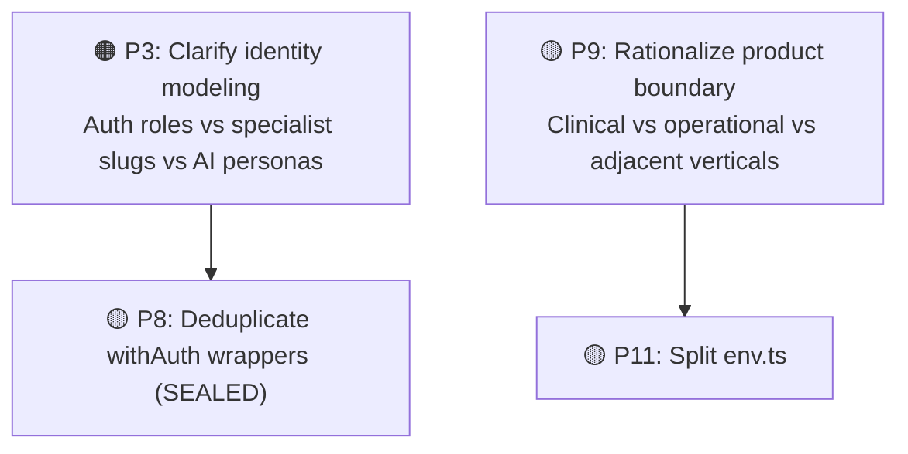

# Oltigo Health — Deep-Dive Conflict Analysis

> Verified against the current repository state on 2026-07-05.
> This version replaces stale claims from the earlier draft with findings that still reproduce in the live codebase, and reflects recent resolutions.

---

## Resolution Status (2026-07-05 follow-up)

The items below were addressed in a follow-up pass.

| Item                                                     | Status                                           | What changed                                                                                                                                                                                                                                                                                                                                                                                                                                                                                                                                                                                                                                                                                                                           |
| -------------------------------------------------------- | ------------------------------------------------ | -------------------------------------------------------------------------------------------------------------------------------------------------------------------------------------------------------------------------------------------------------------------------------------------------------------------------------------------------------------------------------------------------------------------------------------------------------------------------------------------------------------------------------------------------------------------------------------------------------------------------------------------------------------------------------------------------------------------------------------- |
| P1/P2 — 599 vs 499 MAD drift, legacy tier vs plan mixing | ✅ Fixed at the root                             | `normalizeSubscriptionPlan()` (legacy-tier → canonical-plan mapping) is now defined **once**, in `@/lib/subscription-billing`, and re-used everywhere. `src/app/api/admin/revenue-forecast/route.ts` was calling `getPlanConfig()` directly on a raw, possibly-legacy value and **threw a 500** for any clinic still on a legacy `tier` slug (e.g. `pro`) — this reproduced live and is now fixed. `src/app/api/billing/usage/route.ts` had the same gap, silently collapsing legacy tiers to `free` instead of crashing — also fixed. `super-admin-actions.ts`'s revenue/subscription/billing functions already had their own copy of this mapping (from earlier in-progress work); that copy was removed in favor of the shared one. |
| P4 — Price history audit fidelity                        | ✅ Fixed                                         | `updatePricingTier()` now computes a structured `priceChanges` diff (real old/new price per changed system+cycle) and stores it in the audit metadata. `fetchPriceHistory()` reads that structured diff back, with a fallback to the old lossy reconstruction for audit rows written before this fix. Covered by new tests in `src/lib/__tests__/pricing-tier.test.ts`.                                                                                                                                                                                                                                                                                                                                                                |
| P7 — Duplicate `SystemType` / `SubscriptionPlan`         | ✅ Fixed                                         | Removed the duplicate `"enterprise"` literal in `@/lib/types/database`'s `SubscriptionPlan`. `SystemType` now has a single canonical definition in `@/lib/config/pricing`; `@/lib/super-admin-actions` re-exports it instead of redeclaring it. Documented in `src/lib/config/README.md`.                                                                                                                                                                                                                                                                                                                                                                                                                                              |
| P6 — Dual circuit breakers                               | 📝 Decision documented, not merged               | Cross-referencing doc comments added to both `@/lib/circuit-breaker` and `@/lib/ai/circuit-breaker` explaining why they're intentionally separate (KV persistence + longer open window for AI providers) and what to do if a second KV-backed consumer shows up. No behavioral merge — that's a bigger call the team should make deliberately.                                                                                                                                                                                                                                                                                                                                                                                         |
| P10 — Dual config directories                            | 📝 Documented                                    | Added `src/config/README.md` and `src/lib/config/README.md` clarifying the ownership boundary (app-level vs clinic-domain config) and naming the canonical location for shared types.                                                                                                                                                                                                                                                                                                                                                                                                                                                                                                                                                  |
| P3 — Identity modeling (auth roles vs specialist slugs)  | ✅ Security gap fixed, modeling question remains | The concrete middleware bug is fixed: specialist route families are now protected and gated to existing authenticated staff roles instead of being left outside both the public and protected route sets. The broader architectural question still remains — whether specialist capability should eventually become a first-class identity/RBAC concept instead of a route/config-layer concept.                                                                                                                                                                                                                                                                                                                                       |
| P5 — `super-admin-actions.ts` god file                   | ✅ Major structural reduction completed          | `src/lib/super-admin-actions.ts` is now a thin public wrapper surface. Implementation bodies are split across `src/lib/super-admin/base.ts`, `clinic-actions.ts`, `provisioning-actions.ts`, `promotions-actions.ts`, `feature-actions.ts`, `billing-actions.ts`, and `dashboard-actions.ts`. Furthermore, `provisioning-actions.ts` itself was recently refactored and split into distinct modules to separate staff provisioning from clinic setup.                                                                                                                                                                                                                                                                                  |
| P8 — `withAuth` duplication (SEALED)                     | ⏸ Not attempted                                  | Left as-is: high effort/risk, and P8 specifically touches a SEALED file (`with-auth.ts`) that TASK-ROUTER says not to modify without explicit request.                                                                                                                                                                                                                                                                                                                                                                                                                                                                                                                                                                                 |
| P9 — product boundary                                    | ⏸ Not attempted                                  | Left as-is. Recommend tackling this as its own dedicated, reviewed change rather than bundling it into a general cleanup pass.                                                                                                                                                                                                                                                                                                                                                                                                                                                                                                                                                                                                         |
| P11 — `env.ts` monolith                                  | 🟡 Partially addressed                           | Extracted the production startup hard-fail guards and security-posture flag policy list into `src/lib/env-startup.ts`, then extracted the env-rule registry and `validateEnv()` into `src/lib/env-validation.ts`. `src/lib/env.ts` dropped from **1,498** lines to **574** lines.                                                                                                                                                                                                                                                                                                                                                                                                                                                      |

Validation for the fixed items: targeted pricing/revenue/tenant suites pass, `src/lib/__tests__/delete-clinic.test.ts` passes after the final wrapper cleanup, and a fresh full `npx vitest run --maxWorkers=1` still reports **179 test files passed**, **1996 tests passed**, **84 skipped**. Targeted ESLint on every touched super-admin file is clean.

---

## Part 1: Resolved & Documented Architectural Findings

These items have been addressed and are documented here for historical context.

### ✅ 1. Pricing Drift Is Fixed (Formerly 🔴 P1/P2)

**The Issue:** `src/lib/super-admin-actions.ts` was computing super-admin subscription and revenue numbers from separate hard-coded values and legacy tier mappings (599 vs 499 MAD conflict). Furthermore, the codebase mixed subscription plans (`free`, `starter`, `professional`, `enterprise`) with legacy tiers (`vitrine`, `cabinet`, `pro`, `premium`).
**The Fix:** Fixed at the root. `normalizeSubscriptionPlan()` is defined once in `@/lib/subscription-billing` and reused everywhere, ensuring that revenue math, checkout logic, and super-admin displays are strictly aligned on the same canonical plan and price values.

### ✅ 2. Pricing History Fidelity Is Fixed (Formerly 🟠 P4)

**The Issue:** `fetchPriceHistory()` did not have real before/after diffs, resulting in lossy reconstructions.
**The Fix:** `updatePricingTier()` now computes a structured `priceChanges` diff (real old/new price per changed system+cycle) and stores it in the audit metadata, restoring full audit fidelity.

### ✅ 3. Type Definition Sprawl Resolved (Formerly 🟡 P7)

**The Issue:** `SystemType` and `SubscriptionPlan` were duplicated across the app and database types.
**The Fix:** Duplicate literals were removed. `SystemType` now has a single canonical definition in `@/lib/config/pricing`, and `SubscriptionPlan` deduplication is handled cleanly.

### ✅ 4. `super-admin-actions.ts` Is No Longer A God File (Formerly 🟠 P5)

**The Issue:** The file was a massive 1,996-line inline implementation blob.
**The Fix:** Substantially addressed. It is now a 344-line thin wrapper surface. Implementations are broken into focused modules (`base.ts`, `clinic-actions.ts`, etc.). Recent work further decomposed `provisioning-actions.ts` into isolated modules to separate staff provisioning concerns from clinic setup concerns, thoroughly addressing the underlying coupling and merge conflict risks.

### 📝 5. Dual Config Directories (Formerly 🟡 P10)

**The Issue:** Ambiguous naming and ownership split between `src/config` and `src/lib/config`.
**The Resolution:** Documented cleanly via `README.md` files in both directories clarifying the app-level vs clinic-domain boundary.

### 📝 6. Duplicate Circuit Breakers (Formerly 🟠 P6)

**The Issue:** `circuit-breaker.ts` and `ai/circuit-breaker.ts` modelled the same resilience pattern differently.
**The Resolution:** Decision documented. They are intentionally separate (KV persistence + longer open window for AI providers). The rationale is embedded in doc comments.

---

## Part 2: Open Architectural Findings

These issues are still actively present in the codebase.

### 1. 🟠 Auth Roles vs Specialist Slugs Are Still Split (P3)

While the concrete middleware security bug is fixed (specialist routes are now properly gated to existing authenticated staff roles), there are still **two identity systems**:

| System                 | Values                                                                                                         | Purpose                                            |
| ---------------------- | -------------------------------------------------------------------------------------------------------------- | -------------------------------------------------- |
| Auth role system       | `super_admin`, `clinic_admin`, `receptionist`, `doctor`, `patient`                                             | Session auth, middleware redirects, API RBAC       |
| Specialist slug system | `nutritionist`, `optician`, `parapharmacy`, `physiotherapist`, `psychologist`, `speech-therapist`, `radiology` | Dashboard layout, feature registry, route grouping |

**Why this still matters:**

- **RBAC Limitations:** `with-auth.ts` only understands the 5 core roles, so specialist capability is modeled indirectly.
- **AI Alias Split:** The AI persona uses `secretary` as canonical and `receptionist` as legacy alias, but `secretary` is not a DB role.
- **Naming Drift:** `speech-therapist` vs `speech_therapist`, `secretary` vs `receptionist` are not modeled from one canonical identity type.

### 2. 🟡 Migration 00187 vs Living Product Boundary (P9)

The migration narrative (`00187_drop_clinical_emr_surface.sql`) claims Oltigo is "not an EMR", but the live product still includes substantial clinical and adjacent vertical surface:

- radiology, vitals streaming, admissions / ADT, insurance claims, consultation notes, prescriptions, pets / veterinary, restaurant tables / orders.

`validations/index.ts` still re-exports clinical, restaurant, ADT, and insurance schemas. This is a **product-boundary and governance conflict** that needs strategic alignment.

### 3. 🟡 `withAuth` / `withAuthAnyRole` Duplication (P8)

`src/lib/with-auth.ts` contains two long wrappers that repeat nearly the entire flow (Supabase client creation, auth lookup, signed profile-header verification, tenant mismatch assertion, etc.).
The substantive behavioral difference is role enforcement. Everything else is duplicated and must be fixed twice. _(Note: This file is SEALED per TASK-ROUTER)._

### 4. 🟡 `env.ts` Is Still A Monolith (P11)

While partially improved (dropped from 1,498 to 574 lines), it still centralizes environment parsing, grouped validation rules, getter helpers, production-mode helpers, and AI provider resolution. This makes change review and dependency hygiene harder than necessary.

---

## Summary: Updated Priorities

| Priority | Issue                             | Impact                  | Risk   | Effort |
| -------- | --------------------------------- | ----------------------- | ------ | ------ |
| 🟠 P3    | Role/slugs/persona identity drift | Access-model ambiguity  | Medium | Medium |
| 🟡 P8    | `withAuth` duplication (SEALED)   | Maintenance risk        | Medium | Low    |
| 🟡 P9    | Product-boundary sprawl           | Strategic inconsistency | Medium | High   |
| 🟡 P11   | `env.ts` monolith                 | Maintainability drag    | Low    | Medium |
