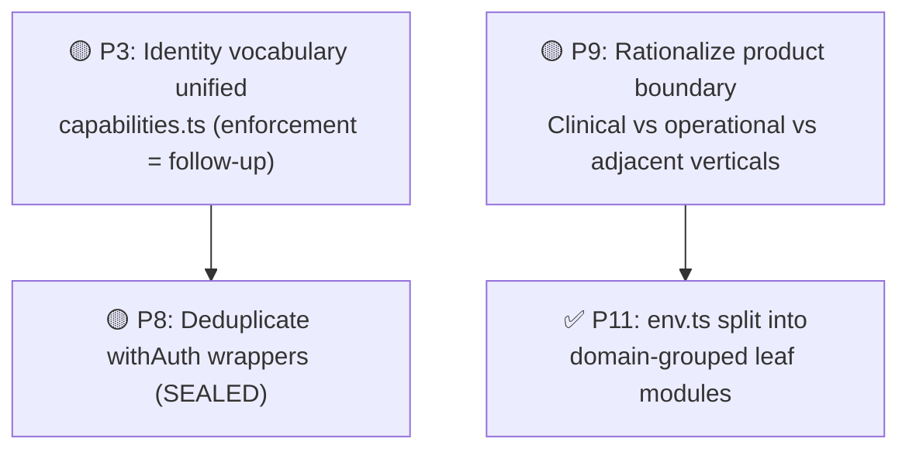

# Oltigo Health — Deep-Dive Conflict Analysis

> Verified against the current repository state on 2026-07-05.
> This version replaces stale claims from the earlier draft with findings that still reproduce in the live codebase, and reflects recent resolutions.

---

## Resolution Status (2026-07-05 follow-up)

The items below were addressed in a follow-up pass.

| Item                                                     | Status                                           | What changed                                                                                                                                                                                                                                                                                                                                                                                                                                                                                                                                                                                                                                                                                                                           |
| -------------------------------------------------------- | ------------------------------------------------ | -------------------------------------------------------------------------------------------------------------------------------------------------------------------------------------------------------------------------------------------------------------------------------------------------------------------------------------------------------------------------------------------------------------------------------------------------------------------------------------------------------------------------------------------------------------------------------------------------------------------------------------------------------------------------------------------------------------------------------------- |
| P1/P2 — 599 vs 499 MAD drift, legacy tier vs plan mixing | ✅ Fixed at the root                             | `normalizeSubscriptionPlan()` (legacy-tier → canonical-plan mapping) is now defined **once**, in `@/lib/subscription-billing`, and re-used everywhere. `src/app/api/admin/revenue-forecast/route.ts` was calling `getPlanConfig()` directly on a raw, possibly-legacy value and **threw a 500** for any clinic still on a legacy `tier` slug (e.g. `pro`) — this reproduced live and is now fixed. `src/app/api/billing/usage/route.ts` had the same gap, silently collapsing legacy tiers to `free` instead of crashing — also fixed. `super-admin-actions.ts`'s revenue/subscription/billing functions already had their own copy of this mapping (from earlier in-progress work); that copy was removed in favor of the shared one. |
| P4 — Price history audit fidelity                        | ✅ Fixed                                         | `updatePricingTier()` now computes a structured `priceChanges` diff (real old/new price per changed system+cycle) and stores it in the audit metadata. `fetchPriceHistory()` reads that structured diff back, with a fallback to the old lossy reconstruction for audit rows written before this fix. Covered by new tests in `src/lib/__tests__/pricing-tier.test.ts`.                                                                                                                                                                                                                                                                                                                                                                |
| P7 — Duplicate `SystemType` / `SubscriptionPlan`         | ✅ Fixed                                         | Removed the duplicate `"enterprise"` literal in `@/lib/types/database`'s `SubscriptionPlan`. `SystemType` now has a single canonical definition in `@/lib/config/pricing`; `@/lib/super-admin-actions` re-exports it instead of redeclaring it. Documented in `src/lib/config/README.md`.                                                                                                                                                                                                                                                                                                                                                                                                                                              |
| P6 — Dual circuit breakers                               | 📝 Decision documented, not merged               | Cross-referencing doc comments added to both `@/lib/circuit-breaker` and `@/lib/ai/circuit-breaker` explaining why they're intentionally separate (KV persistence + longer open window for AI providers) and what to do if a second KV-backed consumer shows up. No behavioral merge — that's a bigger call the team should make deliberately.                                                                                                                                                                                                                                                                                                                                                                                         |
| P10 — Dual config directories                            | 📝 Documented                                    | Added `src/config/README.md` and `src/lib/config/README.md` clarifying the ownership boundary (app-level vs clinic-domain config) and naming the canonical location for shared types.                                                                                                                                                                                                                                                                                                                                                                                                                                                                                                                                                  |
| P3 — Identity modeling (auth roles vs specialist slugs)  | 🟡 Partially resolved | **Identity vocabulary + route-prefix drift unified.** `src/lib/config/capabilities.ts` is the single canonical identity source: 5 `CoreRole`s (compiler-locked to the DB `UserRole`), a `Capability` union, a `CAPABILITIES` role→capability map, a `CORE_ROLE_ROUTE` role→route map, and one canonical slug↔capability mapping resolving the `speech-therapist`/`speech_therapist` and `secretary`/`receptionist` drift. `SPECIALIST_PROTECTED_PREFIXES` + `ROLE_ROUTE_MAP` (routes.ts) and `PROTECTED_ROUTE_PREFIXES` (next.config.ts) are DERIVED from it; the AI persona alias reuses `ROLE_TO_PERSONA`. Drift is guarded by `src/lib/__tests__/capabilities.test.ts`. **Follow-up (not done):** capability-based authorization is NOT yet wired into runtime gating — `src/middleware.ts` still gates via `SPECIALIST_STAFF_ROLES.some(...)`, not the `CAPABILITIES` map / `roleHasCapability`. Wiring that requires an explicit unseal decision (`src/middleware.ts` is SEALED Layer-1). No new DB roles, no migrations. See §17 of `project_architecture_analysis(2).md`. |
| P5 — `super-admin-actions.ts` god file                   | ✅ Major structural reduction completed          | `src/lib/super-admin-actions.ts` is now a thin public wrapper surface. Implementation bodies are split across 16 files in `src/lib/super-admin/`: `activity-helpers.ts`, `base.ts`, `billing-actions.ts`, `catalog-helpers.ts`, `clinic-detail-actions.ts`, `clinic-lifecycle-actions.ts`, `clinic-setup-actions.ts`, `dashboard-actions.ts`, `feature-actions.ts`, `helpers.ts`, `models.ts`, `promotion-helpers.ts`, `promotions-actions.ts`, `staff-provisioning-actions.ts`, `subscription-helpers.ts`, `types.ts`. The former `clinic-actions.ts` was split into the three `clinic-*-actions.ts` modules; `provisioning-actions.ts` became `staff-provisioning-actions.ts`.                                                                                                                                                                                                                                                                                  |
| P8 — `withAuth` duplication (SEALED)                     | ⏸ Not attempted                                  | Left as-is: high effort/risk, and P8 specifically touches a SEALED file (`with-auth.ts`) that TASK-ROUTER says not to modify without explicit request.                                                                                                                                                                                                                                                                                                                                                                                                                                                                                                                                                                                 |
| P9 — product boundary                                    | ⏸ Not attempted                                  | Left as-is. Recommend tackling this as its own dedicated, reviewed change rather than bundling it into a general cleanup pass.                                                                                                                                                                                                                                                                                                                                                                                                                                                                                                                                                                                                         |
| P11 — `env.ts` monolith                                  | ✅ Resolved                                      | Extracted the production startup hard-fail guards and security-posture flag policy list into `src/lib/env-startup.ts`, then extracted the env-rule registry and `validateEnv()` into `src/lib/env-validation.ts`, then split the remaining ~50 typed getters and toggle helpers into domain-grouped leaf modules: `src/lib/env-getters-core.ts` (Supabase, domains, platform secrets), `src/lib/env-getters-integrations.ts` (Stripe, R2, Cloudflare, Workers AI, Twilio, Meta/WhatsApp, email, Anthropic, E2B, insurance), `src/lib/env-getters-observability.ts` (Plausible, GA, AV-scan), and `src/lib/env-flags.ts` (boolean toggles + runtime-mode helpers). `src/lib/env.ts` is now a thin barrel (**251** lines, down from **1,498**) that keeps `enforceEnvValidation()` and re-exports the identical 65-export public API — no consumer import changed.                                                                                                                                                                                                                                                                                                                                                                                                                                                      |

Validation for the fixed items: targeted pricing/revenue/tenant suites pass, `src/lib/__tests__/delete-clinic.test.ts` passes after the final wrapper cleanup, and a fresh full `npx vitest run --maxWorkers=1` still reports **179 test files passed**, **1996 tests passed**, **84 skipped**. Targeted ESLint on every touched super-admin file is clean.

---

## Part 1: Resolved & Documented Architectural Findings

These items have been addressed and are documented here for historical context.

### ✅ 1. Pricing Drift Is Fixed (Formerly 🔴 P1/P2)

**The Issue:** `src/lib/super-admin-actions.ts` was computing super-admin subscription and revenue numbers from separate hard-coded values and legacy tier mappings (599 vs 499 MAD conflict). Furthermore, the codebase mixed subscription plans (`free`, `starter`, `professional`, `enterprise`) with legacy tiers (`vitrine`, `cabinet`, `pro`, `premium`).
**The Fix:** Fixed at the root. `normalizeSubscriptionPlan()` is defined once in `@/lib/subscription-billing` and reused everywhere, ensuring that revenue math, checkout logic, and super-admin displays are strictly aligned on the same canonical plan and price values.

### ✅ 2. Pricing History Fidelity Is Fixed (Formerly 🟠 P4)

**The Issue:** `fetchPriceHistory()` did not have real before/after diffs, resulting in lossy reconstructions.
**The Fix:** `updatePricingTier()` now computes a structured `priceChanges` diff (real old/new price per changed system+cycle) and stores it in the audit metadata, restoring full audit fidelity.

### ✅ 3. Type Definition Sprawl Resolved (Formerly 🟡 P7)

**The Issue:** `SystemType` and `SubscriptionPlan` were duplicated across the app and database types.
**The Fix:** Duplicate literals were removed. `SystemType` now has a single canonical definition in `@/lib/config/pricing`, and `SubscriptionPlan` deduplication is handled cleanly.

### ✅ 4. `super-admin-actions.ts` Is No Longer A God File (Formerly 🟠 P5)

**The Issue:** The file was a massive 1,996-line inline implementation blob.
**The Fix:** Substantially addressed. It is now a 344-line thin wrapper surface. Implementations are broken into 16 focused modules under `src/lib/super-admin/`: `activity-helpers.ts`, `base.ts`, `billing-actions.ts`, `catalog-helpers.ts`, `clinic-detail-actions.ts`, `clinic-lifecycle-actions.ts`, `clinic-setup-actions.ts`, `dashboard-actions.ts`, `feature-actions.ts`, `helpers.ts`, `models.ts`, `promotion-helpers.ts`, `promotions-actions.ts`, `staff-provisioning-actions.ts`, `subscription-helpers.ts`, `types.ts`. The former `clinic-actions.ts` was split into `clinic-detail-actions.ts`, `clinic-lifecycle-actions.ts`, and `clinic-setup-actions.ts`; `provisioning-actions.ts` became `staff-provisioning-actions.ts`.

### 📝 5. Dual Config Directories (Formerly 🟡 P10)

**The Issue:** Ambiguous naming and ownership split between `src/config` and `src/lib/config`.
**The Resolution:** Documented cleanly via `README.md` files in both directories clarifying the app-level vs clinic-domain boundary.

### 📝 6. Duplicate Circuit Breakers (Formerly 🟠 P6)

**The Issue:** `circuit-breaker.ts` and `ai/circuit-breaker.ts` modelled the same resilience pattern differently.
**The Resolution:** Decision documented. They are intentionally separate (KV persistence + longer open window for AI providers). The rationale is embedded in doc comments.

---

## Part 2: Open Architectural Findings

These issues are still actively present in the codebase.

### 1. 🟡 Auth Roles vs Specialist Slugs — Vocabulary Unified, Enforcement Follow-up (P3)

> **Partially resolved.** The identity *vocabulary* and the *route-prefix drift* are now unified behind a single canonical layer, `src/lib/config/capabilities.ts`: specialist capability is modeled as **capabilities layered on the 5 core roles** (not new DB roles), the derived prefix/route lists (`SPECIALIST_PROTECTED_PREFIXES`, `ROLE_ROUTE_MAP`, `next.config.ts` prefixes) are generated from that one map, and the AI persona alias reuses the same mapping.
>
> **Still a follow-up:** capability-based *authorization enforcement* is NOT wired into runtime gating. `src/middleware.ts` continues to gate specialist routes with `SPECIALIST_STAFF_ROLES.some(...)`, not the new `CAPABILITIES` map / `roleHasCapability`. Switching the gate to consume capabilities is an explicit unseal decision because `src/middleware.ts` is a SEALED Layer-1 file. The historical split is retained below for context.

Previously there were **two identity systems**:

| System                 | Values                                                                                                         | Purpose                                            |
| ---------------------- | -------------------------------------------------------------------------------------------------------------- | -------------------------------------------------- |
| Auth role system       | `super_admin`, `clinic_admin`, `receptionist`, `doctor`, `patient`                                             | Session auth, middleware redirects, API RBAC       |
| Specialist slug system | `nutritionist`, `optician`, `parapharmacy`, `physiotherapist`, `psychologist`, `speech-therapist`, `radiology` | Dashboard layout, feature registry, route grouping |

**How it was resolved (P3):**

- **One canonical source:** `src/lib/config/capabilities.ts` defines `CoreRole` (the 5 DB roles), a `Capability` union, and `CAPABILITIES: Record<CoreRole, Capability[]>`. Specialist capability is now modeled explicitly, not indirectly — as capabilities layered on the existing roles (no new DB roles, no migrations).
- **AI alias unified:** `secretary` (canonical) ↔ `receptionist` (DB role) is encoded once as `ROLE_TO_PERSONA` / `PERSONA_ALIASES` in `capabilities.ts`; `src/lib/ai/agent-config.ts` imports that mapping instead of re-declaring it.
- **Naming drift resolved once:** the canonical slug↔capability mapping picks `speech_therapist`/`receptionist` as canonical and keeps `speech-therapist` etc. as documented aliases, so lookups fail-safely.
- **No drift by construction:** `SPECIALIST_PROTECTED_PREFIXES`, `ROLE_ROUTE_MAP` (SEALED `routes.ts`, import-only) and `PROTECTED_ROUTE_PREFIXES` (`next.config.ts`) are derived from `capabilities.ts`; `src/lib/__tests__/capabilities.test.ts` asserts full derivation and fail-closed behaviour for unknown roles/slugs.
- **Enforcement is a deliberate follow-up:** the `CAPABILITIES` map is authored but not yet consulted by `src/middleware.ts`, which still gates via `SPECIALIST_STAFF_ROLES`. Wiring middleware to `roleHasCapability` is a SEALED-file change and needs an explicit unseal decision; until then the behaviour is unchanged (identity is unified, enforcement path is not migrated).

### 2. 🟡 Migration 00187 vs Living Product Boundary (P9)

The migration narrative (`00187_drop_clinical_emr_surface.sql`) claims Oltigo is "not an EMR", but the live product still includes substantial clinical and adjacent vertical surface:

- radiology, vitals streaming, admissions / ADT, insurance claims, consultation notes, prescriptions, pets / veterinary, restaurant tables / orders.

`validations/index.ts` still re-exports clinical, restaurant, ADT, and insurance schemas. This is a **product-boundary and governance conflict** that needs strategic alignment.

### 3. 🟡 `withAuth` / `withAuthAnyRole` Duplication (P8)

`src/lib/with-auth.ts` contains two long wrappers that repeat nearly the entire flow (Supabase client creation, auth lookup, signed profile-header verification, tenant mismatch assertion, etc.).
The substantive behavioral difference is role enforcement. Everything else is duplicated and must be fixed twice. _(Note: This file is SEALED per TASK-ROUTER)._

### 4. ✅ `env.ts` Monolith Resolved (P11)

Resolved. `src/lib/env.ts` is now a thin barrel (251 lines) over six domain-grouped leaf modules — `env-validation.ts` (ENV_RULES + `validateEnv()`), `env-startup.ts` (production enforcement guards), `env-getters-core.ts` (Supabase, domains, platform secrets), `env-getters-integrations.ts` (Stripe, R2, Cloudflare, Workers AI, Twilio, Meta/WhatsApp, email, Anthropic, E2B, insurance), `env-getters-observability.ts` (Plausible, GA, AV-scan), and `env-flags.ts` (boolean toggles + runtime-mode helpers). The barrel keeps `enforceEnvValidation()` and preserves the exact 65-export public API, so `@/lib/env` remains the only import path consumers use. The `.semgrep/env-access.yml` allowlist and the R-08 CRON_SECRET CI guard were extended to cover the leaf modules.

---

## Live Conflict Status (verified 2026-07-05)

The Architecture A ("operations platform, NOT an EMR") vs Architecture B ("clinical/multi-vertical product") conflict documented as **P9** remains **open and actively contradictory** in the codebase. Concrete evidence:

### Evidence 1: Migration 00187 declares "NOT an EMR" and drops clinical tables

`supabase/migrations/00187_drop_clinical_emr_surface.sql` (line 5):
> "Oltigo is a multi-tenant clinic OPERATIONS platform … It is NOT an EMR and must not store or process clinical / medical-record data"

It drops **12 clinical tables**: `drug_interaction_alerts`, `drug_interactions`, `cdss_override_log`, `lab_results`, `lab_test_orders`, `lab_tests`, `prescription_drafts`, `prescription_renewal_requests`, `prescription_renewals`, `encounter_addenda`, `clinical_encounters`, `telemedicine_sessions`.

### Evidence 2: Clinical API routes still exist

Despite the migration's declaration, `src/app/api/` still contains active clinical route directories:
- `prescriptions/`
- `vitals/`
- `radiology/`
- `insurance-claims/`
- `admissions/`

### Evidence 3: Non-healthcare verticals still present

Multi-vertical expansion routes remain in `src/app/api/`:
- `pets/` (veterinary)
- `menus/` (restaurant)
- `restaurant-orders/`
- `restaurant-tables/`

### Evidence 4: Validation schemas still re-export clinical and vertical types

`src/lib/validations/index.ts` still re-exports schemas that serve the clinical and non-healthcare surfaces:
- `radiologyOrderCreateSchema` (line 55)
- `petProfileCreateSchema` (line 59)
- `labReportSchema` (line 54)

### Conclusion

P9 is unresolved. The database layer has partially committed to Architecture A (dropping EMR tables), while the application layer (API routes, validation schemas) retains Architecture B surface. This creates a split where the schema no longer supports data that the API routes still expose, representing both a governance gap and a runtime risk for any code path that references the dropped tables.

---

## Summary: Updated Priorities

| Priority | Issue                             | Impact                  | Risk   | Effort |
| -------- | --------------------------------- | ----------------------- | ------ | ------ |
| 🟡 P3    | Role/slugs/persona identity drift | Vocabulary/prefix drift unified in `capabilities.ts`; capability-based enforcement is a follow-up (SEALED middleware) | Low | Partial |
| 🟡 P8    | `withAuth` duplication (SEALED)   | Maintenance risk        | Medium | Low    |
| 🟡 P9    | Product-boundary sprawl           | Strategic inconsistency | Medium | High   |
| ✅ P11   | `env.ts` monolith                 | Resolved — barrel + domain-grouped leaf modules, public API unchanged | Low | Done |
