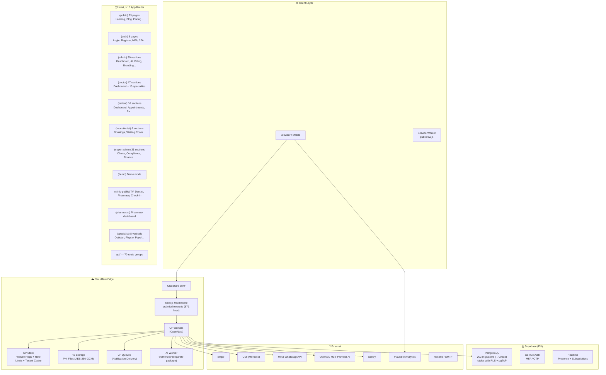
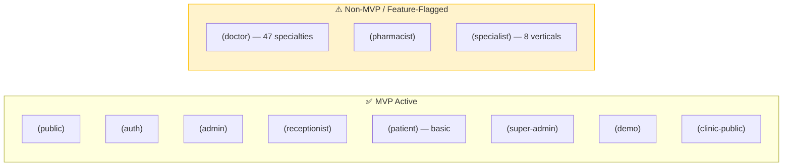
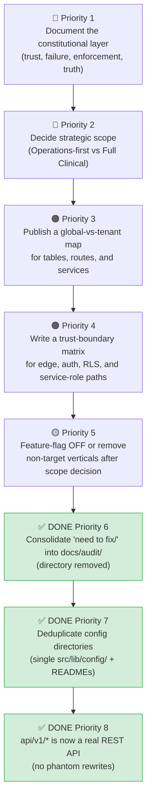
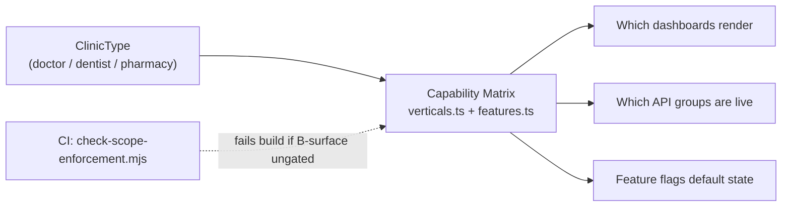
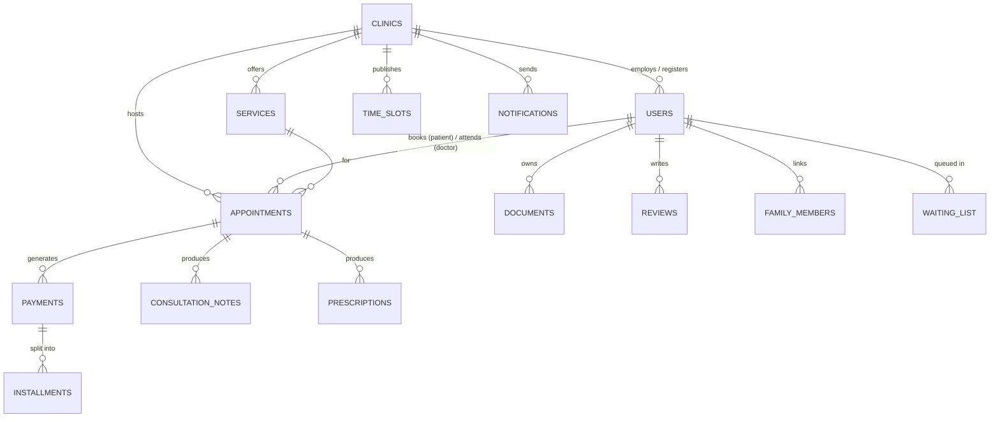
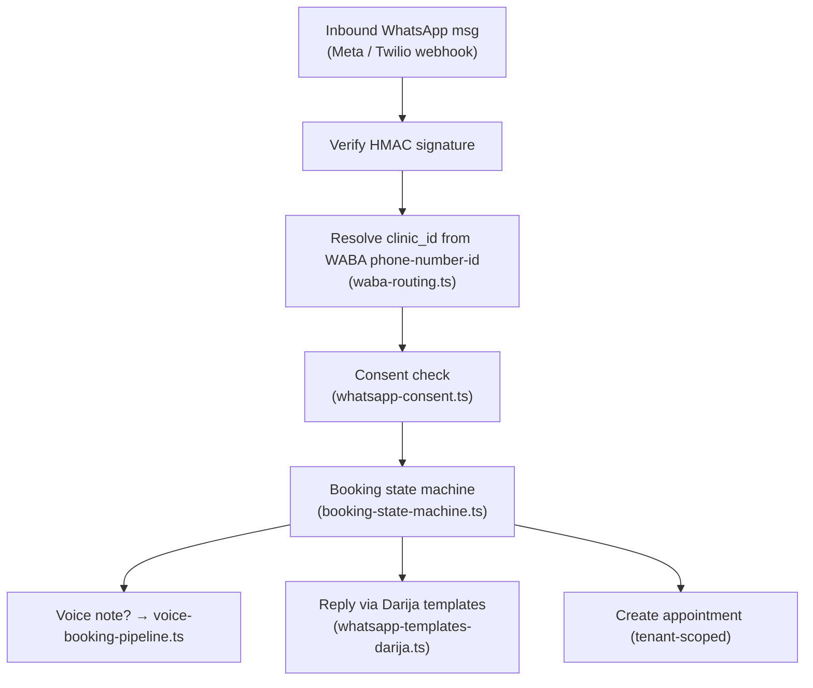
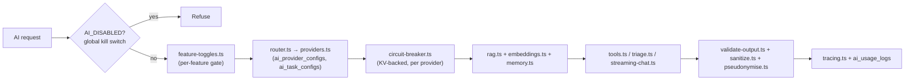

# Oltigo Health — Full Architecture Analysis & Conflict Map

> **Scanned:** Every directory and key file in the repository.
> **Purpose:** High-level structure summary + identification of old/new architecture overlaps and conflicts.
> **Last verified against live code:** 2026-07-05 (branch `main`).

## What Oltigo Health Is (One-Paragraph Product Definition)

Oltigo Health is a **multi-tenant SaaS platform for Moroccan clinics**. Every clinic is a
tenant, isolated by `clinic_id` at both the application layer (`requireTenant()`) and the
database layer (Supabase Row Level Security). It combines a **public managed clinic website +
online booking**, **role-based operational dashboards** (super-admin, clinic-admin,
receptionist, doctor, patient — plus pharmacist and specialist verticals), **WhatsApp / email /
SMS notifications**, **CMI + Stripe payments and subscriptions**, and a large **AI surface**
(FAQ/booking bot, RAG, AI "team", triage, tracing). It is built on **Next.js 16 + React 19
(App Router)**, deployed to **Cloudflare Workers via OpenNext**, with **Cloudflare R2** for
encrypted PHI file storage, **KV** for flags/rate-limits/tenant cache, and **CF Queues** for
notification delivery. Domain specifics: timezone `Africa/Casablanca`, currency MAD (centimes),
insurance types CNSS/CNOPS/AMO/RAMED, languages FR (default) / AR (RTL) / Darija (WhatsApp) / EN,
and PHI governance under Moroccan Law 09-08.

> [!NOTE]
> **Accuracy pass (2026-07-05).** This document was reconciled against the live repository.
> Several claims from the earlier draft were stale and have been corrected inline (flagged
> with **CORRECTED**). The companion file [`deep_dive_analysis.md`](deep_dive_analysis.md)
> tracks the _resolution status_ of the specific conflicts (pricing drift, god-file split,
> `env.ts` reduction, config-dir documentation, etc.); this file is the _structural map_.
> Where the two disagree, `deep_dive_analysis.md` is newer for resolution state.

### Summary of corrections applied in this pass

| Claim in earlier draft                                            | Reality on `main` (2026-07-05)                                                                                                                       |
| ----------------------------------------------------------------- | ---------------------------------------------------------------------------------------------------------------------------------------------------- |
| `(doctor)` = 47 specialty subdirs                                 | ✅ Still accurate — 47 dirs under `src/app/(doctor)/doctor/`                                                                                         |
| `need to fix/` directory with 11 parked audit reports             | ❌ **Gone** — consolidated into `docs/audit/` (31 files). See §4.7                                                                                   |
| `src/config/` and `src/lib/config/` both exist (dual config dirs) | ❌ **Resolved** — only `src/lib/config/` remains (with a `README.md`). See §11                                                                       |
| `src/types/` holds the 356 KB `database.ts`                       | ❌ Wrong location — `database.ts` lives in **`src/lib/types/`** and is **~340 KB / 12,146 lines**. `src/types/` holds 5 ambient `.d.ts` module shims |
| `super-admin-actions.ts` = 65 KB god file                         | ❌ **Now 12 KB / 346-line thin wrapper**; implementation split into `src/lib/super-admin/` (16 files)                                                |
| `env.ts` = 59 KB monolith                                         | 🟡 **Now 24 KB / 574 lines**; `env-startup.ts` + `env-validation.ts` extracted                                                                       |
| `api/v1/*` = phantom versioning (rewrites only, no real handlers) | ❌ **Real public REST API now** — API-key auth, keyset pagination (appointments, patients, register-clinic, clinic/quota-status, cache/invalidate)   |
| 203 migrations                                                    | 🟡 **202 SQL files**, numbered through `00203`                                                                                                       |

---

## 1. High-Level Architecture Diagram



---

## 2. Directory Structure Map

### Root Level

| Path                       | Type  | Purpose                                                                                                      |
| -------------------------- | ----- | ------------------------------------------------------------------------------------------------------------ |
| [src/](/src)               | Core  | Application source code                                                                                      |
| [docs/](/docs)             | Docs  | 60+ operational documents, runbooks, SOPs, compliance                                                        |
| [supabase/](/supabase)     | DB    | **202** migration files (numbered through `00203`), seeds, edge functions, pgTAP tests                       |
| [infra/](/infra)           | IaC   | 11 Terraform files (DNS, KV, R2, Queues, Routes, backend/providers/vars)                                     |
| [workers/](/workers)       | Edge  | Separate AI worker (own package.json)                                                                        |
| [scripts/](/scripts)       | Ops   | 44 scripts (seed, backup, checks, deploy, chaos)                                                             |
| [e2e/](/e2e)               | Test  | 30 Playwright E2E specs                                                                                      |
| [evals/](/evals)           | AI    | AI evaluation harness (schemas, runners, test-cases)                                                         |
| [k6/](/k6)                 | Perf  | K6 load test scripts                                                                                         |
| [.github/](/.github)       | CI    | 16 GitHub Actions workflows                                                                                  |
| [.storybook/](/.storybook) | UI    | Storybook config                                                                                             |
| [.ai/](/.ai)               | Agent | `TASK-ROUTER.md`, SEALED-file map, `skills/ui-ux`, `prompts/BLOCKER-AUDIT-PROMPT.md`                         |
| [.kiro/](/.kiro)           | Agent | Kiro spec/steering config                                                                                    |
| [docs/audit/](/docs/audit) | Audit | **CORRECTED:** all audit reports live here now (31 files). The old `need to fix/` directory has been removed |

### Source Code (`src/`)

| Path                               | Contents                          | Scale                                                                                                                                                                                                |
| ---------------------------------- | --------------------------------- | ---------------------------------------------------------------------------------------------------------------------------------------------------------------------------------------------------- |
| [src/app/](/src/app)               | App Router: 17 route groups + API | 11 role-based route groups, 70 API route groups                                                                                                                                                      |
| [src/components/](/src/components) | UI components                     | 36 component directories (35 feature dirs + `__tests__`) + standalone files                                                                                                                          |
| [src/lib/](/src/lib)               | Core library code                 | **119 top-level files** + 20 subdirectories                                                                                                                                                          |
| [src/lib/types/](/src/lib/types)   | Generated + domain types          | **CORRECTED:** `database.ts` (**~340 KB / 12,146 lines**) lives here, plus `database-extended.ts`, `dental.ts`, `para-medical.ts`, `custom-fields.ts`                                                |
| [src/modules/](/src/modules)       | Feature modules                   | audit (append-only), vitals (stream) (+ \_\_tests\_\_)                                                                                                                                               |
| [src/types/](/src/types)           | Ambient module shims              | **CORRECTED:** 5 `.d.ts` shims (ai, lucide-react, qrcode-browser, swagger-ui-react, web-speech-api) — **not** `database.ts`                                                                          |
| [src/lib/config/](/src/lib/config) | App + clinic-domain config        | **CORRECTED:** single config home (`agent.config.ts`, `specialist-registry.ts`, `clinic-types.ts`, `pricing.ts`, `verticals.ts`, `default-services.ts`, `README.md`). `src/config/` no longer exists |
| [src/locales/](/src/locales)       | i18n                              | fr.json, en.json, ar.json                                                                                                                                                                            |
| [src/content/](/src/content)       | Blog                              | MDX blog posts                                                                                                                                                                                       |

---

## 3. The Two Architectures — Where They Overlap & Conflict

The codebase contains two coexisting visions that are in tension:

That said, the repository has also evolved a **third, deeper layer** that the original "Lane A vs. Lane B" framing misses:

- A **guardrail-heavy distributed monolith** where architecture is enforced in runtime code, SQL/RLS, infra config, CI guards, and pgTAP tests at the same time.
- A system whose deepest invariants are often expressed as **things that must never happen**, not just happy-path flows.
- A platform with **distributed truth**, where multiple files are intentionally authoritative for different parts of the same behavior and sync tests keep them aligned.

### 🟢 Architecture A: "Operations-Only Managed SaaS" (The Target)

The MVP scope document ([MVP_SCOPE.md](/MVP_SCOPE.md)) and Product Focus Map ([PRODUCT_FOCUS_MAP.md](/docs/PRODUCT_FOCUS_MAP.md)) describe Oltigo as a **managed-site + operations platform**:

- Public clinic website + booking
- Receptionist dashboard (scheduling, walk-ins)
- WhatsApp reminders
- Admin branding & analytics
- Super-admin tenant management
- CMI/Stripe payments + subscriptions
- AI for operations (smart reminders, FAQ bot, internal AI team)

### 🔴 Architecture B: "Full Clinical EMR Platform" (The Legacy/Expanded)

The actual codebase is a **full-blown clinical platform** with deep PHI handling:

- 47 specialty sub-dashboards for doctors (cardiology, dermatology, IVF, dialysis, psychiatry...)
- Radiology (DICOM viewer, image uploads to R2)
- Prescriptions, vitals streaming, clinical encounters
- Insurance claims processing
- Patient timeline & medical history export
- Dental odontogram, prosthetic orders
- Restaurant/hospitality vertical
- Veterinary/pet profiles vertical

---

## 4. Conflict & Overlap Map

> [!CAUTION]
> These are the specific areas where the two architectures clash. Each needs a deliberate decision.

### 4.1. Route Groups — Active vs. Aspirational



| Route Group                    | Status                       | Conflict                                                                                                                                                                    |
| ------------------------------ | ---------------------------- | --------------------------------------------------------------------------------------------------------------------------------------------------------------------------- |
| `(doctor)` — 47 subdirectories | ⚠️ **Massive scope creep**   | Contains full specialty modules (cardiology, dialysis, IVF, psychiatry, urology…). These are clinical/PHI-handling dashboards that contradict the "operations-only" target. |
| `(specialist)` — 8 verticals   | ⚠️ Feature-flagged but built | Nutritionist, optician, physiotherapist, psychologist, speech-therapist, radiology, parapharmacy, equipment. Full layout shells exist.                                      |
| `(pharmacist)`                 | ⚠️ Non-MVP                   | Separate role and layout for pharmacy workflows.                                                                                                                            |
| `(clinic-public)/dentist`      | ⚠️ Specialty-specific        | Dentist-specific public pages under `clinic-public`.                                                                                                                        |

### 4.2. API Routes — Core vs. Clinical/Non-MVP

| API Route Group                                  | Status                         | Notes                                                                                                                                                                                                                                 |
| ------------------------------------------------ | ------------------------------ | ------------------------------------------------------------------------------------------------------------------------------------------------------------------------------------------------------------------------------------- |
| `api/booking`, `api/appointments`                | ✅ Core                        | MVP booking flow                                                                                                                                                                                                                      |
| `api/auth`, `api/admin`, `api/super-admin`       | ✅ Core                        | Auth & management                                                                                                                                                                                                                     |
| `api/notifications`, `api/webhooks`              | ✅ Core                        | WhatsApp + Stripe webhooks                                                                                                                                                                                                            |
| `api/payments`, `api/billing`, `api/invoices`    | ✅ Core                        | Revenue pipeline                                                                                                                                                                                                                      |
| `api/cron/` (23 cron jobs)                       | ✅ Core                        | Operational automation                                                                                                                                                                                                                |
| `api/vitals`, `api/vitals/stream`                | 🔴 **Clinical PHI**            | Real-time vitals — full EMR territory                                                                                                                                                                                                 |
| `api/radiology/*`                                | 🔴 **Clinical PHI**            | Radiology orders, uploads, PDF reports                                                                                                                                                                                                |
| `api/prescriptions`                              | 🔴 **Clinical PHI**            | Prescription management                                                                                                                                                                                                               |
| `api/insurance-claims`                           | 🔴 **Clinical PHI**            | Insurance claim processing                                                                                                                                                                                                            |
| `api/admissions`                                 | 🔴 **Clinical PHI**            | ADT (admit-discharge-transfer)                                                                                                                                                                                                        |
| `api/restaurant-orders`, `api/restaurant-tables` | 🟡 **Non-healthcare vertical** | Restaurant vertical                                                                                                                                                                                                                   |
| `api/pets`                                       | 🟡 **Non-healthcare vertical** | Veterinary pets                                                                                                                                                                                                                       |
| `api/menus`                                      | 🟡 **Non-healthcare vertical** | Restaurant menus                                                                                                                                                                                                                      |
| `api/copilotkit`                                 | 🟡 AI experimental             | CopilotKit integration                                                                                                                                                                                                                |
| `api/v1/*`                                       | ✅ **CORRECTED → real API**    | **No longer phantom.** Public REST API with API-key auth (`authenticateApiKey`) + keyset pagination: `v1/appointments`, `v1/patients`, `v1/register-clinic` (+ `verification-token`), `v1/clinic/quota-status`, `v1/cache/invalidate` |

### 4.3. Library Layer — Dual Identity

| Library File/Module                                                                           | Architecture A                   | Architecture B                                                                        | Conflict                                                                                                                                                                                                                                                                                                                                         |
| --------------------------------------------------------------------------------------------- | -------------------------------- | ------------------------------------------------------------------------------------- | ------------------------------------------------------------------------------------------------------------------------------------------------------------------------------------------------------------------------------------------------------------------------------------------------------------------------------------------------ |
| [src/lib/r2.ts](/src/lib/r2.ts) (24 KB)                                                       | File uploads for clinic branding | **PHI-encrypted medical file storage**                                                | Stores both operational and clinical files in the same bucket logic                                                                                                                                                                                                                                                                              |
| [src/lib/encryption.ts](/src/lib/encryption.ts)                                               | Not needed for ops-only          | AES-256-GCM PHI encryption                                                            | Would be unnecessary overhead if clinical modules are disabled                                                                                                                                                                                                                                                                                   |
| [src/lib/phi-field-encryption.ts](/src/lib/phi-field-encryption.ts)                           | Not needed                       | Column-level PHI encryption                                                           | Pure clinical concern                                                                                                                                                                                                                                                                                                                            |
| [src/lib/phi-compliance.ts](/src/lib/phi-compliance.ts)                                       | Not needed                       | PHI compliance checks                                                                 | Pure clinical concern                                                                                                                                                                                                                                                                                                                            |
| [src/lib/strip-exif.ts](/src/lib/strip-exif.ts)                                               | Not needed                       | EXIF stripping from medical images                                                    | Pure clinical concern                                                                                                                                                                                                                                                                                                                            |
| [src/lib/data/specialists.ts](/src/lib/data/specialists.ts) (52 KB)                           | Not needed                       | Full specialist data layer                                                            | Largest data file; no MVP use                                                                                                                                                                                                                                                                                                                    |
| [src/lib/super-admin-actions.ts](/src/lib/super-admin-actions.ts) **(now 12 KB / 346 lines)** | Partial (tenant mgmt)            | Full (clinical admin)                                                                 | **CORRECTED — no longer a god file.** Now a thin wrapper; implementations split across `src/lib/super-admin/` (16 files: `base.ts`, `clinic-*-actions.ts`, `provisioning`/`staff-provisioning-actions.ts`, `billing-actions.ts`, `dashboard-actions.ts`, `feature-actions.ts`, `promotions-actions.ts`, helpers). See `deep_dive_analysis.md` P5 |
| [src/lib/env.ts](/src/lib/env.ts) **(now 24 KB / 574 lines)**                                 | ~30% needed                      | 100% used                                                                             | **CORRECTED — partially split.** `env-startup.ts` (prod hard-fail guards) and `env-validation.ts` (rule registry + `validateEnv()`) extracted. Still centralizes parsing + getters + AI provider resolution. See `deep_dive_analysis.md` P11                                                                                                     |
| [src/lib/whatsapp/](/src/lib/whatsapp)                                                        | Reminders only                   | **Full conversational booking** via WhatsApp (state machine, voice pipeline, consent) | The WhatsApp layer is far beyond simple reminders                                                                                                                                                                                                                                                                                                |
| [src/lib/ai/](/src/lib/ai) (**33 files**)                                                     | Basic FAQ bot                    | Full AI team, RAG, embeddings, triage, streaming chat, tools, memory, tracing         | Enormous AI surface for a clinic operations tool                                                                                                                                                                                                                                                                                                 |
| [src/modules/vitals/](/src/modules/vitals)                                                    | Not needed                       | Real-time vitals streaming                                                            | Pure clinical                                                                                                                                                                                                                                                                                                                                    |

### 4.4. Database — Schema Sprawl

| Migration Range | Theme                                                                             | Architecture                                   |
| --------------- | --------------------------------------------------------------------------------- | ---------------------------------------------- |
| `00001–00030`   | Core schema, auth, RLS, booking                                                   | ✅ A (Operations)                              |
| `00009–00015`   | Clinic types, specialty modules, para-medical, diagnostic, pharmacy, equipment    | 🔴 B (Clinical)                                |
| `00061–00064`   | **Veterinary vertical**, **Restaurant vertical**, pet profiles, restaurant tables | 🟡 Non-healthcare                              |
| `00086`         | Drop legacy restaurant RLS                                                        | 🧹 Cleanup of non-MVP                          |
| `00106–00120`   | AI: support AI, receptionist AI, billing AI, doctor AI, clinical encounters, CDSS | 🔴 B (Clinical AI)                             |
| `00143–00203`   | Mixed fixes, booking improvements, compliance, document extraction                | Mixed A+B                                      |
| `00187`         | `drop_clinical_emr_surface.sql`                                                   | 🧹 **Explicit removal of clinical EMR tables** |
| `00188`         | `remove_demo_tenant.sql`                                                          | 🧹 Cleanup                                     |

> [!IMPORTANT]
> Migration `00187_drop_clinical_emr_surface.sql` **intentionally drops clinical EMR tables**, signaling a move toward Architecture A. But many API routes and components still reference those surfaces. This is a live conflict.

### 4.5. Components — Bloat vs. Core

| Component Group                                | Status      | Scale                                                                              |
| ---------------------------------------------- | ----------- | ---------------------------------------------------------------------------------- |
| `components/ui/`                               | ✅ Core     | 48 primitives (button, dialog, table, toast...) + Storybook stories                |
| `components/layouts/`                          | ⚠️ Mixed    | 13 layout shells — many are specialist/non-MVP (equipment, pharmacist, specialist) |
| `components/landing/`, `components/marketing/` | ✅ Core     | Public site                                                                        |
| `components/booking/`, `components/schedule/`  | ✅ Core     | Booking flow                                                                       |
| `components/dental/`, `components/dental-lab/` | 🔴 Clinical | Dental-specific (odontogram, lab orders)                                           |
| `components/dialysis/`                         | 🔴 Clinical | Dialysis session management                                                        |
| `components/ivf/`                              | 🔴 Clinical | IVF cycle tracking                                                                 |
| `components/medical/`                          | 🔴 Clinical | Clinical components                                                                |
| `components/para-medical/`                     | 🔴 Clinical | Para-medical specialty                                                             |
| `components/polyclinic/`                       | 🔴 Clinical | Multi-department clinic                                                            |

### 4.6. Infrastructure & Config Conflicts

| Item                                                                      | Conflict                                                                                                                                                                                                                                                                                                                                                                                         |
| ------------------------------------------------------------------------- | ------------------------------------------------------------------------------------------------------------------------------------------------------------------------------------------------------------------------------------------------------------------------------------------------------------------------------------------------------------------------------------------------ |
| **[wrangler.toml](/wrangler.toml) (28 KB / 560 lines)**                   | Massive config — includes cron triggers, KV bindings, R2 buckets, queue consumers for both operational and clinical features                                                                                                                                                                                                                                                                     |
| **[worker-cron-handler.ts](/worker-cron-handler.ts) (16 KB / 324 lines)** | Top-level cron handler dispatching 23 cron jobs — mixes operational automation, billing, compliance retention, and platform maintenance in one control surface. Must stay in sync with `wrangler.toml` (see §5.1)                                                                                                                                                                                |
| **[next.config.ts](/next.config.ts)**                                     | **CORRECTED:** `PROTECTED_ROUTE_PREFIXES` lists specialist paths (pharmacist, nutritionist, optician, parapharmacy, physiotherapist, psychologist, speech-therapist, radiology, equipment). These routes **do exist** as built route groups under `(pharmacist)`/`(specialist)`; they are intentionally gated to authenticated staff roles (see `deep_dive_analysis.md` P3), not phantom entries |
| **[sentry.server.config.ts](/sentry.server.config.ts) (9 KB)**            | Configured to capture errors from ALL modules including clinical. Companion configs: `sentry.client.config.ts`, `sentry.edge.config.ts`                                                                                                                                                                                                                                                          |
| **`api/v1/*`**                                                            | **CORRECTED — not phantom.** Real public REST API with API-key auth + keyset pagination (see §4.2). No rewrite indirection remains in `next.config.ts`                                                                                                                                                                                                                                           |

### 4.7. Audit Reports — Now Consolidated (was: the "need to fix" Directory)

> [!NOTE]
> **CORRECTED / RESOLVED.** The `need to fix/` directory (space in the name) described in the
> earlier draft **no longer exists**. All of those audit reports have been consolidated into
> [`docs/audit/`](/docs/audit), which now holds **31 files**, including the previously-parked
> `audit_report.md`, `supabase_audit_report.md`, `infra_audit_report.md`, `workers_audit.md`,
> `evals-audit.md`, plus newer dated audits, `baseline.md`, `cve-baseline.md`,
> `open-actions.md`, and `remediation-tracker-2026-06.md`. **No cleanup action is needed here
> anymore** — priority D6 in §13 is done.

The pre-existing quality baseline referenced by cleanup PRs is [`docs/audit/baseline.md`](/docs/audit/baseline.md) (per `AGENTS.md`).

---

## 5. The Hidden Architecture: Constitutional Guardrails

The strongest architectural property in this repo is not visible from route groups alone.

Oltigo behaves like a **constitutional system**: whenever the platform depends on a subtle invariant, there is often a matching runtime assertion, SQL test, CI guard, or infra constraint pinning it in place.

This matters because the repo's true architecture is not just "what modules exist," but **what the system refuses to allow**.

### 5.1. Executable Governance Layer

| Invariant                                                                                   | Where It Is Enforced                                                                                                                                                                                        | Why It Matters                                                                                    |
| ------------------------------------------------------------------------------------------- | ----------------------------------------------------------------------------------------------------------------------------------------------------------------------------------------------------------- | ------------------------------------------------------------------------------------------------- |
| Every API mutation must visibly reference `clinic_id` unless explicitly allowlisted         | [`scripts/check-tenant-scoping.mjs`](/scripts/check-tenant-scoping.mjs), [`.github/workflows/ci.yml`](/.github/workflows/ci.yml)                                                                            | Tenant scoping is treated as a machine-checkable architectural rule, not a code-review preference |
| `FORCE ROW LEVEL SECURITY` must never be enabled on `public` tables                         | [`docs/adr/0011-no-force-rls.md`](/docs/adr/0011-no-force-rls.md), [`supabase/tests/no_force_rls.test.sql`](/supabase/tests/no_force_rls.test.sql), [`.github/workflows/ci.yml`](/.github/workflows/ci.yml) | The tenant layer intentionally depends on carefully constrained `SECURITY DEFINER` escape hatches |
| Every cron route must authenticate with `verifyCronSecret()`                                | [`scripts/check-cron-auth.ts`](/scripts/check-cron-auth.ts), [`src/lib/cron-auth.ts`](/src/lib/cron-auth.ts)                                                                                                | Cron routes are CSRF-exempt and therefore treated as a distinct security protocol                 |
| `wrangler.toml` cron expressions and `worker-cron-handler.ts` routing map must stay in sync | [`src/lib/__tests__/cron-schedule-sync.test.ts`](/src/lib/__tests__/cron-schedule-sync.test.ts)                                                                                                             | Cron behavior has intentionally distributed truth that must be pinned by tests                    |
| Egress-sensitive integrations must use `safeFetch()` instead of raw `fetch()`               | [`scripts/check-egress-safefetch.mjs`](/scripts/check-egress-safefetch.mjs), [`src/lib/fetch-wrapper.ts`](/src/lib/fetch-wrapper.ts)                                                                        | Third-party outbound traffic is centralized behind an allowlist/audit choke-point                 |
| `MVP_SCOPE.md` must only name symbols that still exist in code                              | [`scripts/check-mvp-scope-refs.mjs`](/scripts/check-mvp-scope-refs.mjs)                                                                                                                                     | Scope-control docs are treated as audit-facing interfaces, not informal prose                     |
| Cross-tenant validation inside security-definer booking RPCs must remain intact             | [`supabase/tests/booking_atomic_insert.test.sql`](/supabase/tests/booking_atomic_insert.test.sql)                                                                                                           | Some multi-tenant safety rules live in SQL functions, not app handlers                            |

### 5.2. Negative Architecture Register

These are the repo's strongest "never-events":

- Never trust inbound tenant headers. Middleware strips all forwarded tenant headers plus the legacy `x-clinic-id`.
- Never trust inbound auth profile headers without an HMAC signature and freshness window.
- Never allow cron routes without bearer-secret authentication.
- Never allow raw egress from sensitive integration modules.
- Never enable `FORCE ROW LEVEL SECURITY` on the public schema.
- Never let security-definer tenant validation silently weaken in booking flows.

This "negative architecture" is more structurally important than many visible features.

---

## 6. Trust Boundary Matrix

The repo does **not** operate with one simple trust model. It has several trust boundaries, each with a different source of truth:

| Boundary                             | Trusted Signal                                                                                                  | Distrusted Signal                             | Notes                                                                                 |
| ------------------------------------ | --------------------------------------------------------------------------------------------------------------- | --------------------------------------------- | ------------------------------------------------------------------------------------- |
| Public tenant discovery              | Subdomain -> [`public_clinic_directory`](/src/lib/middleware/subdomain-resolution.ts) via anon Supabase + cache | Any inbound tenant header                     | Public resolution is intentionally narrowed and cacheable                             |
| Authenticated route auth context     | Middleware-signed `x-auth-profile-*` headers or fallback DB profile lookup                                      | Unsigned/forged profile headers               | This is an internal security protocol, not just a perf optimization                   |
| Anonymous/public tenant-scoped RLS   | `x-clinic-id` on explicitly created tenant/anon clients                                                         | Client-supplied root-request headers          | Header-based scoping exists, but only after middleware/server code derives the tenant |
| Authenticated tenant-scoped RLS      | `get_user_clinic_id()` from the caller's own `users` row                                                        | Request header as authenticated tenant source | Migration `00201` explicitly hardens authenticated RLS away from header trust         |
| Cross-tenant/admin/system operations | Service role or scoped admin client + explicit audit labels                                                     | Implicit trust in bypassed RLS                | The app accepts privileged islands, but labels and wrappers them explicitly           |

### 6.1. Why This Matters

The document should model **who is trusted for what**, not just say "tenant isolation exists."

The real architecture is:

- **Subdomain-derived tenant identity** at the edge
- **Signed internal auth-context propagation** between middleware and handlers
- **JWT-derived clinic identity** for authenticated RLS
- **Explicit service-role exceptions** for platform-level and cross-tenant control-plane work

---

## 7. Failure Semantics Matrix

The system does not have one universal failure posture. It uses a **failure-policy lattice**:

| Subsystem                                     | Default Behavior                                 | Failure Mode                                                                                                      |
| --------------------------------------------- | ------------------------------------------------ | ----------------------------------------------------------------------------------------------------------------- |
| `withAuth()` tenant context                   | Fail closed on unexpected tenant-context failure | Returns `503` if tenant context cannot be established and the failure is not the expected permission-denied case  |
| `setTenantContext()` on authenticated clients | Expected permission denial is tolerated          | Permission-denied is a typed, non-fatal branch because the service-role-only RPC is not supposed to succeed there |
| Rate limiting                                 | Mixed                                            | Some limiters fail closed, some degrade to in-memory fallback, some have grace windows before hard denial         |
| Global AI kill switch                         | Mixed / fail-open                                | `AI_DISABLED=true` disables immediately, but missing/broken KV defaults to enabled for backward compatibility     |
| AI feature gating                             | Opt-in, not fail-closed                          | Unknown `feature_key` values are allowed; toggle-load failure defaults to "no explicit block"                     |
| OpenNext R2 incremental cache                 | Deploy gated                                     | Request-time missing binding is tolerated, but deploy-time missing binding hard-fails unless feature-gated        |
| Sign-out                                      | Graceful                                         | Sign-out always redirects even if the logout API call fails                                                       |

### 7.1. Subtle But Important Pattern

One of the most interesting hidden properties is that **controlled failure is part of the design**:

- `set_tenant_context()` is intentionally restricted to `service_role`
- authenticated clients are expected to hit permission denial there
- the application treats that denial as a normal branch, not as an outage

That is a non-obvious architectural decision and should be documented as such.

---

## 8. Global vs. Tenant Surfaces

This is not a purely tenant-scoped app. It contains explicit **platform-global islands** inside a tenant-scoped system.

### 8.1. Platform-Global by Design

| Surface                                                 | Why It Is Global                                                     |
| ------------------------------------------------------- | -------------------------------------------------------------------- |
| `ai_provider_configs`                                   | AI provider routing is a platform control-plane concern              |
| `ai_feature_toggles`                                    | Feature gating applies across the platform, not per clinic           |
| `ai_task_configs`                                       | Model/task pinning is managed centrally                              |
| `ai_usage_logs`                                         | AI governance and cost visibility are platform-level                 |
| `uptime_events`                                         | Infrastructure monitoring is intentionally cross-tenant              |
| `document_templates`                                    | Shared template catalog managed by super-admin                       |
| `demo_leads` / onboarding surfaces                      | Prospects are not tenants yet                                        |
| Team/support briefings and some internal admin datasets | These are site-team/platform operations, not clinic-owned PHI tables |

### 8.2. Tenant-Scoped by Design

- Core clinics/users/appointments/payments/patient data
- Most PHI-bearing tables
- Clinic-admin operational surfaces
- Public clinic content once a tenant has been resolved

### 8.3. Architectural Consequence

The real boundary is not simply "multi-tenant everywhere."

It is:

- **tenant data by default**
- **platform-global exceptions by explicit design**
- **each exception should be justified and named**

This deserves its own map in the architecture, not scattered comments.

---

## 9. Runtime Phase Model

The repo has a real **phase-specific runtime model** that affects correctness:

| Phase                 | Key Constraint                                                                                            |
| --------------------- | --------------------------------------------------------------------------------------------------------- |
| Build time            | Some bindings/context are unavailable; code must not assume Worker env on module init                     |
| Deploy time           | Certain OpenNext features, especially incremental cache wiring, can fail hard if infra is not provisioned |
| Request time          | Cloudflare bindings must be resolved from request-scoped OpenNext context, not `globalThis`               |
| Worker isolate time   | In-memory caches and counters are isolate-local and can disappear on cold start                           |
| Cross-isolate runtime | KV, R2, queues, and DB-backed counters are needed when truth must survive isolate churn                   |
| DB/RLS time           | Authenticated and anonymous tenant scoping use different signals and helper functions                     |

### 9.1. Concrete Examples

- [`src/lib/cf-bindings.ts`](/src/lib/cf-bindings.ts) exists because Cloudflare bindings are request-scoped under OpenNext.
- [`open-next.config.ts`](/open-next.config.ts) gates R2 incremental cache because request-time and deploy-time behavior differ.
- [`src/lib/rate-limit.ts`](/src/lib/rate-limit.ts) explicitly distinguishes distributed backends from in-memory fallback because isolate-local truth is not enough in production.

This is a core architectural concern, not an implementation footnote.

---

## 10. Distributed Truth Map

The repo repeatedly chooses **synchronized multi-source truth** instead of one canonical file:

| Concern                     | Source A                          | Source B                                            | Sync Mechanism                                                                |
| --------------------------- | --------------------------------- | --------------------------------------------------- | ----------------------------------------------------------------------------- |
| Cron schedules              | [`wrangler.toml`](/wrangler.toml) | [`worker-cron-handler.ts`](/worker-cron-handler.ts) | [`cron-schedule-sync.test.ts`](/src/lib/__tests__/cron-schedule-sync.test.ts) |
| Scope-control documentation | [`MVP_SCOPE.md`](/MVP_SCOPE.md)   | Actual code symbols/files                           | [`check-mvp-scope-refs.mjs`](/scripts/check-mvp-scope-refs.mjs)               |
| Tenant safety               | App code wrappers                 | SQL/RLS helpers + pgTAP                             | CI + SQL tests                                                                |
| AI routing                  | DB tables/config                  | Runtime router/provider code                        | Runtime loading + tests/guards                                                |

The document should stop implying that one file alone is authoritative for everything.

The architecture is better described as **distributed truth with synchronization guards**.

---

## 11. Validation / Type System Overlap

| Layer       | Old Pattern                                                                                                                                        | New Pattern                                                                                                                | Conflict                                                                                                                                                                                                                      |
| ----------- | -------------------------------------------------------------------------------------------------------------------------------------------------- | -------------------------------------------------------------------------------------------------------------------------- | ----------------------------------------------------------------------------------------------------------------------------------------------------------------------------------------------------------------------------- |
| Validations | [src/lib/validations.ts](/src/lib/validations.ts) (single file barrel)                                                                             | [src/lib/validations/](/src/lib/validations) (27 schema files by domain)                                                   | Both exist — the barrel file and the directory. The barrel is a re-export hub but could confuse imports.                                                                                                                      |
| Types       | [src/lib/types/database.ts](/src/lib/types/database.ts) (**~340 KB / 12,146 lines**) + [database-extended.ts](/src/lib/types/database-extended.ts) | Per-domain types in route handlers + `dental.ts`, `para-medical.ts`, `custom-fields.ts`                                    | The auto-generated Supabase types file includes types for ALL tables (clinical + operational + restaurant + veterinary). Schema reduction would shrink this. **CORRECTED:** it lives in `src/lib/types/`, not `src/types/`    |
| Config      | ~~`src/config/`~~ (removed)                                                                                                                        | [src/lib/config/](/src/lib/config) (clinic-types, pricing, verticals, agent.config, specialist-registry, default-services) | **CORRECTED / RESOLVED:** there is now a **single** config directory. `src/config/` no longer exists; `src/lib/config/README.md` documents the app-level vs clinic-domain ownership boundary. See `deep_dive_analysis.md` P10 |

---

## 12. Scale & Complexity Summary

| Metric                     | Count                                                                             |
| -------------------------- | --------------------------------------------------------------------------------- |
| Route groups (app router)  | 17 (12 role-based + api + api-docs + auth + booking + .well-known + unauthorized) |
| API route groups           | **70**                                                                            |
| Cron jobs                  | **23**                                                                            |
| Database migrations        | **202 SQL files** (numbered through `00203`)                                      |
| `src/lib/` files           | **119 top-level files + 20 subdirectories**                                       |
| AI library files           | **33** (in `src/lib/ai/` alone)                                                   |
| Components directories     | **36** (35 feature dirs + `__tests__`)                                            |
| UI primitives              | **48**                                                                            |
| Layout shells              | **13**                                                                            |
| Specialist types           | **7** (nutritionist, optician, parapharmacy, physio, psych, speech, radiology)    |
| Doctor sub-dashboards      | **47**                                                                            |
| E2E test specs             | **30**                                                                            |
| CI workflows               | **16**                                                                            |
| Scripts                    | **44**                                                                            |
| Env vars (in .env.example) | ~100+                                                                             |
| i18n locales               | 3 (fr, en, ar)                                                                    |

---

## 13. Recommended Cleanup Priorities



> [!NOTE]
> **Status update (2026-07-05):** Priorities **D6, D7, D8 are complete** (see the correction
> table at the top and §§4.6, 4.7, 11). D1–D5 remain the strategic work: the constitutional
> layer is now documented in §§5–10 of this file (D1 mostly done as documentation), but the
> **scope decision (D2)** — Operations-only vs Full-Clinical — is still the biggest open call
> and gates D3/D4/D5. Additional open refactors are tracked as P3/P8/P9/P11 in
> [`deep_dive_analysis.md`](deep_dive_analysis.md).

> [!IMPORTANT]
> **The biggest missing piece is no longer just a lane decision.**
>
> The document now needs to capture:
>
> - what the system trusts
> - what failures are acceptable
> - which invariants are constitutional
> - where truth is intentionally duplicated
> - which global surfaces are exempt from tenant scoping by design
>
> The strategic scope decision still matters, but the repo's deeper governing logic must be documented first or the architecture will continue to look flatter than it really is.

---

## 14. Canonical Reference for AI Agents

> This section is the **hand-off contract**: give it (plus this whole file) to an AI so it has a
> full, accurate picture before making changes. It reconciles the analysis above with the repo's
> own agent guidance (`AGENTS.md`, `.ai/TASK-ROUTER.md`).

### 14.1. Tech Stack (authoritative)

| Concern       | Choice                                                                                                                                         |
| ------------- | ---------------------------------------------------------------------------------------------------------------------------------------------- |
| Framework     | Next.js 16 + React 19 (App Router). **Breaking-changed Next** — read `node_modules/next/dist/docs/` before writing Next code (per `AGENTS.md`) |
| Language      | TypeScript (strict; no `any`, no `getattr`-style dynamic access)                                                                               |
| Database      | Supabase / PostgreSQL with Row Level Security (RLS)                                                                                            |
| Deploy        | Cloudflare Workers via OpenNext (`open-next.config.ts`, `wrangler.toml`)                                                                       |
| Edge state    | Cloudflare KV (flags/rate-limits/tenant cache), R2 (encrypted PHI), Queues (notifications)                                                     |
| Notifications | WhatsApp (Meta Cloud API / Twilio), Email (Resend / SMTP), In-App, SMS                                                                         |
| Payments      | CMI (Moroccan interbank) + Stripe (international)                                                                                              |
| Observability | Sentry (client/server/edge configs), Plausible analytics                                                                                       |
| Tests         | Vitest (unit/integration), Playwright (E2E, 30 specs), pgTAP (SQL), k6 (load)                                                                  |
| i18n          | FR (default), AR (RTL), Darija (WhatsApp templates), EN                                                                                        |

### 14.2. The 5-Layer Edit Model (from `.ai/TASK-ROUTER.md`)

Any AI editing this repo **must** respect these layers:

```
Layer 1 (SEALED): Auth, RLS, multi-tenant → src/middleware.ts, src/lib/auth.ts (+ with-auth.ts,
                  api-auth.ts, auth-roles.ts, auth-providers.ts, cron-auth.ts), src/lib/tenant.ts,
                  src/lib/tenant-context.ts, src/lib/encryption.ts, src/lib/seed-guard.ts
Layer 2 (SEALED): Booking, payments, notifications → src/app/api/booking/, src/app/api/payments/,
                  src/lib/whatsapp.ts
Layer 3 (EDIT):   Config, features, niches → src/lib/config/, src/lib/features.ts,
                  src/lib/hooks/use-clinic-features.tsx
Layer 4 (EDIT):   Templates, UI, pages → src/lib/templates.ts, src/components/, src/app/
Layer 5 (CREATE): New features → create new files; never modify layers 1–2
```

**Never** (per TASK-ROUTER "DO NOT" rules): modify middleware/auth/RLS/tenant/encryption/seed-guard,
edit existing API handlers (create new ones), delete feature flags, rename DB columns, or `git add .`.

> [!WARNING]
> **Known stale reference to fix in `.ai/TASK-ROUTER.md`:** its "Add new niche" row still points at
> `src/config/specialist-registry.ts`, but `src/config/` was removed — the file now lives at
> **`src/lib/config/specialist-registry.ts`**. Any AI following the router should use the
> `src/lib/config/` path.

### 14.3. Identity / Role Model

- **5 auth roles** (privilege order): `super_admin` > `clinic_admin` > `receptionist` > `doctor` > `patient`.
- **Specialist slugs** (separate system, not DB roles): `nutritionist`, `optician`, `parapharmacy`,
  `physiotherapist`, `psychologist`, `speech-therapist`, `radiology` (+ `equipment` vertical).
- **AI persona alias:** `secretary` (canonical) ↔ `receptionist` (legacy) — `secretary` is **not** a DB role.
- **Open conflict (P3):** auth roles, specialist slugs, and AI personas are three overlapping identity
  vocabularies with naming drift (`speech-therapist` vs `speech_therapist`). See `deep_dive_analysis.md` P3.

### 14.4. Non-Negotiable Invariants (what an AI must not break)

1. **Tenant scoping:** every DB op filters by `clinic_id`; use `requireTenant()`/`requireTenantWithConfig()`; never trust client `x-clinic-id` (middleware strips it). Enforced by `scripts/check-tenant-scoping.mjs` in CI.
2. **No `FORCE ROW LEVEL SECURITY`** on public tables (ADR-0011 + `supabase/tests/no_force_rls.test.sql`).
3. **Cron routes** authenticate via `verifyCronSecret()` (`scripts/check-cron-auth.ts`); `wrangler.toml` crons and `worker-cron-handler.ts` must stay in sync (`cron-schedule-sync.test.ts`).
4. **Egress** from sensitive integrations goes through `safeFetch()` (`scripts/check-egress-safefetch.mjs`).
5. **PHI** encrypted with AES-256-GCM (`@/lib/encryption`, unique IV per file); never log secrets/PHI.
6. **Audit** every state change via `logAuditEvent()`; validate all inputs with Zod (`@/lib/validations`).
7. **API shape:** `apiSuccess`/`apiError` from `@/lib/api-response`; wrap handlers with `withAuth`/`withValidation`/`withAuthValidation`.
8. `MVP_SCOPE.md` may only name symbols that still exist (`scripts/check-mvp-scope-refs.mjs`).

### 14.5. The One Decision That Unblocks Everything

The single biggest source of "conflict between the old and new project" is unresolved **product scope**:

- **Architecture A (target, per `MVP_SCOPE.md`):** operations-only managed-site + booking + reminders + billing + light AI.
- **Architecture B (built):** full clinical EMR + non-healthcare verticals (restaurant, veterinary).
- Migration `00187_drop_clinical_emr_surface.sql` signals a move toward A, yet the routes, API handlers,
  components, validations, and 340 KB type file for B still ship.

**An AI cannot "fix the conflict" without this decision.** The recommended prompt to that AI is:

> "Given `MVP_SCOPE.md` as the target scope, either (a) feature-flag OFF and quarantine every
> Architecture-B surface listed in §4, or (b) formally adopt B and update `MVP_SCOPE.md`,
> `00187`, and the docs to match. Do not silently leave both."

### 14.6. Where To Look First (entry points)

| To understand…            | Start at                                                         |
| ------------------------- | ---------------------------------------------------------------- |
| Agent rules / do-not list | `AGENTS.md`, `.ai/TASK-ROUTER.md`                                |
| Intended scope            | `MVP_SCOPE.md`, `docs/PRODUCT_FOCUS_MAP.md`                      |
| Tenant/auth core (SEALED) | `src/middleware.ts`, `src/lib/tenant.ts`, `src/lib/with-auth.ts` |
| Routing surface           | `src/app/` route groups + `src/app/api/` (70 groups)             |
| Edge/deploy config        | `wrangler.toml`, `open-next.config.ts`, `worker-cron-handler.ts` |
| Data model                | `supabase/migrations/` (→`00203`), `src/lib/types/database.ts`   |
| Open conflicts + status   | `deep_dive_analysis.md` (this folder)                            |
| Per-role design + limits  | **§15 of this file**                                             |

---

## 15. Per-Role Architecture — How Each Role Works, Its Dashboard, and Its Limits

> This is the **target role model** ("how it needs to be"), grounded in the code that exists
> today. It combines the actual routing/RBAC facts with prescriptive access limits so an AI can
> both understand the current state and enforce the intended boundaries.

### 15.1. The Access Model (source of truth)

Two enforcement layers must always agree (defense-in-depth):

1. **Middleware routing** (`src/middleware.ts` + `src/lib/middleware/routes.ts`): decides which
   URL prefix a logged-in user may reach, from their DB `role`.
2. **API RBAC + RLS** (`withAuth(handler, allowedRoles)` + Supabase Row Level Security): decides
   which data operations they may perform, always scoped by `clinic_id`.

**Canonical role → route mapping (`ROLE_ROUTE_MAP` / `ROLE_DASHBOARD_MAP`):**

| DB `role`      | Allowed prefix  | Landing dashboard         | Tenant scope                       |
| -------------- | --------------- | ------------------------- | ---------------------------------- |
| `super_admin`  | `/super-admin`  | `/super-admin/dashboard`  | **Platform-global** (cross-tenant) |
| `clinic_admin` | `/admin`        | `/admin/dashboard`        | Single clinic                      |
| `receptionist` | `/receptionist` | `/receptionist/dashboard` | Single clinic                      |
| `doctor`       | `/doctor`       | `/doctor/dashboard`       | Single clinic                      |
| `patient`      | `/patient`      | `/patient/dashboard`      | Own records within one clinic      |

- `STAFF_ROLES` = `super_admin`, `clinic_admin`, `receptionist`, `doctor` (patient excluded from clinic-management endpoints).
- **Specialist / pharmacist dashboards are NOT DB roles.** `SPECIALIST_PROTECTED_PREFIXES`
  (`/pharmacist`, `/nutritionist`, `/optician`, `/parapharmacy`, `/physiotherapist`,
  `/psychologist`, `/radiology`, `/speech-therapist`, `/equipment`) are real authenticated
  surfaces, gated to `SPECIALIST_STAFF_ROLES` = `clinic_admin`, `receptionist`, `doctor`.
  They are modeled as **route slugs**, not `UserRole` values — this is open conflict **P3**.
- **Fail-closed rule (AUDIT-LB2):** every role with a protected prefix MUST appear in
  `ROLE_ROUTE_MAP`; unknown roles are denied. Never let a role fall through.

> [!IMPORTANT]
> **Non-negotiable for every role:** all data access is scoped by `clinic_id` (`requireTenant()`),
> client-supplied tenant headers are stripped, every mutation is Zod-validated and audit-logged,
> and PHI is AES-256-GCM encrypted. A role can only ever see/act within its own clinic — the sole
> cross-tenant exception is `super_admin` (§8 platform-global surfaces).

### 15.2. `super_admin` — Platform Operator (cross-tenant control plane)

- **Who:** Oltigo's own operations team. **Not** a clinic employee.
- **Works on:** onboarding/provisioning clinics, subscriptions & pricing, platform finance,
  compliance/KYC, feature flags, AI provider governance, uptime, and support across ALL tenants.
- **Scope:** the only role allowed to operate **across tenants** and on platform-global tables
  (`ai_provider_configs`, `ai_feature_toggles`, `uptime_events`, `document_templates`, `demo_leads`…).
- **Dashboard sections (33):** `dashboard`, `clinics`, `onboarding`, `pilots`, `kyc`,
  `subscriptions`, `pricing`, `billing`, `finance`, `usage` / `usage-dashboard`, `feature-flags`,
  `features`, `ai-team`, `agents`, `marketplace`, `templates`, `announcements`, `messaging`,
  `compliance`, `audit-logs`, `uptime`, `system`, `chaos`, `support`, `team`, `referrals`,
  `referral-program`, `analytics`, `settings`, `profile`.
- **Limits (should-be):** must use scoped admin/service-role clients with **explicit audit labels**
  for any cross-tenant read/write; never touch clinical PHI content directly (governance, not care);
  destructive tenant operations (delete/suspend clinic) require audit + confirmation.

### 15.3. `clinic_admin` — Clinic Owner / Manager (single tenant)

- **Who:** the clinic's owner or administrator. Top of the per-clinic hierarchy.
- **Works on:** everything about **their own clinic** — staff (doctors, receptionists), services,
  working hours/holidays, branding & public website, billing/revenue, insurance claims, reports,
  clinic-level AI config, and data-retention/compliance settings.
- **Scope:** single `clinic_id`. No cross-tenant visibility.
- **Dashboard sections (~40):** `dashboard`, `patients`, `doctors`, `receptionists`,
  `departments`, `sections`, `services`, `working-hours`, `holidays`, `beds`, `machines`,
  `billing`, `expenses`, `financial-summary`, `revenue-cycle`, `revenue-per-doctor`,
  `insurance-claims`, `lab-invoices`, `lab-materials`, `patient-acquisition`, `reviews`,
  `reports`, `analytics`, `branding`, `website-editor`, `templates`, `custom-fields`,
  `notifications`, `ai-config`, `ai-manager`, `ai-routing`, `ai-team`, `audit-logs`,
  `data-retention`, `onboarding`, `referral-program`, `support`, `status`, `settings`.
- **Limits (should-be):** may manage staff and clinic config but **cannot** access other clinics
  or platform-global control planes; AI config is per-clinic overrides only (provider routing stays
  super-admin-owned); can view clinic audit logs, not platform ones.

### 15.4. `receptionist` — Front Desk / Operations (single tenant)

- **Who:** front-desk staff. **This is the MVP's primary daily-driver role.**
- **Works on:** the booking/scheduling loop — creating & managing appointments, walk-ins/waiting
  room, patient records (contact-level), and taking payments.
- **Scope:** single `clinic_id`; operational data only.
- **Dashboard sections (6):** `dashboard`, `bookings`, `waiting-room`, `patients`, `payments`,
  `daily-report`.
- **Limits (should-be):** manage appointments and front-desk patient data; take payments; **no**
  access to clinical/PHI depth (diagnoses, prescriptions), staff management, branding, or finance
  beyond day-of payments/daily report. In AI code the persona alias is `secretary` (canonical) ↔
  `receptionist` (legacy) — naming drift to reconcile (P3).

### 15.5. `doctor` — Clinician (single tenant) ⚠️ largest surface

- **Who:** treating clinicians.
- **Works on:** their schedule/slots, their patients, clinical notes, and (in the built system) a
  very large set of **specialty sub-dashboards**.
- **Scope:** single `clinic_id`; PHI-bearing.
- **Dashboard sections (47) — split by architecture:**
  - **✅ Operational / core:** `dashboard`, `micro-dashboard`, `schedule`, `slots`, `patients`,
    `waiting-room`, `referrals`, `analytics`, `certificates`, `consent-forms`, `chat`.
  - **🔴 Clinical / specialty (Architecture-B):** `cardiology`, `dermatology`, `endocrinology`,
    `ent`, `neurology`, `orthopedics`, `psychiatry`, `pulmonology`, `rheumatology`, `urology`,
    `dialysis-machines`, `dialysis-sessions`, `ivf-cycles`, `ivf-protocols`, `pregnancies`,
    `child-info`, `growth-charts`, `vaccinations`, `odontogram`, `prosthetic-orders`,
    `vision-tests`, `iop-tracking`, `ultrasounds`, `consultation-photos`, `before-after`,
    `treatment-plans`, `treatment-packages`, `wellbeing`, `lab-invoices`, `lab-materials`,
    `inventory`, `stock`, `sterilization`, `departments`, `patient-finance`, `installments`.
- **Limits (should-be):** clinical write access to **their own** patients' records within the
  clinic; no staff/billing admin; no cross-clinic access. **This role is where the scope decision
  (§14.5) bites hardest** — the specialty dashboards are the bulk of Architecture-B and should be
  feature-flagged per clinic type (`doctor` / `dentist` / `pharmacy`) rather than all-on.

### 15.6. `patient` — End User (own records only)

- **Who:** the clinic's patients.
- **Works on:** their appointments, documents, invoices/payment plans, prescriptions, and
  medical history/timeline — **read-mostly, self-service**.
- **Scope:** **own records within a single clinic** (strictest RLS: `patient_id` + `clinic_id`).
- **Dashboard sections (16):** `dashboard`, `appointments`, `prescriptions`, `documents`,
  `medical-history`, `medical-timeline`, `treatment-plan`, `tooth-map`, `before-after`,
  `invoices`, `payment-plan`, `family`, `feedback`, `notifications`, `preferences`, `settings`.
- **Limits (should-be):** may view own data + book/cancel own appointments + manage family
  members they're linked to; **never** see other patients or clinic-internal operations; excluded
  from `STAFF_ROLES`.

### 15.7. `pharmacist` — Pharmacy vertical (route slug, not a DB role) ⚠️

- **Who:** pharmacy staff (for `pharmacy` clinic type). Accessed by staff roles via the
  `/pharmacist` protected prefix, not a distinct `UserRole`.
- **Dashboard sections (8):** `dashboard`, `stock`, `expiry`, `orders`, `prescriptions`, `sales`,
  `suppliers`, `loyalty`.
- **Limits (should-be):** pharmacy inventory + dispensing + sales within one clinic; gate behind
  the `pharmacy` clinic type / feature flag. **Modeling gap (P3):** no `pharmacist` DB role exists,
  so RBAC is indirect — a candidate for promotion to a first-class role or capability.

### 15.8. `(specialist)` verticals — route slugs, not DB roles ⚠️

Feature-flagged specialty dashboards under `src/app/(specialist)/`, gated to `SPECIALIST_STAFF_ROLES`:

| Vertical           | Sections (actual)                                                 |
| ------------------ | ----------------------------------------------------------------- |
| `radiology`        | `dashboard`, `orders`, `images`, `viewer`, `reports`, `templates` |
| `nutritionist`     | `dashboard`, `meal-plans`, `measurements`, `bmi`                  |
| `optician`         | `dashboard`, `prescriptions`, `frame-catalog`, `lens-inventory`   |
| `physiotherapist`  | `dashboard`, `sessions`, `exercise-programs`, `progress-photos`   |
| `psychologist`     | `dashboard`, `session-notes`, `therapy-plans`, `progress`         |
| `speech-therapist` | `dashboard`, `sessions`, `exercise-library`, `reports`            |
| `parapharmacy`     | `dashboard`, `catalog`, `inventory`, `sales`                      |
| `equipment`        | `dashboard`, `inventory`, `rentals`, `maintenance`                |

- **Limits (should-be):** each vertical is single-tenant and should be OFF by default, enabled per
  clinic type/vertical flag (`src/lib/config/verticals.ts` `VerticalId`). Same P3 caveat: these are
  capabilities layered on the 5 core roles, not identities of their own.

### 15.9. Role Boundary Summary (quick matrix)

| Capability                   | super_admin | clinic_admin | receptionist | doctor  |  patient  |
| ---------------------------- | :---------: | :----------: | :----------: | :-----: | :-------: |
| Cross-tenant / platform ops  |     ✅      |      ❌      |      ❌      |   ❌    |    ❌     |
| Manage clinic staff & config |  ✅ (any)   |   ✅ (own)   |      ❌      |   ❌    |    ❌     |
| Bookings / waiting room      |     ✅      |      ✅      |      ✅      |   ✅    | own only  |
| Clinical/PHI records         | governance  |  oversight   |   limited    |   ✅    | own only  |
| Billing / finance            |  platform   |    clinic    | day payments |   ❌    | own bills |
| Take payments                |     ✅      |      ✅      |      ✅      |   ❌    |  pay own  |
| Enabled by default in MVP    |     ✅      |      ✅      |      ✅      | partial |   basic   |

> [!NOTE]
> **Prescriptive intent:** the operations-first MVP (Architecture A) centres on
> `receptionist` + `clinic_admin` + `patient` + `super_admin`. `doctor`'s clinical specialty
> surface and all `(specialist)`/`pharmacist` verticals are Architecture-B — keep them behind
> per-clinic-type feature flags until the §14.5 scope decision is made, rather than exposing every
> section to every clinic.

---

## 16. Scope Enforcement — Turning the A-vs-B Decision Into Code

The single biggest fix (§14.5) is worthless as prose; it must become **enforced config**. Target design:

1. **ADR:** add `docs/adr/00xx-operations-first-scope.md` stating "Oltigo is operations-first;
   clinical + non-healthcare verticals are opt-in per clinic type." This becomes the citable source of truth.
2. **Capability matrix (single source):** in `src/lib/config/verticals.ts` + `src/lib/features.ts`,
   define `ClinicType → { enabledDashboards, enabledApiGroups, enabledFlags }`. A clinic of type
   `doctor` does **not** get `dialysis`, `ivf`, `restaurant`, etc. unless its vertical/flag is on.
3. **CI guard:** mirror `scripts/check-mvp-scope-refs.mjs` with a `check-scope-enforcement.mjs` that
   fails the build if any Architecture-B route/handler (list in §4) is reachable with no gating flag.
4. **Default-off:** every §4 "🔴 Clinical" / "🟡 Non-healthcare" surface ships flag-OFF; enabling is
   an explicit super-admin action, logged.



> [!IMPORTANT]
> **Acceptance test for "conflict resolved":** a freshly-provisioned `doctor`-type clinic should
> see only operational + general-clinical dashboards, with every specialty/vertical dashboard hidden
> until explicitly enabled. If a new clinic sees IVF/dialysis/restaurant out of the box, scope is still unenforced.

---

## 17. Capability RBAC — One Canonical Identity Model (fixes P3)

Today identity is scattered across three vocabularies: DB `UserRole` (5), specialist **route slugs**
(9), and AI **personas** (`secretary`↔`receptionist`). Target: a **single canonical capability layer**.

```ts
// proposed: src/lib/config/capabilities.ts (single source of truth)
type CoreRole = "super_admin" | "clinic_admin" | "receptionist" | "doctor" | "patient";
type Capability =
  | "manage_platform"
  | "manage_clinic"
  | "front_desk"
  | "clinical_care"
  | "pharmacy"
  | "radiology"
  | "nutrition"
  | "optics"
  | "physio"
  | "psychology"
  | "speech_therapy"
  | "parapharmacy"
  | "equipment";

// role + clinic type → capabilities → allowed dashboards/prefixes
const CAPABILITIES: Record<CoreRole, Capability[]> = {
  /* ... */
};
```

- Derive `ROLE_ROUTE_MAP`, `next.config.ts` `PROTECTED_ROUTE_PREFIXES`, and the specialist registry
  **from this one map** instead of maintaining three hand-synced lists.
- Reconcile naming drift once: `speech-therapist` vs `speech_therapist`, `secretary` vs `receptionist`.
- Decide whether `pharmacist`/specialists become first-class `UserRole`s or stay capabilities layered
  on `clinic_admin`/`doctor` — either is fine, but pick one and encode it here.

---

## 18. Core Data Model (ERD)

The `~340 KB` `src/lib/types/database.ts` and 202 migrations have **no** entity map. Core operational
spine (from `00001_initial_schema.sql`), all tenant-scoped by `clinic_id`:



- **Tenant-scoped tables (default):** `clinics`, `users`, `appointments`, `services`, `time_slots`,
  `payments`, `installments`, `documents`, `reviews`, `notifications`, `waiting_list`,
  `consultation_notes`, `prescriptions`, `treatment_plans`, `odontogram`, `lab_orders`,
  `family_members`, `products`/`suppliers`/`stock` (pharmacy), `loyalty_points`, `sterilization_log`.
- **Platform-global tables (NOT clinic-scoped — see §8):** `ai_provider_configs`,
  `ai_feature_toggles`, `ai_task_configs`, `ai_usage_logs`, `uptime_events`, `document_templates`,
  `demo_leads`.
- **PHI-bearing (encrypt + strict RLS):** `consultation_notes`, `prescriptions`, `documents`,
  radiology images, vitals, `treatment_plans`, `odontogram`, plus every specialty table (00009–00015).

> [!NOTE]
> This ERD is the **operational core**; the full 252+ table schema (clinical specialties, restaurant,
> veterinary) fans out from these. Regenerate the entity list from `supabase/migrations/` when the
> scope decision (§16) prunes tables.

---

## 19. Per-Role RLS Policy Map (defense-in-depth contract)

App-level `clinic_id` filtering is **not** enough — RLS is the second wall (see AGENTS.md rule 4).
The tenant identity signals differ by caller (see §6):

| Caller             | Clinic-id signal                                          | Helper                                                 |
| ------------------ | --------------------------------------------------------- | ------------------------------------------------------ |
| Authenticated user | `get_user_clinic_id()` from the caller's `users` row      | migration `00201` hardened this away from header trust |
| Anonymous/public   | `x-clinic-id` on an explicitly-created tenant/anon client | only after middleware derives the tenant               |
| Cron / system      | service role (bypasses RLS) + explicit audit label        | `SUPABASE_SERVICE_ROLE_KEY`                            |

**Target: an explicit policy table per PHI/operational table** (fill from `supabase/migrations/`):

| Table                | patient       | doctor            | receptionist      | clinic_admin    | super_admin    |
| -------------------- | ------------- | ----------------- | ----------------- | --------------- | -------------- |
| `appointments`       | own rows (RW) | own clinic (RW)   | own clinic (RW)   | own clinic      | all (audited)  |
| `consultation_notes` | own rows (R)  | own patients (RW) | none              | oversight (R)   | governance (R) |
| `prescriptions`      | own rows (R)  | own patients (RW) | R (dispense flow) | R               | R (audited)    |
| `payments`           | own rows (R)  | none              | own clinic (RW)   | own clinic      | platform       |
| `users` (staff)      | self (R)      | self (R)          | self (R)          | own clinic (RW) | all            |

> [!IMPORTANT]
> The cells above are the **intended** contract; the actual `CREATE POLICY` statements live in
> `supabase/migrations/` (hardening in `00029`, `00035`, `00057`, `00068`, `00201`) and are checked
> by pgTAP (`supabase/tests/`) + the no-FORCE-RLS test. An AI changing any table must update BOTH
> the app scoping and the RLS policy, and keep this table in sync.

---

## 20. Notification & AI Subsystem Flows

### 20.1. WhatsApp conversational booking (`src/lib/whatsapp/`)



Outbound reminders flow the other way: cron → CF Queue → delivery. Never query across tenants in a
webhook; if `clinic_id` can't be resolved, **skip** (AGENTS.md rule 5).

### 20.2. AI request path (`src/lib/ai/`, 33 files)



- AI **routing/config is platform-global** (super-admin owned); clinics get overrides only.
- PHI must be pseudonymised (`pseudonymise.ts`) before leaving the tenant boundary to a provider.
- Failure posture is **fail-open by default** for the kill switch/toggles (§7) — deliberate, document it.

---

## 21. Environments & Configuration Surface

- **Runtimes:** local dev (`*.localhost` subdomains) → **staging** (`[env.staging]` in `wrangler.toml`,
  `WORKER_ENV=staging`) → **production** (`[env.production]`, `WORKER_ENV=production`). `NODE_ENV` is
  `production` in both CF envs, so **`WORKER_ENV` is the only staging/prod discriminator** (audit F-13).
- **Connection pooling:** production MUST use `SUPABASE_POOLER_URL` (PgBouncer :6543) — Workers have no
  persistent TCP; direct :5432 exhausts connections at scale.
- **Env-var groups (from `.env.example`, ~37 groups):** Supabase (+pooling), Site URL, Phone Auth,
  Subdomain routing, Seed-password rotation, Booking HMAC, Cron auth, R2, WhatsApp/Twilio,
  Stripe (+Price IDs), CMI (+security), AI (Workers AI), Email, Custom domains, File encryption,
  Sentry (+CSP), Uptime, Analytics, CORS, Data masking, Push, Turnstile, Rate limiting,
  Secret rotation, Feature flags, DNS verification, Slack alerts.
- **Required-in-production hard-fails** (`src/lib/env-startup.ts`): seed-password rotation flag,
  file-encryption keys, data-masking — the server refuses to boot without them.
- **Secrets** are set via `wrangler secret put ... --env production`, never committed.

| Feature to enable  | Minimum env vars                                                     |
| ------------------ | -------------------------------------------------------------------- |
| Boot (any)         | Supabase URL + anon + service-role; site URL; encryption keys (prod) |
| Public booking     | `BOOKING_HMAC_SECRET`                                                |
| Cron jobs          | `CRON_SECRET`                                                        |
| WhatsApp           | Meta WABA creds **or** Twilio creds (`WHATSAPP_PROVIDER`)            |
| Payments           | Stripe keys + Price IDs, and/or CMI creds                            |
| File uploads (PHI) | R2 bucket creds + `CONTACT_ENCRYPTION_KEY`                           |

---

## 22. Per-Role "Definition of Done" (acceptance criteria)

So an AI can verify a role actually **works** end-to-end, not just that files exist:

| Role           | Golden-path acceptance test                                                                                                                                                     |
| -------------- | ------------------------------------------------------------------------------------------------------------------------------------------------------------------------------- |
| `patient`      | Register/login → browse services → book appointment → receive confirmation → view it under `/patient/appointments` → cancel → get cancellation notification                     |
| `receptionist` | Login → create walk-in/booking → move through waiting room → take payment → see it in `daily-report` — all scoped to their clinic only                                          |
| `doctor`       | Login → see today's `schedule`/`slots` → open a patient → add a consultation note/prescription (own patients only) → cannot see another clinic's patients                       |
| `clinic_admin` | Login → add a doctor + receptionist → configure services/working-hours → edit branding/website → view revenue report — cannot see other clinics                                 |
| `super_admin`  | Login → provision a new clinic → set its subscription/pricing → toggle a feature flag → view cross-tenant analytics/uptime — every cross-tenant action audited                  |
| `pharmacist`   | (pharmacy clinic) Login → manage stock/expiry → fulfil a prescription → record a sale — gated behind pharmacy clinic type                                                       |
| specialists    | (relevant vertical enabled) Login → open vertical dashboard → complete its core workflow (e.g. radiology: order → upload image → report) — OFF for clinics without the vertical |

> [!TIP]
> These map directly onto the E2E specs in `e2e/` (e.g. `booking-full-cycle`, `receptionist-workflow`,
> `rbac`, `tenant-isolation`, `cross-tenant-idor`). A role is "done" when its row above is green **and**
> the corresponding isolation test proves it cannot cross the tenant/role boundary.
