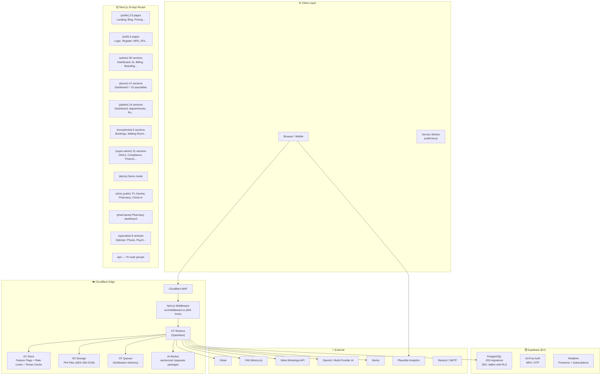
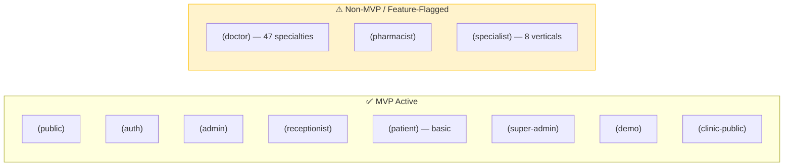
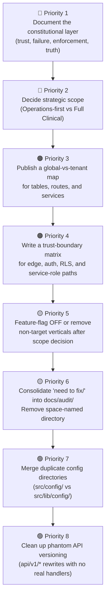

# Oltigo Health — Full Architecture Analysis & Conflict Map

> **Scanned:** Every directory and key file in the repository.
> **Purpose:** High-level structure summary + identification of old/new architecture overlaps and conflicts.

---

## 1. High-Level Architecture Diagram

---

## 2. Directory Structure Map

### Root Level

| Path                                                      | Type         | Purpose                                                   |
| --------------------------------------------------------- | ------------ | --------------------------------------------------------- |
| [src/](file:///c:/webs-alots/src)                         | Core         | Application source code                                   |
| [docs/](file:///c:/webs-alots/docs)                       | Docs         | 60+ operational documents, runbooks, SOPs, compliance     |
| [supabase/](file:///c:/webs-alots/supabase)               | DB           | 203 migrations, seeds, edge functions, tests              |
| [infra/](file:///c:/webs-alots/infra)                     | IaC          | 14 Terraform files (DNS, KV, R2, Queues, Routes)          |
| [workers/](file:///c:/webs-alots/workers)                 | Edge         | Separate AI worker (own package.json)                     |
| [scripts/](file:///c:/webs-alots/scripts)                 | Ops          | 44 scripts (seed, backup, checks, deploy, chaos)          |
| [e2e/](file:///c:/webs-alots/e2e)                         | Test         | 30 Playwright E2E specs                                   |
| [evals/](file:///c:/webs-alots/evals)                     | AI           | AI evaluation harness (schemas, runners, test-cases)      |
| [k6/](file:///c:/webs-alots/k6)                           | Perf         | K6 load test scripts                                      |
| [.github/](file:///c:/webs-alots/.github)                 | CI           | 16 GitHub Actions workflows                               |
| [.storybook/](file:///c:/webs-alots/.storybook)           | UI           | Storybook config                                          |
| **[need to fix/](file:///c:/webs-alots/need%20to%20fix)** | ⚠️ **Audit** | **11 audit reports parked outside the project structure** |

### Source Code (`src/`)

| Path                                                    | Contents                          | Scale                                           |
| ------------------------------------------------------- | --------------------------------- | ----------------------------------------------- |
| [src/app/](file:///c:/webs-alots/src/app)               | App Router: 17 route groups + API | 11 role-based route groups, 70 API route groups |
| [src/components/](file:///c:/webs-alots/src/components) | UI components                     | 36 component directories + 23 standalone files  |
| [src/lib/](file:///c:/webs-alots/src/lib)               | Core library code                 | **118 files** + 18 subdirectories               |
| [src/modules/](file:///c:/webs-alots/src/modules)       | Feature modules                   | audit, vitals (+ \_\_tests\_\_)                 |
| [src/types/](file:///c:/webs-alots/src/types)           | Type declarations                 | 5 `.d.ts` files (database.ts is **356 KB**)     |
| [src/config/](file:///c:/webs-alots/src/config)         | App config                        | agent.config.ts, specialist-registry.ts         |
| [src/locales/](file:///c:/webs-alots/src/locales)       | i18n                              | fr.json, en.json, ar.json                       |
| [src/content/](file:///c:/webs-alots/src/content)       | Blog                              | MDX blog posts                                  |

---

## 3. The Two Architectures — Where They Overlap & Conflict

The codebase contains two coexisting visions that are in tension:

That said, the repository has also evolved a **third, deeper layer** that the original "Lane A vs. Lane B" framing misses:

- A **guardrail-heavy distributed monolith** where architecture is enforced in runtime code, SQL/RLS, infra config, CI guards, and pgTAP tests at the same time.
- A system whose deepest invariants are often expressed as **things that must never happen**, not just happy-path flows.
- A platform with **distributed truth**, where multiple files are intentionally authoritative for different parts of the same behavior and sync tests keep them aligned.

### 🟢 Architecture A: "Operations-Only Managed SaaS" (The Target)

The MVP scope document ([MVP_SCOPE.md](file:///c:/webs-alots/MVP_SCOPE.md)) and Product Focus Map ([PRODUCT_FOCUS_MAP.md](file:///c:/webs-alots/docs/PRODUCT_FOCUS_MAP.md)) describe Oltigo as a **managed-site + operations platform**:

- Public clinic website + booking
- Receptionist dashboard (scheduling, walk-ins)
- WhatsApp reminders
- Admin branding & analytics
- Super-admin tenant management
- CMI/Stripe payments + subscriptions
- AI for operations (smart reminders, FAQ bot, internal AI team)

### 🔴 Architecture B: "Full Clinical EMR Platform" (The Legacy/Expanded)

The actual codebase is a **full-blown clinical platform** with deep PHI handling:

- 47 specialty sub-dashboards for doctors (cardiology, dermatology, IVF, dialysis, psychiatry...)
- Radiology (DICOM viewer, image uploads to R2)
- Prescriptions, vitals streaming, clinical encounters
- Insurance claims processing
- Patient timeline & medical history export
- Dental odontogram, prosthetic orders
- Restaurant/hospitality vertical
- Veterinary/pet profiles vertical

---

## 4. Conflict & Overlap Map

> [!CAUTION]
> These are the specific areas where the two architectures clash. Each needs a deliberate decision.

### 4.1. Route Groups — Active vs. Aspirational

| Route Group                    | Status                       | Conflict                                                                                                                                                                    |
| ------------------------------ | ---------------------------- | --------------------------------------------------------------------------------------------------------------------------------------------------------------------------- |
| `(doctor)` — 47 subdirectories | ⚠️ **Massive scope creep**   | Contains full specialty modules (cardiology, dialysis, IVF, psychiatry, urology…). These are clinical/PHI-handling dashboards that contradict the "operations-only" target. |
| `(specialist)` — 8 verticals   | ⚠️ Feature-flagged but built | Nutritionist, optician, physiotherapist, psychologist, speech-therapist, radiology, parapharmacy, equipment. Full layout shells exist.                                      |
| `(pharmacist)`                 | ⚠️ Non-MVP                   | Separate role and layout for pharmacy workflows.                                                                                                                            |
| `(clinic-public)/dentist`      | ⚠️ Specialty-specific        | Dentist-specific public pages under `clinic-public`.                                                                                                                        |

### 4.2. API Routes — Core vs. Clinical/Non-MVP

| API Route Group                                  | Status                         | Notes                                                             |
| ------------------------------------------------ | ------------------------------ | ----------------------------------------------------------------- |
| `api/booking`, `api/appointments`                | ✅ Core                        | MVP booking flow                                                  |
| `api/auth`, `api/admin`, `api/super-admin`       | ✅ Core                        | Auth & management                                                 |
| `api/notifications`, `api/webhooks`              | ✅ Core                        | WhatsApp + Stripe webhooks                                        |
| `api/payments`, `api/billing`, `api/invoices`    | ✅ Core                        | Revenue pipeline                                                  |
| `api/cron/` (23 cron jobs)                       | ✅ Core                        | Operational automation                                            |
| `api/vitals`, `api/vitals/stream`                | 🔴 **Clinical PHI**            | Real-time vitals — full EMR territory                             |
| `api/radiology/*`                                | 🔴 **Clinical PHI**            | Radiology orders, uploads, PDF reports                            |
| `api/prescriptions`                              | 🔴 **Clinical PHI**            | Prescription management                                           |
| `api/insurance-claims`                           | 🔴 **Clinical PHI**            | Insurance claim processing                                        |
| `api/admissions`                                 | 🔴 **Clinical PHI**            | ADT (admit-discharge-transfer)                                    |
| `api/restaurant-orders`, `api/restaurant-tables` | 🟡 **Non-healthcare vertical** | Restaurant vertical                                               |
| `api/pets`                                       | 🟡 **Non-healthcare vertical** | Veterinary pets                                                   |
| `api/menus`                                      | 🟡 **Non-healthcare vertical** | Restaurant menus                                                  |
| `api/copilotkit`                                 | 🟡 AI experimental             | CopilotKit integration                                            |
| `api/v1/*`                                       | ⚠️ **Phantom versioning**      | Just rewrites to unversioned handlers — no real v1 implementation |

### 4.3. Library Layer — Dual Identity

| Library File/Module                                                                            | Architecture A                   | Architecture B                                                                        | Conflict                                                            |
| ---------------------------------------------------------------------------------------------- | -------------------------------- | ------------------------------------------------------------------------------------- | ------------------------------------------------------------------- |
| [src/lib/r2.ts](file:///c:/webs-alots/src/lib/r2.ts) (24 KB)                                   | File uploads for clinic branding | **PHI-encrypted medical file storage**                                                | Stores both operational and clinical files in the same bucket logic |
| [src/lib/encryption.ts](file:///c:/webs-alots/src/lib/encryption.ts)                           | Not needed for ops-only          | AES-256-GCM PHI encryption                                                            | Would be unnecessary overhead if clinical modules are disabled      |
| [src/lib/phi-field-encryption.ts](file:///c:/webs-alots/src/lib/phi-field-encryption.ts)       | Not needed                       | Column-level PHI encryption                                                           | Pure clinical concern                                               |
| [src/lib/phi-compliance.ts](file:///c:/webs-alots/src/lib/phi-compliance.ts)                   | Not needed                       | PHI compliance checks                                                                 | Pure clinical concern                                               |
| [src/lib/strip-exif.ts](file:///c:/webs-alots/src/lib/strip-exif.ts)                           | Not needed                       | EXIF stripping from medical images                                                    | Pure clinical concern                                               |
| [src/lib/data/specialists.ts](file:///c:/webs-alots/src/lib/data/specialists.ts) (52 KB)       | Not needed                       | Full specialist data layer                                                            | Largest data file; no MVP use                                       |
| [src/lib/super-admin-actions.ts](file:///c:/webs-alots/src/lib/super-admin-actions.ts) (65 KB) | Partial (tenant mgmt)            | Full (clinical admin)                                                                 | **Largest lib file** — mixes operational and clinical admin actions |
| [src/lib/env.ts](file:///c:/webs-alots/src/lib/env.ts) (59 KB)                                 | ~30% needed                      | 100% used                                                                             | Monolithic env validation covering every feature                    |
| [src/lib/whatsapp/](file:///c:/webs-alots/src/lib/whatsapp)                                    | Reminders only                   | **Full conversational booking** via WhatsApp (state machine, voice pipeline, consent) | The WhatsApp layer is far beyond simple reminders                   |
| [src/lib/ai/](file:///c:/webs-alots/src/lib/ai) (30 files)                                     | Basic FAQ bot                    | Full AI team, RAG, embeddings, triage, streaming chat, tools, memory, tracing         | Enormous AI surface for a clinic operations tool                    |
| [src/modules/vitals/](file:///c:/webs-alots/src/modules/vitals)                                | Not needed                       | Real-time vitals streaming                                                            | Pure clinical                                                       |

### 4.4. Database — Schema Sprawl

| Migration Range | Theme                                                                             | Architecture                                   |
| --------------- | --------------------------------------------------------------------------------- | ---------------------------------------------- |
| `00001–00030`   | Core schema, auth, RLS, booking                                                   | ✅ A (Operations)                              |
| `00009–00015`   | Clinic types, specialty modules, para-medical, diagnostic, pharmacy, equipment    | 🔴 B (Clinical)                                |
| `00061–00064`   | **Veterinary vertical**, **Restaurant vertical**, pet profiles, restaurant tables | 🟡 Non-healthcare                              |
| `00086`         | Drop legacy restaurant RLS                                                        | 🧹 Cleanup of non-MVP                          |
| `00106–00120`   | AI: support AI, receptionist AI, billing AI, doctor AI, clinical encounters, CDSS | 🔴 B (Clinical AI)                             |
| `00143–00203`   | Mixed fixes, booking improvements, compliance, document extraction                | Mixed A+B                                      |
| `00187`         | `drop_clinical_emr_surface.sql`                                                   | 🧹 **Explicit removal of clinical EMR tables** |
| `00188`         | `remove_demo_tenant.sql`                                                          | 🧹 Cleanup                                     |

> [!IMPORTANT]
> Migration `00187_drop_clinical_emr_surface.sql` **intentionally drops clinical EMR tables**, signaling a move toward Architecture A. But many API routes and components still reference those surfaces. This is a live conflict.

### 4.5. Components — Bloat vs. Core

| Component Group                                | Status      | Scale                                                                              |
| ---------------------------------------------- | ----------- | ---------------------------------------------------------------------------------- |
| `components/ui/`                               | ✅ Core     | 48 primitives (button, dialog, table, toast...) + Storybook stories                |
| `components/layouts/`                          | ⚠️ Mixed    | 13 layout shells — many are specialist/non-MVP (equipment, pharmacist, specialist) |
| `components/landing/`, `components/marketing/` | ✅ Core     | Public site                                                                        |
| `components/booking/`, `components/schedule/`  | ✅ Core     | Booking flow                                                                       |
| `components/dental/`, `components/dental-lab/` | 🔴 Clinical | Dental-specific (odontogram, lab orders)                                           |
| `components/dialysis/`                         | 🔴 Clinical | Dialysis session management                                                        |
| `components/ivf/`                              | 🔴 Clinical | IVF cycle tracking                                                                 |
| `components/medical/`                          | 🔴 Clinical | Clinical components                                                                |
| `components/para-medical/`                     | 🔴 Clinical | Para-medical specialty                                                             |
| `components/polyclinic/`                       | 🔴 Clinical | Multi-department clinic                                                            |

### 4.6. Infrastructure & Config Conflicts

| Item                                                                                | Conflict                                                                                                                                                       |
| ----------------------------------------------------------------------------------- | -------------------------------------------------------------------------------------------------------------------------------------------------------------- |
| **[wrangler.toml](file:///c:/webs-alots/wrangler.toml) (27 KB)**                    | Massive config — includes cron triggers, KV bindings, R2 buckets, queue consumers for both operational and clinical features                                   |
| **[worker-cron-handler.ts](file:///c:/webs-alots/worker-cron-handler.ts) (12 KB)**  | Top-level cron handler dispatching 23 cron jobs — mixes operational automation, billing, compliance retention, and platform maintenance in one control surface |
| **[next.config.ts](file:///c:/webs-alots/next.config.ts)**                          | `PROTECTED_ROUTE_PREFIXES` lists 14 specialist paths (pharmacist, nutritionist, optician, etc.) — routes that don't exist in the MVP target                    |
| **[sentry.server.config.ts](file:///c:/webs-alots/sentry.server.config.ts) (9 KB)** | Configured to capture errors from ALL modules including clinical                                                                                               |
| **`api/v1/` rewrites**                                                              | Phantom API versioning — rewrites `/api/v1/*` to `/api/*` with no real v1 handlers                                                                             |

### 4.7. The "need to fix" Directory

| File                                                                                               | Topic                                                 |
| -------------------------------------------------------------------------------------------------- | ----------------------------------------------------- |
| [audit_report.md](file:///c:/webs-alots/need%20to%20fix/audit_report.md)                           | General audit findings                                |
| [supabase_audit_report.md](file:///c:/webs-alots/need%20to%20fix/supabase_audit_report.md) (32 KB) | Supabase-specific issues                              |
| [infra_audit_report.md](file:///c:/webs-alots/need%20to%20fix/infra_audit_report.md) (24 KB)       | Infrastructure audit                                  |
| [workers_audit.md](file:///c:/webs-alots/need%20to%20fix/workers_audit.md) (19 KB)                 | Workers audit                                         |
| [evals-audit.md](file:///c:/webs-alots/need%20to%20fix/evals-audit.md) (31 KB)                     | AI evals audit                                        |
| + 6 more                                                                                           | e2e, scripts, storybook, k6, github, public directory |

> [!WARNING]
> The `need to fix/` directory (with a space in the name) contains 11 audit reports totaling **~135 KB** parked outside any proper documentation structure. These should be consolidated into `docs/audit/` and the directory removed.

---

## 5. The Hidden Architecture: Constitutional Guardrails

The strongest architectural property in this repo is not visible from route groups alone.

Oltigo behaves like a **constitutional system**: whenever the platform depends on a subtle invariant, there is often a matching runtime assertion, SQL test, CI guard, or infra constraint pinning it in place.

This matters because the repo's true architecture is not just "what modules exist," but **what the system refuses to allow**.

### 5.1. Executable Governance Layer

| Invariant                                                                                   | Where It Is Enforced                                                                                                                                                                                                                                                       | Why It Matters                                                                                    |
| ------------------------------------------------------------------------------------------- | -------------------------------------------------------------------------------------------------------------------------------------------------------------------------------------------------------------------------------------------------------------------------- | ------------------------------------------------------------------------------------------------- |
| Every API mutation must visibly reference `clinic_id` unless explicitly allowlisted         | [`scripts/check-tenant-scoping.mjs`](file:///c:/webs-alots/scripts/check-tenant-scoping.mjs), [`.github/workflows/ci.yml`](file:///c:/webs-alots/.github/workflows/ci.yml)                                                                                                 | Tenant scoping is treated as a machine-checkable architectural rule, not a code-review preference |
| `FORCE ROW LEVEL SECURITY` must never be enabled on `public` tables                         | [`docs/adr/0011-no-force-rls.md`](file:///c:/webs-alots/docs/adr/0011-no-force-rls.md), [`supabase/tests/no_force_rls.test.sql`](file:///c:/webs-alots/supabase/tests/no_force_rls.test.sql), [`.github/workflows/ci.yml`](file:///c:/webs-alots/.github/workflows/ci.yml) | The tenant layer intentionally depends on carefully constrained `SECURITY DEFINER` escape hatches |
| Every cron route must authenticate with `verifyCronSecret()`                                | [`scripts/check-cron-auth.ts`](file:///c:/webs-alots/scripts/check-cron-auth.ts), [`src/lib/cron-auth.ts`](file:///c:/webs-alots/src/lib/cron-auth.ts)                                                                                                                     | Cron routes are CSRF-exempt and therefore treated as a distinct security protocol                 |
| `wrangler.toml` cron expressions and `worker-cron-handler.ts` routing map must stay in sync | [`src/lib/__tests__/cron-schedule-sync.test.ts`](file:///c:/webs-alots/src/lib/__tests__/cron-schedule-sync.test.ts)                                                                                                                                                       | Cron behavior has intentionally distributed truth that must be pinned by tests                    |
| Egress-sensitive integrations must use `safeFetch()` instead of raw `fetch()`               | [`scripts/check-egress-safefetch.mjs`](file:///c:/webs-alots/scripts/check-egress-safefetch.mjs), [`src/lib/fetch-wrapper.ts`](file:///c:/webs-alots/src/lib/fetch-wrapper.ts)                                                                                             | Third-party outbound traffic is centralized behind an allowlist/audit choke-point                 |
| `MVP_SCOPE.md` must only name symbols that still exist in code                              | [`scripts/check-mvp-scope-refs.mjs`](file:///c:/webs-alots/scripts/check-mvp-scope-refs.mjs)                                                                                                                                                                               | Scope-control docs are treated as audit-facing interfaces, not informal prose                     |
| Cross-tenant validation inside security-definer booking RPCs must remain intact             | [`supabase/tests/booking_atomic_insert.test.sql`](file:///c:/webs-alots/supabase/tests/booking_atomic_insert.test.sql)                                                                                                                                                     | Some multi-tenant safety rules live in SQL functions, not app handlers                            |

### 5.2. Negative Architecture Register

These are the repo's strongest "never-events":

- Never trust inbound tenant headers. Middleware strips all forwarded tenant headers plus the legacy `x-clinic-id`.
- Never trust inbound auth profile headers without an HMAC signature and freshness window.
- Never allow cron routes without bearer-secret authentication.
- Never allow raw egress from sensitive integration modules.
- Never enable `FORCE ROW LEVEL SECURITY` on the public schema.
- Never let security-definer tenant validation silently weaken in booking flows.

This "negative architecture" is more structurally important than many visible features.

---

## 6. Trust Boundary Matrix

The repo does **not** operate with one simple trust model. It has several trust boundaries, each with a different source of truth:

| Boundary                             | Trusted Signal                                                                                                                       | Distrusted Signal                             | Notes                                                                                 |
| ------------------------------------ | ------------------------------------------------------------------------------------------------------------------------------------ | --------------------------------------------- | ------------------------------------------------------------------------------------- |
| Public tenant discovery              | Subdomain -> [`public_clinic_directory`](file:///c:/webs-alots/src/lib/middleware/subdomain-resolution.ts) via anon Supabase + cache | Any inbound tenant header                     | Public resolution is intentionally narrowed and cacheable                             |
| Authenticated route auth context     | Middleware-signed `x-auth-profile-*` headers or fallback DB profile lookup                                                           | Unsigned/forged profile headers               | This is an internal security protocol, not just a perf optimization                   |
| Anonymous/public tenant-scoped RLS   | `x-clinic-id` on explicitly created tenant/anon clients                                                                              | Client-supplied root-request headers          | Header-based scoping exists, but only after middleware/server code derives the tenant |
| Authenticated tenant-scoped RLS      | `get_user_clinic_id()` from the caller's own `users` row                                                                             | Request header as authenticated tenant source | Migration `00201` explicitly hardens authenticated RLS away from header trust         |
| Cross-tenant/admin/system operations | Service role or scoped admin client + explicit audit labels                                                                          | Implicit trust in bypassed RLS                | The app accepts privileged islands, but labels and wrappers them explicitly           |

### 6.1. Why This Matters

The document should model **who is trusted for what**, not just say "tenant isolation exists."

The real architecture is:

- **Subdomain-derived tenant identity** at the edge
- **Signed internal auth-context propagation** between middleware and handlers
- **JWT-derived clinic identity** for authenticated RLS
- **Explicit service-role exceptions** for platform-level and cross-tenant control-plane work

---

## 7. Failure Semantics Matrix

The system does not have one universal failure posture. It uses a **failure-policy lattice**:

| Subsystem                                     | Default Behavior                                 | Failure Mode                                                                                                      |
| --------------------------------------------- | ------------------------------------------------ | ----------------------------------------------------------------------------------------------------------------- |
| `withAuth()` tenant context                   | Fail closed on unexpected tenant-context failure | Returns `503` if tenant context cannot be established and the failure is not the expected permission-denied case  |
| `setTenantContext()` on authenticated clients | Expected permission denial is tolerated          | Permission-denied is a typed, non-fatal branch because the service-role-only RPC is not supposed to succeed there |
| Rate limiting                                 | Mixed                                            | Some limiters fail closed, some degrade to in-memory fallback, some have grace windows before hard denial         |
| Global AI kill switch                         | Mixed / fail-open                                | `AI_DISABLED=true` disables immediately, but missing/broken KV defaults to enabled for backward compatibility     |
| AI feature gating                             | Opt-in, not fail-closed                          | Unknown `feature_key` values are allowed; toggle-load failure defaults to "no explicit block"                     |
| OpenNext R2 incremental cache                 | Deploy gated                                     | Request-time missing binding is tolerated, but deploy-time missing binding hard-fails unless feature-gated        |
| Sign-out                                      | Graceful                                         | Sign-out always redirects even if the logout API call fails                                                       |

### 7.1. Subtle But Important Pattern

One of the most interesting hidden properties is that **controlled failure is part of the design**:

- `set_tenant_context()` is intentionally restricted to `service_role`
- authenticated clients are expected to hit permission denial there
- the application treats that denial as a normal branch, not as an outage

That is a non-obvious architectural decision and should be documented as such.

---

## 8. Global vs. Tenant Surfaces

This is not a purely tenant-scoped app. It contains explicit **platform-global islands** inside a tenant-scoped system.

### 8.1. Platform-Global by Design

| Surface                                                 | Why It Is Global                                                     |
| ------------------------------------------------------- | -------------------------------------------------------------------- |
| `ai_provider_configs`                                   | AI provider routing is a platform control-plane concern              |
| `ai_feature_toggles`                                    | Feature gating applies across the platform, not per clinic           |
| `ai_task_configs`                                       | Model/task pinning is managed centrally                              |
| `ai_usage_logs`                                         | AI governance and cost visibility are platform-level                 |
| `uptime_events`                                         | Infrastructure monitoring is intentionally cross-tenant              |
| `document_templates`                                    | Shared template catalog managed by super-admin                       |
| `demo_leads` / onboarding surfaces                      | Prospects are not tenants yet                                        |
| Team/support briefings and some internal admin datasets | These are site-team/platform operations, not clinic-owned PHI tables |

### 8.2. Tenant-Scoped by Design

- Core clinics/users/appointments/payments/patient data
- Most PHI-bearing tables
- Clinic-admin operational surfaces
- Public clinic content once a tenant has been resolved

### 8.3. Architectural Consequence

The real boundary is not simply "multi-tenant everywhere."

It is:

- **tenant data by default**
- **platform-global exceptions by explicit design**
- **each exception should be justified and named**

This deserves its own map in the architecture, not scattered comments.

---

## 9. Runtime Phase Model

The repo has a real **phase-specific runtime model** that affects correctness:

| Phase                 | Key Constraint                                                                                            |
| --------------------- | --------------------------------------------------------------------------------------------------------- |
| Build time            | Some bindings/context are unavailable; code must not assume Worker env on module init                     |
| Deploy time           | Certain OpenNext features, especially incremental cache wiring, can fail hard if infra is not provisioned |
| Request time          | Cloudflare bindings must be resolved from request-scoped OpenNext context, not `globalThis`               |
| Worker isolate time   | In-memory caches and counters are isolate-local and can disappear on cold start                           |
| Cross-isolate runtime | KV, R2, queues, and DB-backed counters are needed when truth must survive isolate churn                   |
| DB/RLS time           | Authenticated and anonymous tenant scoping use different signals and helper functions                     |

### 9.1. Concrete Examples

- [`src/lib/cf-bindings.ts`](file:///c:/webs-alots/src/lib/cf-bindings.ts) exists because Cloudflare bindings are request-scoped under OpenNext.
- [`open-next.config.ts`](file:///c:/webs-alots/open-next.config.ts) gates R2 incremental cache because request-time and deploy-time behavior differ.
- [`src/lib/rate-limit.ts`](file:///c:/webs-alots/src/lib/rate-limit.ts) explicitly distinguishes distributed backends from in-memory fallback because isolate-local truth is not enough in production.

This is a core architectural concern, not an implementation footnote.

---

## 10. Distributed Truth Map

The repo repeatedly chooses **synchronized multi-source truth** instead of one canonical file:

| Concern                     | Source A                                               | Source B                                                                 | Sync Mechanism                                                                                     |
| --------------------------- | ------------------------------------------------------ | ------------------------------------------------------------------------ | -------------------------------------------------------------------------------------------------- |
| Cron schedules              | [`wrangler.toml`](file:///c:/webs-alots/wrangler.toml) | [`worker-cron-handler.ts`](file:///c:/webs-alots/worker-cron-handler.ts) | [`cron-schedule-sync.test.ts`](file:///c:/webs-alots/src/lib/__tests__/cron-schedule-sync.test.ts) |
| Scope-control documentation | [`MVP_SCOPE.md`](file:///c:/webs-alots/MVP_SCOPE.md)   | Actual code symbols/files                                                | [`check-mvp-scope-refs.mjs`](file:///c:/webs-alots/scripts/check-mvp-scope-refs.mjs)               |
| Tenant safety               | App code wrappers                                      | SQL/RLS helpers + pgTAP                                                  | CI + SQL tests                                                                                     |
| AI routing                  | DB tables/config                                       | Runtime router/provider code                                             | Runtime loading + tests/guards                                                                     |

The document should stop implying that one file alone is authoritative for everything.

The architecture is better described as **distributed truth with synchronization guards**.

---

## 11. Validation / Type System Overlap

| Layer       | Old Pattern                                                                                                                                                                      | New Pattern                                                                                                    | Conflict                                                                                                                                                            |
| ----------- | -------------------------------------------------------------------------------------------------------------------------------------------------------------------------------- | -------------------------------------------------------------------------------------------------------------- | ------------------------------------------------------------------------------------------------------------------------------------------------------------------- |
| Validations | [src/lib/validations.ts](file:///c:/webs-alots/src/lib/validations.ts) (single file barrel)                                                                                      | [src/lib/validations/](file:///c:/webs-alots/src/lib/validations) (27 schema files by domain)                  | Both exist — the barrel file and the directory. The barrel is a re-export hub but could confuse imports.                                                            |
| Types       | [src/lib/types/database.ts](file:///c:/webs-alots/src/lib/types/database.ts) (356 KB) + [database-extended.ts](file:///c:/webs-alots/src/lib/types/database-extended.ts) (21 KB) | Per-domain types in route handlers                                                                             | The 356 KB auto-generated Supabase types file includes types for ALL tables (clinical + operational + restaurant + veterinary). Schema reduction would shrink this. |
| Config      | [src/config/](file:///c:/webs-alots/src/config) (clinic-types, pricing, verticals)                                                                                               | [src/lib/config/](file:///c:/webs-alots/src/lib/config) (clinic-types, pricing, subscription-plans, verticals) | **Two config directories** at different paths with overlapping concerns                                                                                             |

---

## 12. Scale & Complexity Summary

| Metric                     | Count                                                                             |
| -------------------------- | --------------------------------------------------------------------------------- |
| Route groups (app router)  | 17 (12 role-based + api + api-docs + auth + booking + .well-known + unauthorized) |
| API route groups           | **70**                                                                            |
| Cron jobs                  | **23**                                                                            |
| Database migrations        | **203**                                                                           |
| `src/lib/` files           | **118 files + 18 subdirectories**                                                 |
| AI library files           | **30** (in `src/lib/ai/` alone)                                                   |
| Components directories     | **36**                                                                            |
| UI primitives              | **48**                                                                            |
| Layout shells              | **13**                                                                            |
| Specialist types           | **7** (nutritionist, optician, parapharmacy, physio, psych, speech, radiology)    |
| Doctor sub-dashboards      | **47**                                                                            |
| E2E test specs             | **30**                                                                            |
| CI workflows               | **16**                                                                            |
| Scripts                    | **44**                                                                            |
| Env vars (in .env.example) | ~100+                                                                             |
| i18n locales               | 3 (fr, en, ar)                                                                    |

---

## 13. Recommended Cleanup Priorities

> [!IMPORTANT]
> **The biggest missing piece is no longer just a lane decision.**
>
> The document now needs to capture:
>
> - what the system trusts
> - what failures are acceptable
> - which invariants are constitutional
> - where truth is intentionally duplicated
> - which global surfaces are exempt from tenant scoping by design
>
> The strategic scope decision still matters, but the repo's deeper governing logic must be documented first or the architecture will continue to look flatter than it really is.
