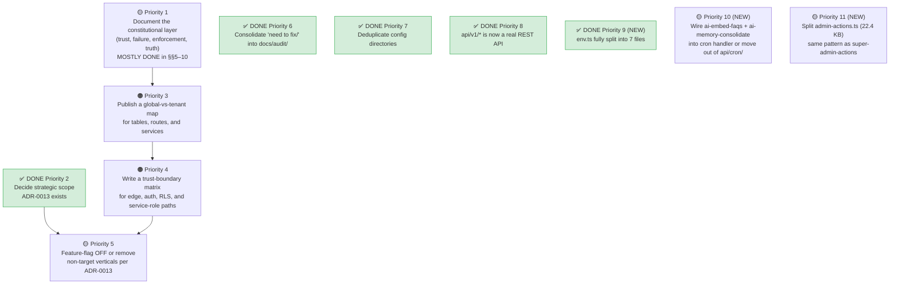

# Architecture Analysis Audit — Corrections & Missing Items

> **Historical analysis note:** This file is an analysis/correction document, not the living architecture source of truth.
> Use `docs/architecture.md`, `docs/architecture/`, and `docs/adr/` first.
>
> **Audited:** [`project_architecture_analysis(2).md`](<./project_architecture_analysis(2).md>) against the **live codebase** at `c:\webs-alots`.
> **Date:** 2026-07-06

---

## Summary Verdict

The document is **~85% accurate** — it captures the product definition, role model, constitutional guardrails, and most structural facts correctly. However, several numeric claims are stale, a major `env.ts` refactor was completed beyond what the document describes, a few files/features exist in the project that the document never mentions, and **ADR-0013** now exists (making the "scope decision is still open" framing partially obsolete). Below is every discrepancy found, followed by the missing items.

---

## Part 1 — Corrections (Document Claims vs. Reality)

### 🔴 Factual Errors (Wrong Numbers / Wrong Descriptions)

| § in Doc                   | Claim                                                        | Actual (verified)                                                                                                                                                                                                                                                                        | Severity        |
| -------------------------- | ------------------------------------------------------------ | ---------------------------------------------------------------------------------------------------------------------------------------------------------------------------------------------------------------------------------------------------------------------------------------- | --------------- |
| §1 diagram, §4.6           | `middleware.ts` = **671 lines**                              | **616 lines** (30.6 KB)                                                                                                                                                                                                                                                                  | 🟡 Stale        |
| §4.6                       | `worker-cron-handler.ts` = **16 KB / 324 lines**             | **12.9 KB / 300 lines**                                                                                                                                                                                                                                                                  | 🟡 Stale        |
| §4.6                       | `wrangler.toml` = **28 KB / 560 lines**                      | **27.8 KB / 514 lines**                                                                                                                                                                                                                                                                  | 🟡 Stale        |
| Correction table (line 39) | `env.ts` = **"Now 24 KB / 574 lines"**                       | **9.2 KB / 226 lines** — a much deeper split happened. `env-getters-core.ts` (3.3 KB), `env-getters-integrations.ts` (5.9 KB), `env-getters-observability.ts` (2.1 KB), and `env-flags.ts` (4 KB) were ALL extracted. The document only mentions `env-startup.ts` + `env-validation.ts`. | 🔴 **Major**    |
| §4.3                       | `env.ts` = **"24 KB / 574 lines"** (repeated)                | Same as above — **9.2 KB / 226 lines**                                                                                                                                                                                                                                                   | 🔴 **Major**    |
| Correction table (line 38) | `super-admin-actions.ts` = **"12 KB / 346 lines"**           | **10.1 KB / 289 lines**                                                                                                                                                                                                                                                                  | 🟡 Stale        |
| Correction table (line 37) | `database.ts` = **"~340 KB / 12,146 lines"**                 | **348 KB / 11,906 lines**                                                                                                                                                                                                                                                                | 🟡 Minor        |
| §4.3                       | `data/specialists.ts` = **52 KB**                            | **51 KB**                                                                                                                                                                                                                                                                                | ✅ Close enough |
| §2, §12                    | `src/lib/` = **"119 top-level files + 20 subdirectories"**   | **124 top-level files + 19 subdirectories**                                                                                                                                                                                                                                              | 🟡 Stale        |
| §12                        | `sentry.server.config.ts` = **9 KB**                         | **9.1 KB**                                                                                                                                                                                                                                                                               | ✅ OK           |
| §12                        | Scripts = **44**                                             | **45**                                                                                                                                                                                                                                                                                   | 🟡 Off by 1     |
| §12                        | Specialist types = **7** (lists them)                        | **8** (missing `equipment` from the count, though `equipment` IS mentioned in §15.8 table)                                                                                                                                                                                               | 🟡 Inconsistent |
| §4.2, §4.6                 | Cron: **"21 cron jobs via 12 triggers"**                     | **21 dispatched routes via 12 triggers** ✅ confirmed — BUT there are now **23 cron route directories** under `api/cron/`. 2 additional dirs (`ai-embed-faqs`, `ai-memory-consolidate`) exist as API routes but are **NOT wired** into `worker-cron-handler.ts` CRON_ROUTES.             | 🟠 Gap          |
| §13, §14.5                 | **"The scope decision (D2) is still the biggest open call"** | **ADR-0013 (`docs/adr/0013-operations-first-scope.md`) now exists**, meaning the decision HAS been taken. The document's framing of D2 as unresolved is stale.                                                                                                                           | 🔴 **Major**    |

---

### 🟡 Stale / Incomplete Descriptions

| § in Doc               | Issue                                                                                                 | Correction                                                                                                                                                                                                                                                                                                                                                                                                                                                                                      |
| ---------------------- | ----------------------------------------------------------------------------------------------------- | ----------------------------------------------------------------------------------------------------------------------------------------------------------------------------------------------------------------------------------------------------------------------------------------------------------------------------------------------------------------------------------------------------------------------------------------------------------------------------------------------- |
| §4.3, correction table | The `env.ts` split is described as extracting only `env-startup.ts` + `env-validation.ts`             | **4 additional files** were also extracted: [env-getters-core.ts](file:///c:/webs-alots/src/lib/env-getters-core.ts), [env-getters-integrations.ts](file:///c:/webs-alots/src/lib/env-getters-integrations.ts), [env-getters-observability.ts](file:///c:/webs-alots/src/lib/env-getters-observability.ts), [env-flags.ts](file:///c:/webs-alots/src/lib/env-flags.ts). The split is **far more complete** than documented — `env.ts` is now a thin 226-line hub, not a 574-line partial split. |
| §2, root table         | `docs/` described as **"60+ operational documents"**                                                  | Actually **133 files** across 9 subdirectories (60 top-level + 13 ADRs + 31 audit + 18 compliance + 5 runbooks + others). The count was off by 2×.                                                                                                                                                                                                                                                                                                                                              |
| §2, root table         | ADR directory not mentioned in root-level table                                                       | `docs/adr/` now contains **13 ADRs** (0001–0013), not just the `0011-no-force-rls.md` that gets cited. ADR-0013 is architecturally significant.                                                                                                                                                                                                                                                                                                                                                 |
| §4.2                   | Cron jobs described as "21 cron jobs via 12 triggers"                                                 | There are actually **23 cron API route directories**. The 2 extra (`ai-embed-faqs`, `ai-memory-consolidate`) are defined as routes but not in the dispatch map. This is either intentional (manually triggered) or an unwired gap.                                                                                                                                                                                                                                                              |
| §1 diagram             | Route groups listed as 17                                                                             | Actual directory count in `src/app/` = **17 subdirectories** ✅ BUT the document's categorization labels are inconsistent — it lists `(booking)` and `(auth)` as route groups in the diagram text but these are non-parenthesized dirs (`booking/`, `auth/`) in the actual filesystem, meaning they're NOT Next.js route groups.                                                                                                                                                                |
| §15.7                  | Pharmacist sections = 8: `dashboard, stock, expiry, orders, prescriptions, sales, suppliers, loyalty` | ✅ Matches exactly                                                                                                                                                                                                                                                                                                                                                                                                                                                                              |
| §9.1                   | References `src/lib/rate-limit.ts`                                                                    | File exists at 33.9 KB — this is a large file not called out in the scale summary. It should be noted as one of the bigger lib files.                                                                                                                                                                                                                                                                                                                                                           |

---

### ✅ Confirmed Accurate (Spot-Checked)

These claims from the document were **verified as correct**:

| Claim                                                                                                                                                        | Verified                                                                      |
| ------------------------------------------------------------------------------------------------------------------------------------------------------------ | ----------------------------------------------------------------------------- |
| 202 SQL migration files, numbered through 00203                                                                                                              | ✅ 202 files, last = `00203_search_path_fix_missing_security_definer_fns.sql` |
| 47 doctor subdirectories                                                                                                                                     | ✅ 47 dirs under `(doctor)/doctor/`                                           |
| 70 API route groups                                                                                                                                          | ✅ 70 directories under `src/app/api/`                                        |
| `src/config/` no longer exists                                                                                                                               | ✅ `False` — only `src/lib/config/`                                           |
| `src/lib/config/` files: agent.config.ts, capabilities.ts, clinic-types.ts, default-services.ts, pricing.ts, README.md, specialist-registry.ts, verticals.ts | ✅ Exact match                                                                |
| `src/types/` = 5 `.d.ts` shims (ai, lucide-react, qrcode-browser, swagger-ui-react, web-speech-api)                                                          | ✅ Exact match                                                                |
| `src/lib/types/` files: custom-fields.ts, database-extended.ts, database.ts, dental.ts, para-medical.ts                                                      | ✅ Exact match                                                                |
| 16 super-admin lib files in `src/lib/super-admin/`                                                                                                           | ✅ 16 files                                                                   |
| 48 UI primitives in `components/ui/`                                                                                                                         | ✅ 48 files                                                                   |
| 13 layout files in `components/layouts/`                                                                                                                     | ✅ 13 files                                                                   |
| 36 component directories                                                                                                                                     | ✅ 36 dirs                                                                    |
| 30 E2E specs                                                                                                                                                 | ✅ 30 specs                                                                   |
| 16 CI workflows                                                                                                                                              | ✅ 16 workflows                                                               |
| 11 Terraform files in `infra/`                                                                                                                               | ✅ 11 `.tf` files                                                             |
| 31 super-admin route sections                                                                                                                                | ✅ 31 dirs                                                                    |
| 8 specialist verticals (equipment, nutritionist, optician, parapharmacy, physiotherapist, psychologist, radiology, speech-therapist)                         | ✅ 8 dirs, exact names match                                                  |
| 31 docs/audit files                                                                                                                                          | ✅ 31 files                                                                   |
| 23 public pages                                                                                                                                              | ✅ 23 `page.tsx` files under `(public)`                                       |
| 6 auth pages                                                                                                                                                 | ✅ 6 dirs                                                                     |
| 39 admin sections                                                                                                                                            | ✅ 39 dirs                                                                    |
| 16 patient sections                                                                                                                                          | ✅ 16 dirs                                                                    |
| 6 receptionist sections                                                                                                                                      | ✅ 6 dirs                                                                     |
| `capabilities.ts` exists with test                                                                                                                           | ✅ Both exist                                                                 |
| `cron-schedule-sync.test.ts` exists                                                                                                                          | ✅ Exists                                                                     |
| 3 locales: fr.json, en.json, ar.json                                                                                                                         | ✅ Exact match                                                                |
| 33 AI library files                                                                                                                                          | ✅ 33 files                                                                   |
| WhatsApp lib files                                                                                                                                           | ✅ 6 files in `src/lib/whatsapp/`                                             |

---

## Part 2 — Missing Items (Things the Document Should Cover)

### 🔴 Critical Missing Items

#### M1. ADR-0013 Exists — Scope Decision Was Made

The document repeatedly frames the "Operations-first vs Full-Clinical" scope decision (§14.5, §16, §13 D2) as the **single biggest open question**. But [ADR-0013](file:///c:/webs-alots/docs/adr/0013-operations-first-scope.md) (`0013-operations-first-scope.md`) now exists in `docs/adr/`. The document should:

- Reference ADR-0013 as the authoritative scope decision
- Update D2 in §13 to ✅ DONE
- Update §14.5 to reflect the decision has been taken
- Update §16 to reference the ADR rather than proposing its creation

#### M2. The `env.ts` Split Is Actually 6 Files, Not 2

The document mentions `env-startup.ts` + `env-validation.ts` as the extracted files. In reality, **6 files** were extracted:

| File                                                                                       | Size                | Purpose                                          |
| ------------------------------------------------------------------------------------------ | ------------------- | ------------------------------------------------ |
| [env.ts](file:///c:/webs-alots/src/lib/env.ts)                                             | 9.2 KB / 226 lines  | Thin hub (down from 59 KB)                       |
| [env-startup.ts](file:///c:/webs-alots/src/lib/env-startup.ts)                             | 14.5 KB / 355 lines | Production hard-fail guards                      |
| [env-validation.ts](file:///c:/webs-alots/src/lib/env-validation.ts)                       | 14.4 KB / 383 lines | Rule registry + `validateEnv()`                  |
| [env-getters-core.ts](file:///c:/webs-alots/src/lib/env-getters-core.ts)                   | 3.3 KB              | Core env getters (Supabase, site URL)            |
| [env-getters-integrations.ts](file:///c:/webs-alots/src/lib/env-getters-integrations.ts)   | 5.9 KB              | Integration env getters (Stripe, WhatsApp, etc.) |
| [env-getters-observability.ts](file:///c:/webs-alots/src/lib/env-getters-observability.ts) | 2.1 KB              | Observability env getters (Sentry, analytics)    |
| [env-flags.ts](file:///c:/webs-alots/src/lib/env-flags.ts)                                 | 4 KB                | Feature flag env vars                            |

**Total extracted surface: ~44.2 KB across 6 satellite files**, leaving `env.ts` as a lightweight re-export hub. This is a **D8-class cleanup win** that should be documented as complete.

#### M3. Two Unwired Cron Routes

`ai-embed-faqs` and `ai-memory-consolidate` exist as route handlers under `src/app/api/cron/` but are **NOT** dispatched by `worker-cron-handler.ts` CRON_ROUTES. This means they either:

- Are manually triggered (not on a schedule) — in which case they shouldn't live under `api/cron/`
- Are unwired gaps that need to be added to the dispatch map + `wrangler.toml`

Either way, the document should flag them.

---

### 🟠 Important Missing Items

#### M4. `instrumentation.ts` Not Mentioned

[src/instrumentation.ts](file:///c:/webs-alots/src/instrumentation.ts) (11.4 KB) is a **significant infrastructure file** — Next.js instrumentation hook for server startup, OpenTelemetry setup, Sentry initialization, and startup validation. Not mentioned anywhere in the document.

#### M5. `scope-gate.ts` Not Mentioned

[src/lib/scope-gate.ts](file:///c:/webs-alots/src/lib/scope-gate.ts) (2.7 KB) exists — this is directly relevant to §16 (Scope Enforcement). The document proposes building scope enforcement, but this file already provides a runtime gate. Should be referenced.

#### M6. Large Files Not Catalogued

The document calls out large files like `env.ts`, `database.ts`, `super-admin-actions.ts`, `specialists.ts`, and `r2.ts`. But several other large files in `src/lib/` are missed:

| File                                                                             | Size    | Relevance                                                         |
| -------------------------------------------------------------------------------- | ------- | ----------------------------------------------------------------- |
| [rate-limit.ts](file:///c:/webs-alots/src/lib/rate-limit.ts)                     | 33.9 KB | Largest lib file after `database.ts` — 3-backend rate limiter     |
| [notifications.ts](file:///c:/webs-alots/src/lib/notifications.ts)               | 21.2 KB | Core notification orchestration                                   |
| [admin-actions.ts](file:///c:/webs-alots/src/lib/admin-actions.ts)               | 22.4 KB | Admin server actions — similar pattern to old super-admin-actions |
| [subscription-billing.ts](file:///c:/webs-alots/src/lib/subscription-billing.ts) | 18.8 KB | Subscription + billing logic                                      |
| [supabase-server.ts](file:///c:/webs-alots/src/lib/supabase-server.ts)           | 18.4 KB | Server-side Supabase client factory                               |
| [with-auth.ts](file:///c:/webs-alots/src/lib/with-auth.ts)                       | 18.7 KB | Auth wrapper (SEALED) — larger than documented                    |
| [auth.ts](file:///c:/webs-alots/src/lib/auth.ts)                                 | 19.6 KB | Auth core (SEALED)                                                |
| [cookie-consent.tsx](file:///c:/webs-alots/src/components/cookie-consent.tsx)    | 16.7 KB | Standalone component, unusually large                             |
| [notification-queue.ts](file:///c:/webs-alots/src/lib/notification-queue.ts)     | 15.1 KB | Queue processing logic                                            |
| [r2-cleanup.ts](file:///c:/webs-alots/src/lib/r2-cleanup.ts)                     | 15.1 KB | R2 lifecycle cleanup                                              |
| [env-startup.ts](file:///c:/webs-alots/src/lib/env-startup.ts)                   | 14.5 KB | Prod boot guards                                                  |
| [env-validation.ts](file:///c:/webs-alots/src/lib/env-validation.ts)             | 14.4 KB | Env validation rules                                              |
| [chatbot-data.ts](file:///c:/webs-alots/src/lib/chatbot-data.ts)                 | 14.3 KB | Chatbot training data                                             |
| [template-presets.ts](file:///c:/webs-alots/src/lib/template-presets.ts)         | 23.5 KB | Template preset definitions                                       |
| [globals.css](file:///c:/webs-alots/src/app/globals.css)                         | 22.2 KB | Global stylesheet                                                 |

> [!NOTE]
> `admin-actions.ts` (22.4 KB) may be a candidate for the same split treatment that was applied to `super-admin-actions.ts`. The document doesn't mention it at all.

#### M7. `modules/` Has 3 Entries, Not 2

The document (§2) says `src/modules/` contains `audit` + `vitals` + `__tests__`. That's actually 3 directories. The document lists only "audit (append-only), vitals (stream)" — `__tests__` should be acknowledged.

#### M8. Missing Root-Level Files

Several root-level configuration files are not mentioned in the document:

| File                                        | Purpose                                |
| ------------------------------------------- | -------------------------------------- |
| `.semgrep/`                                 | Semgrep static analysis rules          |
| `.gitleaks.toml` + `.gitleaksignore`        | Secret scanning config                 |
| `.husky/`                                   | Git hooks (pre-commit, etc.)           |
| `docker-compose.yml` (7.6 KB)               | Local dev environment                  |
| `r2-lifecycle.json` (2.3 KB)                | R2 bucket lifecycle rules              |
| `typedoc.json`                              | TypeDoc API documentation config       |
| `vitest.storybook.config.ts`                | Storybook-specific Vitest config       |
| `.vitest-coverage-floor.json`               | Coverage threshold enforcement         |
| `.i18n-coverage-baseline.json`              | i18n translation coverage baseline     |
| `.knip-baseline` + `.knip-exports-baseline` | Dead code detection baselines          |
| `.translation-empty-baseline`               | Empty translation tracking             |
| `knip.json`                                 | Knip (dead code) configuration         |
| `CHANGELOG.md`                              | Project changelog                      |
| `CODE_OF_CONDUCT.md`                        | Community standards                    |
| `CONTRIBUTING.md` (8.2 KB)                  | Contributing guide                     |
| `SECURITY.md` (7.8 KB)                      | Security policy                        |
| `THIRD_PARTY_LICENSES.md`                   | Third-party license attributions       |
| `global.d.ts`                               | Global TypeScript declarations         |
| `worker-env.d.ts` (4.8 KB)                  | Cloudflare Worker env type definitions |

#### M9. `docs/` Subdirectory Map is Missing

The document mentions `docs/` has "60+ operational documents" but doesn't map the subdirectories:

| Subdirectory            | Files | Content                                        |
| ----------------------- | ----- | ---------------------------------------------- |
| `docs/adr/`             | 13    | Architecture Decision Records (0001–0013)      |
| `docs/audit/`           | 31    | Audit reports, baselines, remediation trackers |
| `docs/compliance/`      | 18    | Compliance documentation (GDPR, Law 09-08)     |
| `docs/runbooks/`        | 5     | Operational runbooks                           |
| `docs/ai/`              | 1     | AI-related documentation                       |
| `docs/comms-templates/` | 1     | Communication templates                        |
| `docs/qa/`              | 1     | QA documentation                               |
| `docs/security/`        | 1     | Security documentation                         |
| `docs/tabletop/`        | 1     | Tabletop exercise scenarios                    |
| Top-level files         | 60    | Operational docs, SOPs, guides                 |

#### M10. Component Groups Incomplete

The document (§4.5) lists component groups but misses several directories:

| Component Dir                    | Status      | Missing From Doc                 |
| -------------------------------- | ----------- | -------------------------------- |
| `components/aesthetic/`          | 🔴 Clinical | Aesthetic/cosmetic procedures    |
| `components/editorial/`          | ✅ Core     | Content/editorial components     |
| `components/patient-experience/` | ✅ Core     | Patient experience features      |
| `components/morocco/`            | ✅ Core     | Morocco-specific UI              |
| `components/compliance/`         | ✅ Core     | Compliance-related UI            |
| `components/error-boundaries/`   | ✅ Core     | Error boundary components        |
| `components/support/`            | ✅ Core     | Support/helpdesk UI              |
| `components/brand/`              | ✅ Core     | Branding components              |
| `components/notifications/`      | ✅ Core     | Notification UI components       |
| `components/onboarding/`         | ✅ Core     | Onboarding flow components       |
| `components/doctor/`             | ⚠️ Mixed    | Doctor-specific components       |
| `components/receptionist/`       | ✅ Core     | Receptionist-specific components |
| `components/patient/`            | ✅ Core     | Patient-specific components      |
| `components/super-admin/`        | ✅ Core     | Super-admin components           |
| `components/admin/`              | ✅ Core     | Admin components                 |
| `components/public/`             | ✅ Core     | Public-facing components         |
| `components/installments/`       | ✅ Core     | Payment installment UI           |
| `components/chatbot/`            | ✅ Core     | Chatbot widget                   |

---

### 🟡 Nice-to-Have Missing Items

#### M11. Testing Infrastructure Details

The document mentions test counts but doesn't document:

- `.vitest-coverage-floor.json` — enforces minimum coverage thresholds
- `vitest.storybook.config.ts` — separate Storybook test configuration
- `.knip-baseline` — dead code detection baseline
- The evals directory has **19 files** (AI evaluation harness)
- K6 has **4 load test files**

#### M12. Security Tooling Not Documented

Several security enforcement tools exist that aren't in the "Constitutional Guardrails" section:

- `.semgrep/` — custom Semgrep rules for static analysis
- `.gitleaks.toml` — secret scanning configuration
- `src/lib/hibp.ts` — Have I Been Pwned integration for password checking
- `src/lib/crypto-utils.ts` — Cryptographic utilities
- `src/lib/sanitize-html.ts` / `src/lib/sanitize-ilike.ts` — Input sanitization
- `src/lib/escape-html.ts` / `src/lib/escape-slack.ts` — Output escaping
- `src/lib/reserved-subdomains.ts` (8.6 KB) — Subdomain reservation enforcement

#### M13. Monitoring & Compliance Subdirectories

`src/lib/` subdirectories not mentioned in the document:

| Directory             | Purpose                      |
| --------------------- | ---------------------------- |
| `src/lib/monitoring/` | Monitoring utilities         |
| `src/lib/compliance/` | Compliance enforcement logic |
| `src/lib/security/`   | Security utilities           |
| `src/lib/insurance/`  | Insurance processing         |
| `src/lib/onboarding/` | Onboarding workflows         |
| `src/lib/support/`    | Support/helpdesk logic       |
| `src/lib/reports/`    | Report generation            |
| `src/lib/chaos/`      | Chaos engineering utilities  |
| `src/lib/analytics/`  | Analytics processing         |

#### M14. `booking/` Route Group

`src/app/booking/` is a non-parenthesized route (not a route group) containing a `claim/` subdirectory. It's separate from `(public)` booking pages and the `api/booking/` API routes. The document doesn't distinguish this.

#### M15. Content Directory

`src/content/` with 5 MDX blog post files is mentioned only in passing (§2 table). The content pipeline (MDX → blog) could use more detail.

---

## Part 3 — Corrected Scale & Complexity Summary

Replace §12 with these verified numbers:

| Metric                    | Document Claims            | Actual (Verified)                                               | Delta |
| ------------------------- | -------------------------- | --------------------------------------------------------------- | ----- |
| Route groups (app router) | 17                         | **17 directories** (11 parenthesized groups + 6 non-group dirs) | ✅    |
| API route groups          | 70                         | **70**                                                          | ✅    |
| Cron API route dirs       | 21 (implied)               | **23** (21 dispatched + 2 unwired)                              | 🟡 +2 |
| Cron dispatch routes      | 21                         | **21**                                                          | ✅    |
| Cron triggers             | 12                         | **12**                                                          | ✅    |
| Database migrations       | 202 SQL files (→00203)     | **202** (last = 00203)                                          | ✅    |
| `src/lib/` files          | 119 top-level + 20 subdirs | **124 files + 19 subdirs**                                      | 🟡    |
| AI library files          | 33                         | **33**                                                          | ✅    |
| Components directories    | 36                         | **36**                                                          | ✅    |
| UI primitives             | 48                         | **48**                                                          | ✅    |
| Layout shells             | 13                         | **13**                                                          | ✅    |
| Specialist types          | 7                          | **8** (include equipment)                                       | 🟡    |
| Doctor sub-dashboards     | 47                         | **47**                                                          | ✅    |
| E2E test specs            | 30                         | **30**                                                          | ✅    |
| CI workflows              | 16                         | **16**                                                          | ✅    |
| Scripts                   | 44                         | **45**                                                          | 🟡    |
| `middleware.ts`           | 671 lines                  | **616 lines**                                                   | 🟡    |
| `worker-cron-handler.ts`  | 16 KB / 324 lines          | **12.9 KB / 300 lines**                                         | 🟡    |
| `wrangler.toml`           | 28 KB / 560 lines          | **27.8 KB / 514 lines**                                         | 🟡    |
| `env.ts`                  | 24 KB / 574 lines          | **9.2 KB / 226 lines** (6-file split)                           | 🔴    |
| `super-admin-actions.ts`  | 12 KB / 346 lines          | **10.1 KB / 289 lines**                                         | 🟡    |
| `database.ts`             | ~340 KB / 12,146 lines     | **348 KB / 11,906 lines**                                       | 🟡    |
| Docs total files          | 60+                        | **133** (across 9 subdirs + top-level)                          | 🔴    |
| ADRs                      | 1 cited (0011)             | **13** (0001–0013)                                              | 🔴    |
| i18n locales              | 3                          | **3**                                                           | ✅    |
| Env vars (`.env.example`) | ~100+                      | **355 lines** in `.env.example`                                 | 🟡    |

---

## Part 4 — Priority Updates for §13

Based on what's verified:

---

## Part 5 — Action Items

> [!IMPORTANT]
> **To update the document**, apply these changes:

### Must-Fix (factual errors)

1. Update `env.ts` description everywhere — it's **9.2 KB / 226 lines**, split into **7 total files** (not 2)
2. Update `middleware.ts` line count to **616**
3. Update `worker-cron-handler.ts` to **12.9 KB / 300 lines**
4. Update `wrangler.toml` to **27.8 KB / 514 lines**
5. Update `super-admin-actions.ts` to **10.1 KB / 289 lines**
6. Update `database.ts` to **348 KB / 11,906 lines**
7. Update `src/lib/` count to **124 files + 19 subdirs**
8. Update specialist count to **8** consistently (not 7)
9. Update scripts count to **45**
10. Mark D2 (scope decision) as ✅ DONE — reference ADR-0013
11. Note the 2 unwired cron routes (`ai-embed-faqs`, `ai-memory-consolidate`)

### Should-Add (missing coverage)

12. Add `instrumentation.ts` to infrastructure files
13. Add `scope-gate.ts` to §16 scope enforcement
14. Add large file catalog (rate-limit.ts, notifications.ts, admin-actions.ts, etc.)
15. Add `docs/` subdirectory map
16. Add missing component groups (aesthetic, editorial, patient-experience, morocco, etc.)
17. Add security tooling (.semgrep, .gitleaks, hibp.ts, etc.)
18. Add root-level config files (docker-compose, knip, vitest-storybook, etc.)
19. Document the env-getters split as a completed refactor
20. Add `src/lib/` subdirectory catalog (monitoring, compliance, security, insurance, etc.)
