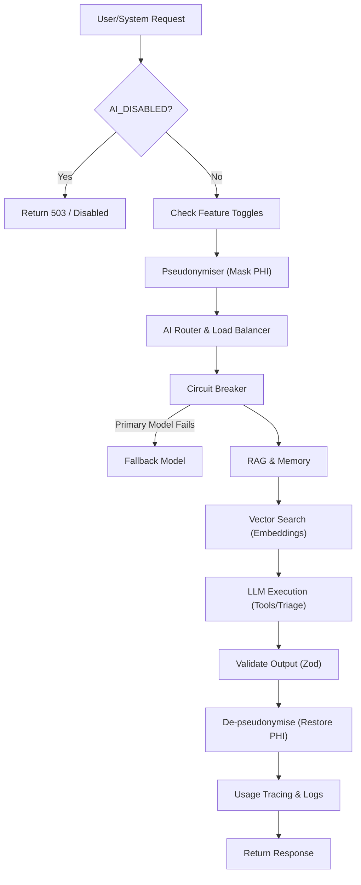

# Oltigo Health: Platform Architecture & Dashboard Schema

> **Historical/analysis note:** This file is kept for architectural context and schema analysis.
> For the living architecture overview, use `docs/architecture.md`, `docs/architecture/`, and `docs/adr/`.

This document serves as the definitive schema for the platform's role-based dashboards, the AI subsystem logic, and the core architectural rules. Use this as your primary reference when building features or debugging to ensure you do not violate tenant isolation or role boundaries.

---

## 1. Core Architectural Logic

Before diving into dashboards, you must understand the three pillars of Oltigo's architecture:

1. **Strict Tenant Isolation (`clinic_id`)**: The platform is a multi-tenant SaaS. Almost every database query MUST be filtered by `clinic_id`. **Never trust client-supplied tenant headers**; the middleware derives the tenant from the subdomain or authenticated user profile.
2. **Role-Based Access Control (RBAC)**: Access is determined by a user's `role` in the database. The 5 core roles are `super_admin`, `clinic_admin`, `receptionist`, `doctor`, and `patient`.
3. **Defense in Depth**: Security is enforced at three layers:
   - **Middleware** (`src/middleware.ts`): URL routing based on role (e.g., stopping a patient from accessing `/admin`).
   - **App Handlers** (`requireTenant()`, `withAuth()`): Server-side validation.
   - **Database RLS**: Supabase Row Level Security ensures queries only return data the user is allowed to see.

---

## 2. Dashboard Schema by Role

Each role has a dedicated Next.js Route Group in `src/app/` mapping directly to their dashboard layout and capabilities.

### 2.1. `super_admin` (Platform Operator)

- **Scope**: **Platform-Global** (Cross-tenant). This is the ONLY role allowed to see data across multiple clinics.
- **Directory**: `src/app/(super-admin)/super-admin`
- **Purpose**: Managing the SaaS platform itself (onboarding clinics, global AI routing, platform billing, monitoring uptime).
- **Core Dashboard Modules (31 total)**:
  - **Platform Ops**: `clinics`, `onboarding`, `compliance`, `audit-logs`, `uptime`, `system`, `chaos`
  - **Revenue**: `pricing`, `subscriptions`, `billing`, `finance`, `usage`
  - **AI & Features**: `feature-flags`, `agents`, `ai-team`, `models`
  - **Support**: `support`, `team`, `announcements`

### 2.2. `clinic_admin` (Clinic Owner / Manager)

- **Scope**: **Single Tenant** (`clinic_id`). Cannot see other clinics.
- **Directory**: `src/app/(admin)/admin`
- **Purpose**: Managing the business and configuration of a single clinic.
- **Core Dashboard Modules (39 total)**:
  - **Staff & HR**: `doctors`, `receptionists`, `working-hours`, `holidays`
  - **Clinic Setup**: `services`, `departments`, `sections`, `machines`, `beds`
  - **Financials**: `financial-summary`, `revenue-cycle`, `expenses`, `insurance-claims`, `billing`
  - **AI & Tech**: `ai-config`, `ai-manager`, `ai-routing` (per-clinic overrides), `website-editor`, `branding`
  - **Reporting**: `reports`, `patient-acquisition`, `reviews`

### 2.3. `doctor` (Clinician)

- **Scope**: **Single Tenant** (`clinic_id`) + **Own Patients** (PHI access).
- **Directory**: `src/app/(doctor)/doctor`
- **Purpose**: Clinical care, managing schedules, and documenting patient encounters.
- **Core Dashboard Modules (47 total)**:
  - **Operational Core**: `dashboard`, `schedule`, `slots`, `patients`, `waiting-room`, `consultation-photos`
  - **Specialty Modules (Architecture-B)**: EMR modules specific to specialties like `cardiology`, `dermatology`, `psychiatry`, `ivf-cycles`, `dialysis-sessions`, `odontogram`. _(Note: These should be feature-flagged based on the clinic's specific vertical)._
  - **Clinical Tools**: `treatment-plans`, `prescriptions`, `vaccinations`, `growth-charts`

### 2.4. `receptionist` (Front Desk / Operations)

- **Scope**: **Single Tenant** (`clinic_id`). Operational data only (no deep PHI).
- **Directory**: `src/app/(receptionist)/receptionist`
- **Purpose**: The daily driver for the clinic's front desk. Managing flow and payments.
- **Core Dashboard Modules (6 total)**:
  - `dashboard` (Overview of the day)
  - `bookings` (Calendar & scheduling)
  - `waiting-room` (Live patient flow management)
  - `patients` (Contact info & basic records)
  - `payments` (Taking day-of payments)
  - `daily-report` (End-of-day reconciliation)

### 2.5. `patient` (End User)

- **Scope**: **Strictly Own Records** within a Single Tenant.
- **Directory**: `src/app/(patient)/patient`
- **Purpose**: Self-service portal for patients.
- **Core Dashboard Modules (16 total)**:
  - **Care**: `appointments`, `medical-history`, `medical-timeline`, `prescriptions`, `treatment-plan`
  - **Finance**: `invoices`, `payment-plan`
  - **Admin**: `family` (linked members), `documents`, `feedback`, `preferences`

---

## 3. AI Subsystem Logic (`src/lib/ai/`)

The AI inside the platform is built for resilience, compliance, and multi-tenant safety. It powers the FAQ bot, WhatsApp conversational booking, and internal clinic briefings.

### AI Data Flow Architecture

### Key AI Components & How They Work:

1. **Kill Switches & Toggles (`feature-toggles.ts`)**: AI can be globally disabled via `AI_DISABLED=true` (fail-open if missing). Individual features are gated per clinic.
2. **Pseudonymisation (`pseudonymise.ts`)**: **CRITICAL**. Before any data is sent to OpenAI/Anthropic, PHI (names, phones, conditions) is stripped and replaced with tokens (e.g., `[PATIENT_1]`). It is restored on the way out.
3. **Routing & Circuit Breakers (`router.ts`, `circuit-breaker.ts`)**: Requests are routed based on task (e.g., fast model for triage, smart model for clinical reasoning). If a provider goes down, the circuit breaker trips and routes to a fallback provider automatically.
4. **RAG & Memory (`rag.ts`, `memory.ts`)**: The AI pulls context from the clinic's specific knowledge base using embeddings (vector search) ensuring it only answers using the clinic's actual policies.
5. **Tools (`tools.ts`)**: The LLM can execute predefined tools (like checking schedule availability or booking an appointment) ensuring it acts within the platform's RBAC rules.
6. **Output Validation (`validate-output.ts`)**: All LLM JSON responses are strictly validated against Zod schemas. If the LLM hallucinates a bad format, it is caught here.

---

## 4. Debugging Guide (No-Mistake Checklist)

When debugging or adding features, check this logic flow to avoid architectural mistakes.

### 🔴 Scenario A: User gets a 401/404 on a Dashboard Route

- **Check 1**: Is the route defined in `src/middleware.ts` for their role?
- **Check 2**: Look at `src/lib/config/capabilities.ts`. Does their core role have the required capability for that URL prefix?
- **Check 3**: Are you trying to access a specialist route (e.g., `/radiology`)? Ensure the specialist feature flag is enabled for that clinic type.

### 🔴 Scenario B: Database Query Fails or Returns Empty

- **Check 1**: Did you include `.eq("clinic_id", clinicId)` in your Supabase query?
- **Check 2**: Are you querying from the client or server? If client, does the authenticated user's JWT contain the correct `clinic_id` for RLS to pass?
- **Check 3**: If it's a cron job or webhook, did you use `service_role` and bypass RLS correctly while still manually filtering by `clinic_id`?

### 🔴 Scenario C: AI Feature is Failing or Hallucinating

- **Check 1**: Is the AI Provider returning 500s? Check the `circuit-breaker.ts` logs in Cloudflare.
- **Check 2**: Is the output failing validation? Check `validate-output.ts` logs. The LLM might be returning a string instead of an array.
- **Check 3**: Is PHI leaking? Verify that `pseudonymise.ts` is wrapping the prompt BEFORE it hits `providers.ts`.

### 🔴 Scenario D: Cron Job is not firing

- **Check 1**: Is the cron expression in `wrangler.toml`?
- **Check 2**: Is the route mapped in `src/worker-cron-handler.ts`?
- **Check 3**: Does the route handler at `src/app/api/cron/...` check for `verifyCronSecret()`?

### 🔴 Scenario E: Cross-Tenant Data Leak (CRITICAL)

- **Rule**: ONLY `super_admin` routes under `src/app/(super-admin)` are allowed to query without `clinic_id`.
- **Fix**: If you see a `clinic_admin` or `doctor` route lacking a tenant filter, **stop and fix it immediately**. Never use `...body` in a `.insert()`—always destructure to prevent users from injecting a different `clinic_id`.
