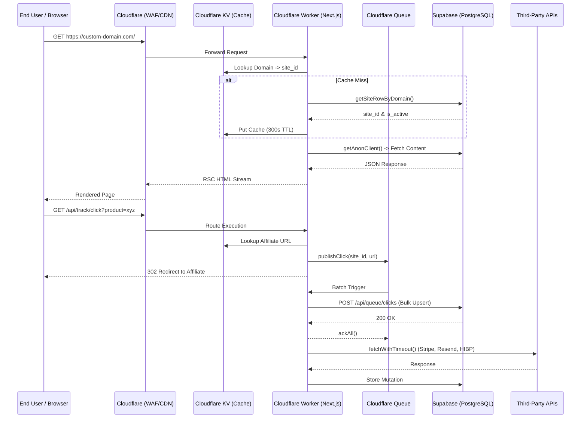

# Affilite-Mix Architecture & Data Flow Diagram

This document provides a high-level overview of the platform architecture, multi-tenant boundaries, and third-party data flows. It serves as evidence of the system boundaries for technical due diligence and SOC2/ISO audits.

## High-Level Architecture

The platform runs on a **Serverless Edge Architecture**, pushing logic as close to the user as possible to minimize latency, while maintaining a strict relational data model for transactional integrity.

### Component Layers

1. **Edge Network & Security (Cloudflare)**
   - **WAF & DDoS Protection:** Bot Fight Mode, Rate Limiting (auth endpoints), and geographic blocking.
   - **CDN & Asset Delivery:** Caching for static assets and public API reads (stale-while-revalidate).
   - **DNS Resolution:** Wildcard CNAME records routing all tenant traffic to the Cloudflare Worker.

2. **Compute (Cloudflare Workers / Next.js Edge Runtime)**
   - **Middleware:** Resolves incoming domains to `site_id` via KV cache / Supabase. Injects `x-site-id` and `x-trace-id` headers. Enforces CSRF token validation and CSP nonces.
   - **App Router:** Renders React Server Components (RSC) and handles API routes.
   - **Cloudflare Queues:** Asynchronous processing for high-volume events (e.g., click tracking, DLQ persistence) and third-party API webhook ingestion.
   - **Cron Triggers:** Scheduled workers for affiliate network ingestion, data retention purging, sitemap generation, and AI content generation.

3. **Data Plane (Supabase / PostgreSQL)**
   - **Database:** PostgreSQL 15 managed by Supabase (EU-Central-1).
   - **Connection Pooling:** PgBouncer (Transaction mode) handling up to 500 max client connections.
   - **Isolation:** Multi-tenancy is enforced natively via PostgreSQL Row-Level Security (RLS) policies ensuring cross-tenant isolation.
   - **Backups:** Point-in-Time Recovery (PITR) enabled with a 5-minute RPO and 7-day retention.

## Data Flow Diagram

## Secrets Matrix & Boundary Control

To prevent configuration drift, secrets are strictly siloed:

| Secret                          | Scope    | Purpose                           | Storage Location       |
| ------------------------------- | -------- | --------------------------------- | ---------------------- |
| `NEXT_PUBLIC_SUPABASE_URL`      | Global   | DB connection routing             | `.env` / CF Vars       |
| `NEXT_PUBLIC_SUPABASE_ANON_KEY` | Global   | Public RLS operations             | `.env` / CF Vars       |
| `SUPABASE_SERVICE_ROLE_KEY`     | Admin    | Internal background jobs / writes | CF Secrets (Encrypted) |
| `JWT_SECRET`                    | Global   | Admin session signing             | CF Secrets (Encrypted) |
| `INTERNAL_API_TOKEN`            | Internal | Queue -> API authentication       | CF Secrets (Encrypted) |
| `STRIPE_WEBHOOK_SECRET`         | Edge     | Webhook signature validation      | CF Secrets (Encrypted) |
| `SENTRY_DSN`                    | Global   | Telemetry / APM routing           | CF Secrets (Encrypted) |

_All secrets are managed via GitHub Actions and deployed to Cloudflare using `wrangler secret put`. None are hardcoded._
