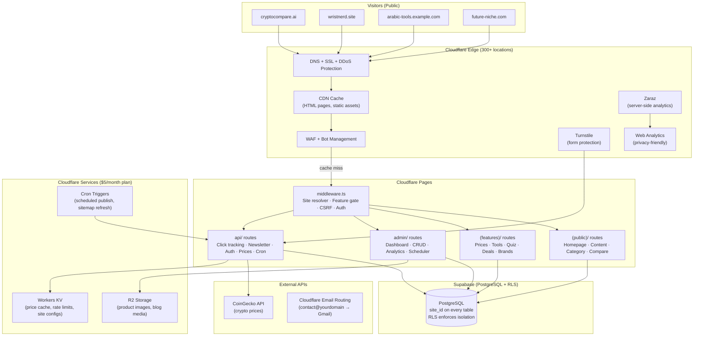
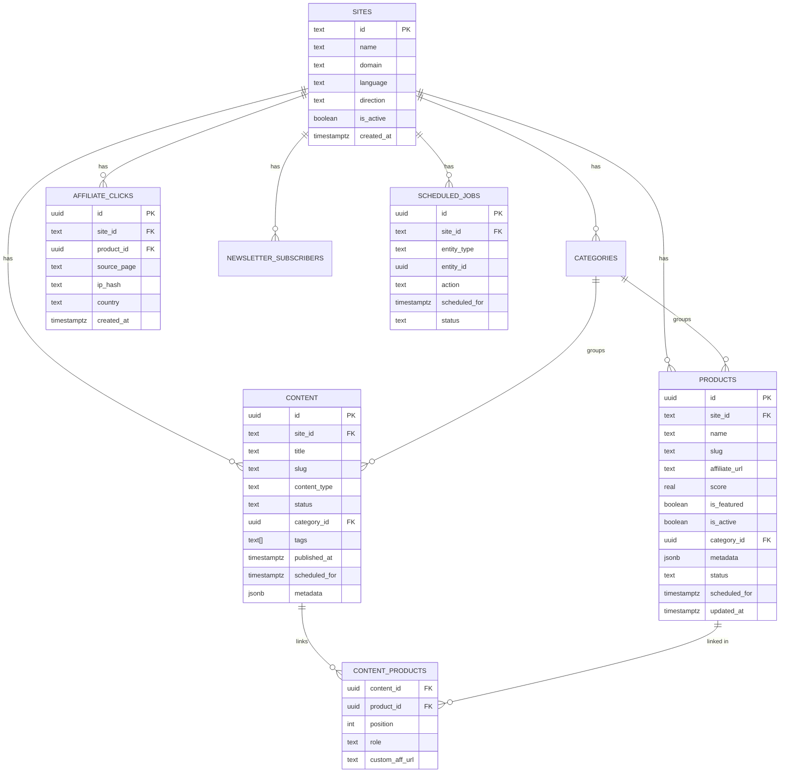
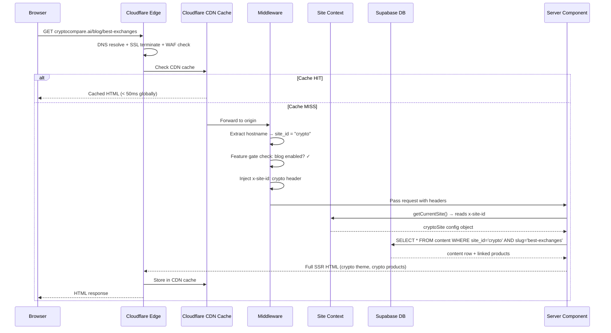
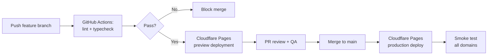

# Affilite-Mix — Production Architecture Document v2.0

> **Version:** 2.0 (Cloudflare-Native Edition)  
> **Status:** Engineering Reference  
> **Last Updated:** 2026-03-24  
> **Audience:** Engineering Team, DevOps, Technical Leadership

---

## Table of Contents

1. [System Overview and Goals](#1-system-overview-and-goals)
2. [Architecture Diagram](#2-architecture-diagram)
3. [Backend Architecture](#3-backend-architecture)
4. [Frontend Architecture](#4-frontend-architecture)
5. [Scheduling System](#5-scheduling-system)
6. [Infrastructure (Cloudflare-Native)](#6-infrastructure-cloudflare-native)
7. [Data Flow Between Components](#7-data-flow-between-components)
8. [Security Considerations](#8-security-considerations)
9. [Performance and Scalability Strategy](#9-performance-and-scalability-strategy)
10. [Tech Stack Justification](#10-tech-stack-justification)
11. [Folder / Project Structure](#11-folder--project-structure)
12. [Adding a New Niche Site](#12-adding-a-new-niche-site)
13. [Migration Strategy from Current Repos](#13-migration-strategy-from-current-repos)

---

## 1. System Overview and Goals

### What Affilite-Mix Is

Affilite-Mix is a **single-codebase, multi-site affiliate platform** that powers unlimited niche review and comparison sites from one repository, one database, and one admin dashboard. Each deployed site (crypto exchanges, luxury watches, Arabic product reviews, kitchen gadgets, fitness gear, or anything else) is fully isolated from the visitor's perspective while sharing all platform infrastructure behind the scenes.

### Before vs After

| Before (4 repos)                                   | After (Affilite-Mix)                          |
| -------------------------------------------------- | --------------------------------------------- |
| 4 separate codebases to maintain                   | 1 codebase                                    |
| 4 separate databases                               | 1 Supabase project                            |
| 4 separate admin panels                            | 1 admin dashboard with site switcher          |
| Fix a bug 4 times                                  | Fix it once, every site gets it               |
| Launch a new niche = fork repo, set up DB, hosting | Add 1 config file + 1 DB row + 1 DNS entry    |
| Pay $50-100+/month for scattered services          | $5-30/month with Cloudflare                   |
| No scheduling                                      | Full scheduling system for content + products |

### Core Goals

| Goal                            | Description                                                                                                                                        |
| ------------------------------- | -------------------------------------------------------------------------------------------------------------------------------------------------- |
| **Site isolation**              | A visitor on `cryptocompare.ai` never sees watch content. Zero data leakage between sites at every layer.                                          |
| **Single-repo maintainability** | Bug fixes, feature upgrades, and security patches ship once and propagate to all sites.                                                            |
| **Config-driven site launches** | Adding a new niche requires one config file, one database row, and one DNS entry — no code changes.                                                |
| **Feature modularity**          | Each site declares which feature modules it activates (live prices, quiz, deals, RSS, etc.). Unused modules add zero bundle weight and return 404. |
| **Scheduling**                  | Schedule content and product publishing to specific dates/times. Auto-publish when the time arrives.                                               |
| **Cloudflare-native**           | Maximize Cloudflare's $5/month Workers plan: Pages, KV, R2, Turnstile, Web Analytics, Email Routing, Cache Rules, Zaraz.                           |
| **Production scalability**      | Support 10+ active sites with combined peak traffic of ~500k monthly visits without per-site infrastructure duplication.                           |
| **Content operations velocity** | An admin can launch a new site and publish its first article within one working day.                                                               |
| **Flexible for any niche**      | The system doesn't care what the niche is — crypto, watches, kitchen gadgets, pet supplies, SaaS tools. Same architecture, different config.       |

### Non-Goals (v1)

- Real-time collaborative editing
- Per-site custom code deployments (config-driven only)
- Native mobile apps (PWA is sufficient)
- AI content generation (designed for, but built in v2)

### Scale Assumptions (v1)

- 3 active sites at launch, 10+ within 12 months
- ~50k–500k monthly page views per site
- Content library: ~500–5,000 articles/products per site
- Admin team: 1–5 editors per site, single engineering team
- Uptime SLA: 99.9%

---

## 2. Architecture Diagram

### High-Level System Architecture



### Database Entity Relationships



### Multi-Domain Routing Flow



---

## 3. Backend Architecture

### 3.1 Service Boundaries

Affilite-Mix is a **modular monolith**, not microservices. For a small team, microservices add operational complexity with no benefit. The codebase is organised into clearly bounded modules that can be extracted if scale demands it later.

```
Core modules:
  site-context     → domain resolution, config loading
  content          → article/review/comparison CRUD and rendering
  products         → affiliate product CRUD and management
  affiliate        → click tracking, URL building, analytics
  auth             → admin authentication and session management
  scheduler        → scheduled publishing for content + products

Feature modules (conditionally loaded):
  crypto/prices    → CoinGecko proxy, price pages, calculator tools
  watches/quiz     → gift-finder quiz logic
  newsletter       → signup, list management
```

### 3.2 API Routes

All API routes live under `app/api/` and are Next.js Route Handlers.

| Route                         | Method                      | Auth              | Description                                                  |
| ----------------------------- | --------------------------- | ----------------- | ------------------------------------------------------------ |
| `/api/track/click`            | POST                        | None (public)     | Record affiliate click, return 302 redirect to affiliate URL |
| `/api/newsletter`             | POST                        | None (public)     | Subscribe email to site-specific newsletter list             |
| `/api/auth/login`             | POST                        | None              | Admin login, issues httpOnly JWT cookie                      |
| `/api/auth/logout`            | POST                        | JWT               | Clear admin session                                          |
| `/api/prices/ticker`          | GET                         | None (public)     | Proxy to CoinGecko with 60s KV cache                         |
| `/api/prices/trending`        | GET                         | None (public)     | Proxy to CoinGecko trending, 5 min KV cache                  |
| `/api/admin/content`          | GET / POST / PATCH / DELETE | JWT               | Content CRUD (filtered by site_id from session)              |
| `/api/admin/products`         | GET / POST / PATCH / DELETE | JWT               | Product CRUD                                                 |
| `/api/admin/categories`       | GET / POST / PATCH / DELETE | JWT               | Category CRUD                                                |
| `/api/admin/sites`            | GET / POST / PATCH          | JWT (super admin) | Site registry management                                     |
| `/api/admin/analytics`        | GET                         | JWT               | Affiliate click aggregates per site                          |
| `/api/admin/schedule`         | GET / POST / PATCH / DELETE | JWT               | Schedule management (view/create/update/cancel)              |
| `/api/cron/publish-scheduled` | POST                        | Cron secret       | Auto-publish scheduled content + products                    |
| `/api/cron/sitemap-refresh`   | POST                        | Cron secret       | Regenerate sitemaps for all sites                            |
| `/api/upload`                 | POST                        | JWT               | Generate presigned R2 upload URL                             |

### 3.3 Database Schema (Complete)

```sql
-- ════════════════════════════════════════════════════
-- SITES — master registry
-- ════════════════════════════════════════════════════

CREATE TABLE sites (
  id          text PRIMARY KEY,               -- "crypto", "watches", "arabic-tools"
  name        text NOT NULL,                   -- "CryptoCompare AI"
  domain      text NOT NULL UNIQUE,            -- "cryptocompare.ai"
  language    text NOT NULL DEFAULT 'en',      -- BCP-47 tag
  direction   text NOT NULL DEFAULT 'ltr',     -- "ltr" or "rtl"
  locale      text NOT NULL DEFAULT 'en_US',   -- OG locale
  is_active   boolean NOT NULL DEFAULT true,
  created_at  timestamptz DEFAULT now()
);

-- ════════════════════════════════════════════════════
-- CATEGORIES
-- ════════════════════════════════════════════════════

CREATE TABLE categories (
  id          uuid DEFAULT gen_random_uuid() PRIMARY KEY,
  site_id     text NOT NULL REFERENCES sites(id) ON DELETE CASCADE,
  name        text NOT NULL,
  slug        text NOT NULL,
  description text DEFAULT '',
  sort_order  int DEFAULT 0,
  created_at  timestamptz DEFAULT now(),
  UNIQUE(site_id, slug)
);

-- ════════════════════════════════════════════════════
-- PRODUCTS / ENTITIES
-- ════════════════════════════════════════════════════

CREATE TABLE products (
  id            uuid DEFAULT gen_random_uuid() PRIMARY KEY,
  site_id       text NOT NULL REFERENCES sites(id) ON DELETE CASCADE,
  name          text NOT NULL,
  slug          text NOT NULL,
  description   text DEFAULT '',
  affiliate_url text DEFAULT '',
  image_url     text DEFAULT '',
  price         text DEFAULT '',
  merchant      text DEFAULT '',
  score         real CHECK (score >= 0 AND score <= 10),
  is_featured   boolean DEFAULT false,
  is_active     boolean DEFAULT true,
  status        text NOT NULL DEFAULT 'active'
                CHECK (status IN ('draft', 'active', 'scheduled', 'expired', 'archived')),
  category_id   uuid REFERENCES categories(id) ON DELETE SET NULL,
  metadata      jsonb DEFAULT '{}',
  scheduled_for timestamptz,                   -- when to auto-activate (null = immediate)
  expires_at    timestamptz,                   -- when to auto-archive (null = never)
  created_at    timestamptz DEFAULT now(),
  updated_at    timestamptz DEFAULT now(),
  UNIQUE(site_id, slug)
);

-- ════════════════════════════════════════════════════
-- CONTENT
-- ════════════════════════════════════════════════════

CREATE TABLE content (
  id               uuid DEFAULT gen_random_uuid() PRIMARY KEY,
  site_id          text NOT NULL REFERENCES sites(id) ON DELETE CASCADE,
  title            text NOT NULL,
  slug             text NOT NULL,
  body             text DEFAULT '',
  excerpt          text DEFAULT '',
  content_type     text NOT NULL DEFAULT 'article'
                   CHECK (content_type IN (
                     'article', 'review', 'comparison', 'guide', 'blog',
                     -- Removed: 'brand-spotlight', 'occasion', 'budget', 'recipient' (use tags instead)
                   )),
  status           text NOT NULL DEFAULT 'draft'
                   CHECK (status IN ('draft', 'review', 'published', 'scheduled', 'archived')),
  category_id      uuid REFERENCES categories(id) ON DELETE SET NULL,
  featured_image   text,
  meta_title       text,
  meta_description text,
  tags             text[] DEFAULT '{}',
  published_at     timestamptz,
  scheduled_for    timestamptz,                -- when to auto-publish (null = manual)
  expires_at       timestamptz,                -- when to auto-archive (null = never)
  author           text,
  metadata         jsonb DEFAULT '{}',
  created_at       timestamptz DEFAULT now(),
  updated_at       timestamptz DEFAULT now(),
  UNIQUE(site_id, slug)
);

-- ════════════════════════════════════════════════════
-- CONTENT ↔ PRODUCTS (many-to-many)
-- ════════════════════════════════════════════════════

CREATE TABLE content_products (
  content_id     uuid NOT NULL REFERENCES content(id) ON DELETE CASCADE,
  product_id     uuid NOT NULL REFERENCES products(id) ON DELETE CASCADE,
  site_id        text NOT NULL REFERENCES sites(id) ON DELETE CASCADE,
  position       int DEFAULT 0,
  role           text DEFAULT 'related'
                 CHECK (role IN ('hero', 'featured', 'related', 'vs-left', 'vs-right')),
  custom_aff_url text,
  PRIMARY KEY (content_id, product_id)
);

-- ════════════════════════════════════════════════════
-- AFFILIATE CLICK TRACKING
-- ════════════════════════════════════════════════════

CREATE TABLE affiliate_clicks (
  id              uuid DEFAULT gen_random_uuid() PRIMARY KEY,
  site_id         text NOT NULL REFERENCES sites(id) ON DELETE CASCADE,
  product_id      uuid REFERENCES products(id) ON DELETE SET NULL,
  product_slug    text DEFAULT '',
  source_page     text DEFAULT '',
  source_type     text DEFAULT 'unknown',
  destination_url text DEFAULT '',
  ip_hash         text,
  user_agent      text,
  referrer        text,
  country         text,
  created_at      timestamptz DEFAULT now()
);

-- ════════════════════════════════════════════════════
-- NEWSLETTER SUBSCRIBERS
-- ════════════════════════════════════════════════════

CREATE TABLE newsletter_subscribers (
  id            uuid DEFAULT gen_random_uuid() PRIMARY KEY,
  site_id       text NOT NULL REFERENCES sites(id) ON DELETE CASCADE,
  email         text NOT NULL,
  is_active     boolean DEFAULT true,
  subscribed_at timestamptz DEFAULT now(),
  UNIQUE(site_id, email)
);

-- ════════════════════════════════════════════════════
-- SCHEDULED JOBS — unified scheduling ledger
-- ════════════════════════════════════════════════════

CREATE TABLE scheduled_jobs (
  id            uuid DEFAULT gen_random_uuid() PRIMARY KEY,
  site_id       text NOT NULL REFERENCES sites(id) ON DELETE CASCADE,
  entity_type   text NOT NULL CHECK (entity_type IN ('content', 'product')),
  entity_id     uuid NOT NULL,
  action        text NOT NULL CHECK (action IN ('publish', 'activate', 'archive', 'expire', 'feature', 'unfeature')),
  scheduled_for timestamptz NOT NULL,
  executed_at   timestamptz,
  status        text NOT NULL DEFAULT 'pending'
                CHECK (status IN ('pending', 'executed', 'cancelled', 'failed')),
  created_by    text,
  notes         text,
  created_at    timestamptz DEFAULT now()
);

-- ════════════════════════════════════════════════════
-- INDEXES
-- ════════════════════════════════════════════════════

CREATE INDEX idx_categories_site        ON categories(site_id);
CREATE INDEX idx_products_site          ON products(site_id);
CREATE INDEX idx_products_site_slug     ON products(site_id, slug);
CREATE INDEX idx_products_site_featured ON products(site_id, is_featured)
  WHERE is_featured = true;
CREATE INDEX idx_products_active        ON products(site_id, is_active)
  WHERE is_active = true;
CREATE INDEX idx_products_scheduled     ON products(scheduled_for)
  WHERE status = 'scheduled';
CREATE INDEX idx_products_expiring      ON products(expires_at)
  WHERE expires_at IS NOT NULL AND status = 'active';
CREATE INDEX idx_content_site           ON content(site_id);
CREATE INDEX idx_content_site_status    ON content(site_id, status);
CREATE INDEX idx_content_site_slug      ON content(site_id, slug);
CREATE INDEX idx_content_site_type      ON content(site_id, content_type);
CREATE INDEX idx_content_published      ON content(site_id, published_at DESC)
  WHERE status = 'published';
CREATE INDEX idx_content_scheduled      ON content(scheduled_for)
  WHERE status = 'scheduled';
CREATE INDEX idx_content_expiring       ON content(expires_at)
  WHERE expires_at IS NOT NULL AND status = 'published';
CREATE INDEX idx_clicks_site            ON affiliate_clicks(site_id);
CREATE INDEX idx_clicks_created         ON affiliate_clicks(created_at DESC);
CREATE INDEX idx_clicks_product         ON affiliate_clicks(product_id);
CREATE INDEX idx_subscribers_site       ON newsletter_subscribers(site_id);
CREATE INDEX idx_scheduled_pending      ON scheduled_jobs(scheduled_for)
  WHERE status = 'pending';
CREATE INDEX idx_scheduled_site         ON scheduled_jobs(site_id);
CREATE INDEX idx_scheduled_entity       ON scheduled_jobs(entity_type, entity_id);

-- ════════════════════════════════════════════════════
-- ROW LEVEL SECURITY
-- ════════════════════════════════════════════════════

ALTER TABLE sites                  ENABLE ROW LEVEL SECURITY;
ALTER TABLE categories             ENABLE ROW LEVEL SECURITY;
ALTER TABLE products               ENABLE ROW LEVEL SECURITY;
ALTER TABLE content                ENABLE ROW LEVEL SECURITY;
ALTER TABLE content_products       ENABLE ROW LEVEL SECURITY;
ALTER TABLE affiliate_clicks       ENABLE ROW LEVEL SECURITY;
ALTER TABLE newsletter_subscribers ENABLE ROW LEVEL SECURITY;
ALTER TABLE scheduled_jobs         ENABLE ROW LEVEL SECURITY;

-- Public read policies (anon key)
CREATE POLICY "public_read_sites"
  ON sites FOR SELECT USING (is_active = true);

CREATE POLICY "public_read_categories"
  ON categories FOR SELECT USING (true);

CREATE POLICY "public_read_active_products"
  ON products FOR SELECT USING (is_active = true AND status = 'active');

CREATE POLICY "public_read_published_content"
  ON content FOR SELECT USING (status = 'published');

CREATE POLICY "public_read_content_products"
  ON content_products FOR SELECT USING (
    EXISTS (
      SELECT 1 FROM content c
      JOIN products p ON p.id = content_products.product_id
      WHERE c.id = content_products.content_id
        AND c.status = 'published'
        AND p.status = 'active'
        AND c.site_id = p.site_id
    )
  );

-- Anonymous write policies (public actions)
CREATE POLICY "public_insert_clicks"
  ON affiliate_clicks FOR INSERT WITH CHECK (true);

CREATE POLICY "public_insert_subscribers"
  ON newsletter_subscribers FOR INSERT WITH CHECK (true);

-- Note: All admin + cron operations use the Supabase service key (bypasses RLS).
-- The service key is ONLY used server-side, never exposed to the browser.

-- ════════════════════════════════════════════════════
-- TRIGGERS
-- ════════════════════════════════════════════════════

CREATE OR REPLACE FUNCTION update_updated_at()
RETURNS TRIGGER AS $$
BEGIN
  NEW.updated_at = now();
  RETURN NEW;
END;
$$ LANGUAGE plpgsql;

CREATE TRIGGER products_updated_at
  BEFORE UPDATE ON products
  FOR EACH ROW EXECUTE FUNCTION update_updated_at();

CREATE TRIGGER content_updated_at
  BEFORE UPDATE ON content
  FOR EACH ROW EXECUTE FUNCTION update_updated_at();

-- ════════════════════════════════════════════════════
-- SCHEDULING FUNCTIONS (called by cron)
-- ════════════════════════════════════════════════════

-- Auto-publish scheduled content
CREATE OR REPLACE FUNCTION publish_scheduled_content()
RETURNS int AS $$
DECLARE
  affected int;
BEGIN
  UPDATE content
  SET status = 'published', published_at = now()
  WHERE status = 'scheduled'
    AND scheduled_for <= now();
  GET DIAGNOSTICS affected = ROW_COUNT;
  RETURN affected;
END;
$$ LANGUAGE plpgsql;

-- Auto-activate scheduled products
CREATE OR REPLACE FUNCTION activate_scheduled_products()
RETURNS int AS $$
DECLARE
  affected int;
BEGIN
  UPDATE products
  SET status = 'active', is_active = true
  WHERE status = 'scheduled'
    AND scheduled_for <= now();
  GET DIAGNOSTICS affected = ROW_COUNT;
  RETURN affected;
END;
$$ LANGUAGE plpgsql;

-- Auto-archive expired content
CREATE OR REPLACE FUNCTION archive_expired_content()
RETURNS int AS $$
DECLARE
  affected int;
BEGIN
  UPDATE content
  SET status = 'archived'
  WHERE status = 'published'
    AND expires_at IS NOT NULL
    AND expires_at <= now();
  GET DIAGNOSTICS affected = ROW_COUNT;
  RETURN affected;
END;
$$ LANGUAGE plpgsql;

-- Auto-archive expired products
CREATE OR REPLACE FUNCTION archive_expired_products()
RETURNS int AS $$
DECLARE
  affected int;
BEGIN
  UPDATE products
  SET status = 'archived', is_active = false
  WHERE status = 'active'
    AND expires_at IS NOT NULL
    AND expires_at <= now();
  GET DIAGNOSTICS affected = ROW_COUNT;
  RETURN affected;
END;
$$ LANGUAGE plpgsql;

-- Execute pending scheduled jobs
CREATE OR REPLACE FUNCTION execute_scheduled_jobs()
RETURNS int AS $$
DECLARE
  job RECORD;
  total int := 0;
BEGIN
  FOR job IN
    SELECT * FROM scheduled_jobs
    WHERE status = 'pending' AND scheduled_for <= now()
    ORDER BY scheduled_for ASC
    FOR UPDATE SKIP LOCKED
  LOOP
    BEGIN
      CASE
        WHEN job.entity_type = 'content' AND job.action = 'publish' THEN
          UPDATE content SET status = 'published', published_at = now()
          WHERE id = job.entity_id AND site_id = job.site_id;

        WHEN job.entity_type = 'content' AND job.action = 'archive' THEN
          UPDATE content SET status = 'archived'
          WHERE id = job.entity_id AND site_id = job.site_id;

        WHEN job.entity_type = 'product' AND job.action = 'activate' THEN
          UPDATE products SET status = 'active', is_active = true
          WHERE id = job.entity_id AND site_id = job.site_id;

        WHEN job.entity_type = 'product' AND job.action = 'expire' THEN
          UPDATE products SET status = 'expired', is_active = false
          WHERE id = job.entity_id AND site_id = job.site_id;

        WHEN job.entity_type = 'product' AND job.action = 'feature' THEN
          UPDATE products SET is_featured = true
          WHERE id = job.entity_id AND site_id = job.site_id;

        WHEN job.entity_type = 'product' AND job.action = 'unfeature' THEN
          UPDATE products SET is_featured = false
          WHERE id = job.entity_id AND site_id = job.site_id;
      END CASE;

      UPDATE scheduled_jobs SET status = 'executed', executed_at = now()
      WHERE id = job.id;

      total := total + 1;

    EXCEPTION WHEN OTHERS THEN
      UPDATE scheduled_jobs SET status = 'failed', notes = SQLERRM
      WHERE id = job.id;
    END;
  END LOOP;

  RETURN total;
END;
$$ LANGUAGE plpgsql;
```

### 3.4 Site Configuration System

Each site is defined by a single TypeScript config file. This is the single source of truth for all site-specific behavior.

```typescript
// config/site-definition.ts — complete interface

export interface SiteDefinition {
  id: string;
  name: string;
  domain: string;
  aliases?: string[]; // e.g. ["www.cryptocompare.ai"]
  language: string; // BCP-47: "en", "ar"
  direction: "ltr" | "rtl";
  locale: string; // "en_US", "ar_SA"

  brand: {
    description: string;
    contactEmail: string;
    niche: string;
    logo?: string;
    faviconUrl?: string;
  };

  theme: {
    primaryColor: string;
    accentColor: string;
    fontHeading: string;
    fontBody: string;
  };

  nav: NavItem[];
  footerNav: Record<string, NavItem[]>;

  contentTypes: ContentTypeConfig[];
  productLabel: string; // "Exchange" / "Watch" / "Product"
  productLabelPlural: string; // "Exchanges" / "Watches" / "Products"

  affiliateDisclosure: string;
  contentDisclosure: string;

  features: FeatureFlags;

  scheduling: {
    enabled: boolean;
    contentScheduling: boolean; // schedule blog/review publish dates
    productScheduling: boolean; // schedule product launch/expiry dates
    autoArchive: boolean; // auto-archive expired items
  };

  pages: {
    about: { title: string; description: string };
    privacy: { title: string; description: string };
    terms: { title: string; description: string };
  };

  seo: {
    robotsDisallow: string[];
    sitemapStaticPages: { path: string; priority: number; changeFrequency: string }[];
  };

  cloudflare?: {
    zoneId?: string; // for cache purging
    turnstileSiteKey?: string; // per-site Turnstile key
    webAnalyticsToken?: string; // per-site analytics token
  };

  adminLabels?: Partial<AdminLabels>; // i18n for Arabic admin
}

export interface FeatureFlags {
  livePrices?: { provider: "coingecko" };
  tools?: string[];
  quiz?: { type: string };
  deals?: boolean;
  brandSpotlights?: boolean;
  newsletter?: boolean;
  rssFeed?: boolean;
  comparisons?: { type: string };
  blog?: { source: "database" | "markdown-files"; dir?: string };
  occasionPages?: boolean;
  budgetPages?: boolean;
  recipientPages?: boolean;
  searchModal?: boolean;
}

export interface ContentTypeConfig {
  value: string;
  label: string;
  commercial: boolean;
  layout: "standard" | "sidebar";
  minProducts?: number;
}

export interface NavItem {
  title: string;
  href: string;
  children?: NavItem[];
}
```

### 3.5 Example Site Config: Crypto

```typescript
// config/sites/crypto.ts
import type { SiteDefinition } from "../site-definition";

export const cryptoSite: SiteDefinition = {
  id: "crypto",
  name: "CryptoCompare AI",
  domain: "cryptocompare.ai",
  language: "en",
  direction: "ltr",
  locale: "en_US",

  brand: {
    description:
      "Compare crypto exchanges side-by-side. Find the best fees, features, and security.",
    contactEmail: "contact@cryptocompare.ai",
    niche: "Cryptocurrency",
  },

  theme: {
    primaryColor: "#0F172A",
    accentColor: "#3B82F6",
    fontHeading: "Inter",
    fontBody: "Inter",
  },

  nav: [
    { title: "Prices", href: "/prices" },
    { title: "Compare", href: "/compare" },
    { title: "Blog", href: "/blog" },
    { title: "Tools", href: "/tools" },
  ],

  footerNav: {
    quickLinks: [
      { title: "Live Prices", href: "/prices" },
      { title: "Compare Exchanges", href: "/compare" },
    ],
    legal: [
      { title: "About", href: "/about" },
      { title: "Privacy", href: "/privacy" },
      { title: "Terms", href: "/terms" },
    ],
  },

  contentTypes: [
    { value: "blog", label: "Blog Post", commercial: false, layout: "standard" },
    { value: "review", label: "Exchange Review", commercial: true, layout: "sidebar" },
    {
      value: "comparison",
      label: "Exchange Comparison",
      commercial: true,
      layout: "sidebar",
      minProducts: 2,
    },
  ],

  productLabel: "Exchange",
  productLabelPlural: "Exchanges",

  affiliateDisclosure: "We may earn commissions from partner links at no extra cost to you.",
  contentDisclosure: "This page contains affiliate links. We may earn a commission if you sign up.",

  features: {
    livePrices: { provider: "coingecko" },
    tools: [
      "fee-calculator",
      "profit-calculator",
      "dca-calculator",
      "converter",
      "portfolio-tracker",
    ],
    newsletter: true,
    rssFeed: true,
    comparisons: { type: "exchange-vs-exchange" },
    blog: { source: "database" },
    searchModal: true,
  },

  scheduling: {
    enabled: true,
    contentScheduling: true,
    productScheduling: true,
    autoArchive: false,
  },

  pages: {
    about: {
      title: "About CryptoCompare AI",
      description: "Learn about our exchange comparison platform",
    },
    privacy: { title: "Privacy Policy", description: "How we handle your data" },
    terms: { title: "Terms of Service", description: "Terms and conditions of use" },
  },

  seo: {
    robotsDisallow: ["/admin/", "/api/"],
    sitemapStaticPages: [
      { path: "/", priority: 1, changeFrequency: "daily" },
      { path: "/prices", priority: 0.9, changeFrequency: "hourly" },
      { path: "/compare", priority: 0.8, changeFrequency: "weekly" },
      { path: "/tools", priority: 0.7, changeFrequency: "monthly" },
    ],
  },
};
```

### 3.6 The `metadata` JSONB Column — Niche-Specific Fields

Instead of creating niche-specific tables, we use a typed `metadata` JSONB column on `products` and `content`. This keeps the schema universal while allowing each niche to store whatever extra fields it needs.

**Crypto product metadata:**

```json
{
  "founded_year": 2017,
  "headquarters": "Cayman Islands",
  "supported_coins_count": 400,
  "kyc_required": true,
  "fees": {
    "spot_maker": 0.1,
    "spot_taker": 0.1,
    "futures_maker": 0.02,
    "futures_taker": 0.04
  },
  "offers": [{ "text": "Get 20% off trading fees", "bonus_amount": 100, "expires_at": null }]
}
```

**Watch product metadata:**

```json
{
  "brand": "Seiko",
  "model": "Presage SRPD37",
  "movement": "automatic",
  "case_size_mm": 40.5,
  "water_resistance": "50m",
  "gift_worthiness_score": 8.5,
  "pros": ["Beautiful dial", "Reliable movement"],
  "cons": ["No screw-down crown"]
}
```

**Arabic product metadata:**

```json
{
  "commission_rate": "15%",
  "commission_type": "recurring",
  "rating": 4.5,
  "availability_regions": ["SA", "AE", "EG"]
}
```

**Future niche (e.g. Kitchen) product metadata:**

```json
{
  "brand": "KitchenAid",
  "wattage": 325,
  "weight_kg": 11.8,
  "warranty_years": 2,
  "dishwasher_safe": true,
  "color_options": ["red", "black", "silver"]
}
```

The TypeScript types enforce structure per site:

```typescript
// types/metadata.ts
export interface CryptoProductMeta {
  founded_year?: number;
  headquarters?: string;
  supported_coins_count?: number;
  kyc_required?: boolean;
  fees?: {
    spot_maker: number;
    spot_taker: number;
    futures_maker?: number;
    futures_taker?: number;
  };
  offers?: Array<{ text: string; bonus_amount?: number; expires_at?: string | null }>;
}

export interface WatchProductMeta {
  brand?: string;
  model?: string;
  movement?: "automatic" | "manual" | "quartz" | "solar";
  case_size_mm?: number;
  water_resistance?: string;
  gift_worthiness_score?: number;
  pros?: string[];
  cons?: string[];
}

export interface ArabicProductMeta {
  commission_rate?: string;
  commission_type?: "recurring" | "one-time" | "tiered";
  rating?: number;
  availability_regions?: string[];
}

// When you add a new niche, just add a new interface here.
// No schema changes, no migrations, no downtime.
export type ProductMeta =
  | CryptoProductMeta
  | WatchProductMeta
  | ArabicProductMeta
  | Record<string, unknown>;
```

---

## 4. Frontend Architecture

### 4.1 Rendering Strategy

| Route                        | Strategy       | Revalidation           | Rationale                         |
| ---------------------------- | -------------- | ---------------------- | --------------------------------- |
| Homepage                     | ISR            | 1 hour                 | Infrequent changes, high traffic  |
| Content pages (blog, review) | ISR            | On publish (tag-based) | Stale content loses SEO value     |
| Category listings            | ISR            | On content change      | High-value landing pages          |
| Comparison pages             | ISR            | On product change      | Product scores update irregularly |
| Live prices (crypto)         | SSR            | None (always fresh)    | Must reflect real-time data       |
| Admin pages                  | SSR (no cache) | —                      | Dynamic, auth-gated               |
| Static pages (about, terms)  | SSG            | On build               | Never changes at runtime          |

Tag-based revalidation: When content is published via admin, a Server Action calls `revalidateTag("content-${site_id}-${slug}")`, immediately invalidating the cache for that specific page. When deploying to Cloudflare, cache purge is done via the Cloudflare API for CDN-cached pages.

### 4.2 State Management

No global client-side state library (no Redux, no Zustand). State is co-located:

- **Server state:** React Server Components + Next.js Data Cache (fetch deduplication)
- **URL state:** `useSearchParams` for filters, pagination, comparison selections
- **Form state:** React `useActionState` + Server Actions for all mutations
- **UI state:** `useState` / `useReducer` local to the component (modals, dropdowns)
- **Admin session:** httpOnly JWT cookie, read server-side per request

### 4.3 Theming System

Each site's theme is injected as CSS custom properties at the root layout level, based on `site.theme` from the config. No runtime overhead.

```tsx
// app/(public)/layout.tsx
export default async function PublicLayout({ children }: { children: React.ReactNode }) {
  const site = await getCurrentSite();
  const cssVars = {
    "--color-primary": site.theme.primaryColor,
    "--color-accent": site.theme.accentColor,
    "--font-heading": `"${site.theme.fontHeading}", serif`,
    "--font-body": `"${site.theme.fontBody}", sans-serif`,
    "--direction": site.direction,
  } as React.CSSProperties;

  return (
    <html lang={site.language} dir={site.direction}>
      <body style={cssVars}>
        <Shell site={site}>{children}</Shell>
      </body>
    </html>
  );
}
```

### 4.4 Component Architecture

Components are organized into four layers with strict import rules:

```
ui/          → Primitive, stateless, site-agnostic (Button, Container, Skeleton)
layout/      → Site-aware structural (Header, Footer, Shell, Breadcrumb)
content/     → Content rendering (ArticleCard, ProductCard, ComparisonTable)
features/    → Niche-specific (crypto/PriceChart, watches/GiftFinderQuiz)
admin/       → Admin-only (SiteSwitcher, ContentForm, MetadataEditor, ScheduleManager)
```

**Import rules:**

- `ui/` components import nothing from other layers
- `layout/` may import from `ui/`
- `content/` and `features/` may import from `ui/` and `layout/`
- `admin/` may import from any layer
- `features/crypto/` must never be imported by `features/watches/` or shared components

Feature components are dynamically imported to prevent cross-site bundle pollution:

```tsx
const PriceChart = dynamic(() => import("@/components/features/crypto/PriceChart"), {
  loading: () => <Skeleton height={320} />,
  ssr: false,
});
```

### 4.5 Admin Dashboard

The admin is a standard SSR application with full-page navigation.

Key admin patterns:

- **Site switcher:** Stored in a server-side session cookie. Every admin route reads the active site from this cookie and filters all DB queries accordingly.
- **Dynamic product form:** The `MetadataEditor` component reads `site.features` to decide which extra fields to render.
- **Content type filtering:** The content list only shows `contentTypes` enabled for the active site.
- **Schedule manager:** Inline scheduling UI on content and product forms — pick a date/time, and the item auto-publishes or expires at that time.

---

## 5. Scheduling System

### 5.1 Overview

The scheduling system lets admins plan content and product publishing in advance. It supports:

| Action                 | Entity  | Description                                                 |
| ---------------------- | ------- | ----------------------------------------------------------- |
| **Schedule publish**   | Content | Write a blog post now, auto-publish at a specific date/time |
| **Schedule activate**  | Product | Add a product now, make it live on launch day               |
| **Schedule archive**   | Content | Publish a seasonal article, auto-archive after the season   |
| **Schedule expire**    | Product | A limited-time deal that auto-deactivates on expiry         |
| **Schedule feature**   | Product | Feature a product on the homepage for a specific period     |
| **Schedule unfeature** | Product | Remove from featured after the promotion ends               |

### 5.2 How It Works

```
Admin creates content with:
  - status = "scheduled"
  - scheduled_for = "2026-04-01T09:00:00Z"

Every 5 minutes, a Cloudflare Cron Trigger calls:
  POST /api/cron/publish-scheduled

The cron handler:
  1. Calls publish_scheduled_content() in Postgres
  2. Calls activate_scheduled_products() in Postgres
  3. Calls archive_expired_content() in Postgres
  4. Calls archive_expired_products() in Postgres
  5. Calls execute_scheduled_jobs() for custom jobs
  6. Purges Cloudflare CDN cache for affected pages
  7. Returns count of items processed

Result: Content/products go live automatically without admin intervention.
```

### 5.3 Admin Scheduling UI

On the content form and product form, the scheduling UI appears when the site has `scheduling.enabled = true`:

```
┌─────────────────────────────────────────────────┐
│  Status: [▼ Scheduled ]                          │
│                                                   │
│  ┌─ Schedule ─────────────────────────────────┐  │
│  │  Publish on: [📅 2026-04-01] [⏰ 09:00 AM] │  │
│  │  Expires on: [📅 _________ ] [⏰ ________ ] │  │
│  │              (optional)                     │  │
│  └─────────────────────────────────────────────┘  │
│                                                   │
│  [Save as Scheduled]    [Publish Now]             │
└─────────────────────────────────────────────────┘
```

### 5.4 Scheduled Jobs Table

For advanced scheduling (feature/unfeature on specific dates, multi-step campaigns), the `scheduled_jobs` table acts as a job queue:

```typescript
// Creating a scheduled job via the admin
await supabase.from("scheduled_jobs").insert({
  site_id: activeSiteId,
  entity_type: "product",
  entity_id: productId,
  action: "feature",
  scheduled_for: "2026-04-01T00:00:00Z",
  created_by: adminId,
  notes: "Feature for Spring Sale campaign",
});

// Later, create the unfeature job
await supabase.from("scheduled_jobs").insert({
  site_id: activeSiteId,
  entity_type: "product",
  entity_id: productId,
  action: "unfeature",
  scheduled_for: "2026-04-15T00:00:00Z",
  created_by: adminId,
  notes: "End of Spring Sale",
});
```

### 5.5 Schedule Dashboard

The admin dashboard has a **Schedule** view showing upcoming and past scheduled actions across all entities:

```
┌──────────────────────────────────────────────────────────────┐
│  📅 Upcoming Schedule                            [This Week ▼]│
│                                                               │
│  Apr 1, 9:00 AM  │ 📄 "Best Exchanges 2026"    │ Publish     │
│  Apr 1, 12:00 PM │ 📦 "Binance"                │ Feature     │
│  Apr 3, 10:00 AM │ 📄 "DCA Strategy Guide"     │ Publish     │
│  Apr 15, 12:00AM │ 📦 "Binance"                │ Unfeature   │
│  May 1, 12:00 AM │ 📄 "Tax Season Guide"       │ Archive     │
│                                                               │
│  ── Past (executed) ──────────────────────────────────────── │
│  Mar 20, 9:00 AM │ 📄 "March Newsletter Recap" │ ✓ Published │
│  Mar 15, 8:00 AM │ 📦 "Coinbase"               │ ✓ Featured  │
└──────────────────────────────────────────────────────────────┘
```

---

## 6. Infrastructure (Cloudflare-Native)

### 6.1 Service Map

| Layer                   | Service                     | Cost                    | Why                                                                                      |
| ----------------------- | --------------------------- | ----------------------- | ---------------------------------------------------------------------------------------- |
| **Application hosting** | Cloudflare Pages            | FREE                    | Next.js via @opennextjs/cloudflare, unlimited bandwidth, global CDN, preview deployments |
| **Database**            | Supabase (PostgreSQL + RLS) | FREE tier or $25/mo Pro | Managed Postgres, RLS for multi-tenant isolation, connection pooling                     |
| **Edge cache**          | Cloudflare KV               | Included in $5 Workers  | Sub-ms reads, crypto price cache, rate limiting counters, site config cache              |
| **Media storage**       | Cloudflare R2               | ~$0.15/mo for 10GB      | Zero egress fees, S3-compatible, presigned uploads                                       |
| **Form protection**     | Cloudflare Turnstile        | FREE                    | Invisible CAPTCHA, protects newsletter + login + contact                                 |
| **Analytics**           | Cloudflare Web Analytics    | FREE                    | Privacy-friendly, no cookies needed, no GDPR banner for analytics                        |
| **Email**               | Cloudflare Email Routing    | FREE                    | contact@yourdomain.com → Gmail, per domain                                               |
| **DNS + CDN + SSL**     | Cloudflare                  | FREE                    | Auto SSL per domain, DDoS protection, 300+ edge locations                                |
| **Server-side tags**    | Cloudflare Zaraz            | FREE                    | GA4 + affiliate pixels loaded server-side, ad-blocker resistant                          |
| **Security**            | Cloudflare WAF              | FREE (basic)            | Bot management, rate limiting rules, attack pattern blocking                             |
| **Cron**                | Cloudflare Cron Triggers    | Included in $5 Workers  | Scheduled publish every 5 min, sitemap refresh nightly                                   |
| **CI/CD**               | GitHub Actions              | FREE                    | Lint, typecheck, test on PR, deploy to Cloudflare Pages                                  |

**Total: $5-30/month for unlimited sites.**

### 6.2 Deployment Architecture

```
Production:
  Branch: main → auto-deploy to Cloudflare Pages (production)
  Preview: PRs → auto-deploy to preview URL (Cloudflare preview deployments)
  Environment: .env stored in Cloudflare Pages environment variables

Staging:
  Branch: staging → deploy to staging Cloudflare Pages project
  Uses separate Supabase project (staging schema mirrors production)
```

Each domain (cryptocompare.ai, wristnerd.site, etc.) is added as a Custom Domain in Cloudflare Pages. All domains point to the same deployment. The middleware resolves domain → site_id.

### 6.3 Environment Variables (Cloudflare Pages)

```bash
# Supabase
NEXT_PUBLIC_SUPABASE_URL=https://xxx.supabase.co
NEXT_PUBLIC_SUPABASE_ANON_KEY=eyJ...          # browser-safe, public
SUPABASE_SERVICE_ROLE_KEY=eyJ...              # server-only

# Admin auth
JWT_SECRET=<random 64-byte hex>
JWT_EXPIRY=86400

# Cloudflare services
CF_ACCOUNT_ID=xxx
CF_KV_NAMESPACE_ID=xxx
R2_ACCOUNT_ID=xxx
R2_ACCESS_KEY_ID=xxx
R2_SECRET_ACCESS_KEY=xxx
R2_BUCKET_NAME=affilite-mix-media
R2_PUBLIC_URL=https://media.affilite-mix.io

# Cloudflare Turnstile
TURNSTILE_SECRET_KEY=xxx

# Cron auth (prevent public access to cron endpoints)
CRON_SECRET=<random string>

```

### 6.4 Cloudflare KV Usage

```typescript
// lib/kv.ts — KV helper

// Price caching (crypto)
async function getCachedPrices(): Promise<CoinPrice[] | null> {
  const cached = await KV.get("prices:ticker", { type: "json" });
  return cached;
}

async function setCachedPrices(prices: CoinPrice[]): Promise<void> {
  await KV.put("prices:ticker", JSON.stringify(prices), { expirationTtl: 60 });
}

// Rate limiting
async function checkRateLimit(key: string, limit: number, windowSec: number): Promise<boolean> {
  const current = parseInt((await KV.get(`rate:${key}`)) || "0");
  if (current >= limit) return false;
  await KV.put(`rate:${key}`, String(current + 1), { expirationTtl: windowSec });
  return true;
}
```

### 6.5 Cloudflare R2 Media Upload

```typescript
// lib/r2.ts — presigned upload

import { S3Client, PutObjectCommand } from "@aws-sdk/client-s3";
import { getSignedUrl } from "@aws-sdk/s3-request-presigner";

const s3 = new S3Client({
  region: "auto",
  endpoint: `https://${R2_ACCOUNT_ID}.r2.cloudflarestorage.com`,
  credentials: { accessKeyId: R2_ACCESS_KEY_ID, secretAccessKey: R2_SECRET_ACCESS_KEY },
});

export async function getUploadUrl(fileName: string, contentType: string): Promise<string> {
  const key = `uploads/${Date.now()}-${fileName}`;
  const command = new PutObjectCommand({
    Bucket: R2_BUCKET_NAME,
    Key: key,
    ContentType: contentType,
  });
  return getSignedUrl(s3, command, { expiresIn: 300 }); // 5 min
}

// Admin uploads directly to R2 via presigned URL.
// Public serves from R2 custom domain: media.affilite-mix.io/uploads/xxx.jpg
```

### 6.6 Cloudflare Cache Purge on Publish

```typescript
// lib/cloudflare.ts — cache purge

export async function purgeCacheForUrl(siteId: string, paths: string[]): Promise<void> {
  const site = getSiteById(siteId);
  if (!site?.cloudflare?.zoneId) return;

  const urls = paths.map((path) => `https://${site.domain}${path}`);

  await fetch(`https://api.cloudflare.com/client/v4/zones/${site.cloudflare.zoneId}/purge_cache`, {
    method: "POST",
    headers: {
      Authorization: `Bearer ${CF_API_TOKEN}`,
      "Content-Type": "application/json",
    },
    body: JSON.stringify({ files: urls }),
  });
}

// Called after content publish:
// await purgeCacheForUrl("crypto", ["/", "/blog/best-exchanges", "/blog"]);
```

### 6.7 CI/CD Pipeline



```yaml
# .github/workflows/ci.yml
name: CI

on:
  push:
    branches: [main, staging]
  pull_request:

jobs:
  check:
    runs-on: ubuntu-latest
    steps:
      - uses: actions/checkout@v4
      - uses: actions/setup-node@v4
        with: { node-version: 22, cache: npm }
      - run: npm ci
      - run: npm run lint
      - run: npm run typecheck
      - run: npm run test
```

### 6.8 Cron Triggers

```
Cloudflare Cron Triggers (configured in wrangler.toml or Pages dashboard):

Every 5 minutes:
  POST /api/cron/publish-scheduled?secret=CRON_SECRET
  → Publishes scheduled content
  → Activates scheduled products
  → Archives expired content/products
  → Executes pending scheduled jobs
  → Purges CDN cache for affected pages

Every day at 2:00 AM UTC:
  POST /api/cron/sitemap-refresh?secret=CRON_SECRET
  → Regenerates sitemap for all active sites
```

---

## 7. Data Flow Between Components

### 7.1 Public Page Render

```
1. Visitor hits cryptocompare.ai/blog/best-exchanges
2. Cloudflare DNS → SSL → CDN cache check
   └── cache HIT → serve immediately (< 50ms globally)
   └── cache MISS → forward to Cloudflare Pages:
3. middleware.ts:
   - hostname = "cryptocompare.ai"
   - allSites.find(s => s.domain === hostname) → site = cryptoSite
   - Check: site.features.blog is enabled → proceed
   - Set request header: x-site-id = "crypto"
4. app/(public)/[contentType]/[slug]/page.tsx:
   - getCurrentSite() → reads x-site-id → returns cryptoSite config
   - getContentBySlug("crypto", "best-exchanges") → Supabase anon client
     SELECT * FROM content WHERE site_id='crypto' AND slug='best-exchanges' AND status='published'
   - getLinkedProducts(content.id)
5. Render:
   - Apply site.theme as CSS variables
   - Apply site.direction ("ltr")
   - Render content.body through ContentBody (HTML sanitized by DOMPurify)
   - Each ProductCard generates click-tracking URL
6. Return HTML → Cloudflare CDN caches it
7. On future publish: Server Action purges Cloudflare cache for this URL
```

### 7.2 Affiliate Click Tracking

```
1. Visitor clicks ProductCard CTA → GET /api/track/click?s=crypto&p=binance&d=<base64-url>
2. Route Handler:
   a. Rate limit check via Cloudflare KV (60 clicks/min per IP)
   b. Validate site_id exists and is active
   c. Validate product exists for this site
   d. Decode destination URL, verify against stored affiliate_url
   e. Hash visitor IP (SHA-256 + daily salt)
   f. Read country from CF-IPCountry header
   g. INSERT INTO affiliate_clicks (async, fire-and-forget)
   h. Return 302 redirect to affiliate URL
```

### 7.3 Scheduled Content Publish Flow

```
1. Admin creates blog post:
   - Sets status = "scheduled"
   - Sets scheduled_for = "2026-04-01T09:00:00Z"
   - Saves → INSERT INTO content (..., status='scheduled', scheduled_for='2026-04-01T09:00:00Z')

2. Cloudflare Cron fires every 5 minutes:
   POST /api/cron/publish-scheduled

3. Cron handler:
   - Calls publish_scheduled_content() in Postgres
   - Postgres: UPDATE content SET status='published', published_at=now()
     WHERE status='scheduled' AND scheduled_for <= now()
   - Returns count of affected rows

4. For each published item:
   - Purge Cloudflare CDN cache: homepage, category page, content page
   - Revalidate Next.js ISR cache (revalidateTag)

5. Result: Blog post is live at 9:00 AM without admin doing anything
```

### 7.4 Live Crypto Price Flow

```
1. Visitor loads cryptocompare.ai/prices
2. CryptoTicker component (Client Component) mounts
3. SWR hook fetches /api/prices/ticker every 30 seconds
4. /api/prices/ticker Route Handler:
   a. Check Cloudflare KV: GET prices:ticker
   b. Cache HIT (TTL 60s) → return cached JSON immediately
   c. Cache MISS → fetch from CoinGecko API (free tier)
   d. PUT prices:ticker to KV with 60s TTL
   e. Return JSON to client
5. Multiple visitors share the same cached response → CoinGecko rate limit never hit
```

---

## 8. Security Considerations

### 8.1 Site Data Isolation

| Layer          | Mechanism                                          | Failure Mode                                                        |
| -------------- | -------------------------------------------------- | ------------------------------------------------------------------- |
| Cloudflare DNS | Each domain routes to same app                     | N/A                                                                 |
| Middleware     | Resolves domain → site_id, injects header          | Wrong site data if hostname spoofed (mitigated by Cloudflare proxy) |
| Application    | Every query filters `WHERE site_id = activeSiteId` | Developer error exposes cross-site data                             |
| Database (RLS) | Row Level Security policies on every table         | Safety net for anon key                                             |
| Service key    | Used only server-side in `supabase-server.ts`      | If leaked, full DB access — rotate immediately                      |
| Admin session  | `activeSiteId` stored in JWT, verified per request | Admin can only access their assigned site                           |

### 8.2 Authentication

- Admin auth uses **JWT tokens** stored in **httpOnly, Secure, SameSite=Strict** cookies
- Tokens expire in 24 hours, auto-refresh within 1 hour of expiry
- Passwords stored as env var per site (simple password auth for v1)
- Failed login rate limited: 5 attempts / 15 min / IP via Cloudflare KV
- Cron endpoints protected by `CRON_SECRET` header

### 8.3 CSRF Protection

All state-changing API routes (POST, PATCH, DELETE) validate the `Origin` header against allowed domains:

```typescript
const SAFE_METHODS = new Set(["GET", "HEAD", "OPTIONS"]);

if (!SAFE_METHODS.has(request.method) && pathname.startsWith("/api/")) {
  const origin = request.headers.get("origin") ?? "";
  const allowed = getAllowedOrigins(); // reads from allSites[].domain
  if (!allowed.includes(origin)) {
    return new NextResponse("Forbidden", { status: 403 });
  }
}
```

### 8.4 Content Security

- **HTML body:** Sanitized with DOMPurify on every render. `<script>`, `<iframe>`, `<object>` stripped
- **Affiliate URLs:** All clicks route through `/api/track/click`, destination validated against stored URL
- **Image uploads:** Presigned R2 URLs, file type validated (MIME + magic bytes), 5MB cap
- **Forms:** Protected by Cloudflare Turnstile (invisible CAPTCHA)

### 8.5 Rate Limiting (via Cloudflare KV)

| Endpoint           | Limit       | Window          |
| ------------------ | ----------- | --------------- |
| `/api/newsletter`  | 3 requests  | 1 hour / IP     |
| `/api/track/click` | 60 requests | 1 minute / IP   |
| `/api/auth/login`  | 5 attempts  | 15 minutes / IP |

### 8.6 Secrets Management

- All secrets stored as Cloudflare Pages environment variables (encrypted at rest)
- No secrets in git — `.env` is in `.gitignore`
- Supabase service key never in `NEXT_PUBLIC_*` variables
- CI secrets stored in GitHub Actions repository secrets

---

## 9. Performance and Scalability Strategy

### 9.1 Caching Hierarchy

```
Request hits:
  1. Cloudflare CDN (edge cache)    → < 50ms globally
  2. Next.js Data Cache (deduped)   → within a single request
  3. Cloudflare KV (price data)     → < 5ms, 60s TTL
  4. Supabase query                 → 10–50ms (indexed queries)
```

In steady state, the vast majority of public page requests are served from Cloudflare's CDN cache without hitting the origin.

### 9.2 Database Performance

- **Composite indexes** on `(site_id, slug)` and `(site_id, status)` ensure O(log n) lookups
- **Partial indexes** (e.g., `WHERE is_featured = true`, `WHERE status = 'published'`) reduce index size
- **Supabase connection pooling** (pgBouncer) handles serverless concurrency
- **JSONB metadata** indexed with GIN if advanced filtering needed

### 9.3 Bundle Optimization

- Feature modules loaded with `next/dynamic` — never bundled for sites that don't use them
- Google Fonts via `next/font` — self-hosted, preloaded, zero layout shift
- Target Core Web Vitals: LCP < 2.5s, CLS < 0.1, INP < 200ms

### 9.4 Scaling Plan

| Traffic          | Action                                         |
| ---------------- | ---------------------------------------------- |
| < 500k pv/month  | Default Cloudflare Pages + Supabase free tier  |
| 500k–5M pv/month | Supabase Pro ($25/mo) for more DB connections  |
| > 5M pv/month    | Add Supabase read replicas, increase KV limits |

---

## 10. Tech Stack Justification

| Technology                   | Why This                                                                                              | Alternatives Considered        |
| ---------------------------- | ----------------------------------------------------------------------------------------------------- | ------------------------------ |
| **Next.js 15** (App Router)  | Built-in ISR, middleware, RSC, Server Actions, multi-domain support                                   | Remix, Astro, SvelteKit        |
| **TypeScript (strict)**      | Site configs, DB queries, component props form a type graph; catches cross-site leaks at compile time | JavaScript                     |
| **Supabase**                 | Hosted Postgres + RLS is the right primitive for multi-tenant isolation                               | PlanetScale, Neon              |
| **Tailwind CSS 4**           | Per-site theming via CSS custom properties; zero runtime overhead                                     | CSS Modules, Styled Components |
| **Cloudflare Pages**         | $0 hosting, unlimited bandwidth, global CDN, already paying for Workers                               | Vercel ($20+/mo)               |
| **Cloudflare KV**            | Edge cache included in $5 plan, replaces Redis                                                        | Upstash ($10/mo)               |
| **Cloudflare R2**            | Zero egress fees, S3-compatible                                                                       | AWS S3 (expensive egress)      |
| **Cloudflare Turnstile**     | Free invisible CAPTCHA, better UX than reCAPTCHA                                                      | Google reCAPTCHA               |
| **Cloudflare Web Analytics** | Free, no cookies, no GDPR banner needed                                                               | GA4 (privacy issues)           |
| **GitHub Actions**           | Free CI, already using GitHub                                                                         | CircleCI, Buildkite            |

---

## 11. Folder / Project Structure

```
affilite-mix/
│
├── app/                                 # Next.js App Router
│   ├── (public)/                        # Public-facing routes
│   │   ├── layout.tsx                   # Site shell: theme injection, header, footer
│   │   ├── page.tsx                     # Homepage (dynamic per site)
│   │   ├── [contentType]/
│   │   │   └── [slug]/
│   │   │       └── page.tsx             # Universal content renderer
│   │   ├── category/[slug]/
│   │   │   └── page.tsx
│   │   ├── compare/
│   │   │   └── page.tsx
│   │   ├── about/page.tsx
│   │   ├── privacy/page.tsx
│   │   ├── terms/page.tsx
│   │   └── contact/page.tsx
│   │
│   ├── (features)/                      # Feature-gated routes
│   │   ├── prices/
│   │   │   ├── page.tsx                 # [crypto] Live price table
│   │   │   └── [coin]/page.tsx
│   │   ├── tools/
│   │   │   ├── page.tsx
│   │   │   ├── fee-calculator/page.tsx
│   │   │   ├── profit-calculator/page.tsx
│   │   │   ├── dca-calculator/page.tsx
│   │   │   ├── converter/page.tsx
│   │   │   └── portfolio-tracker/page.tsx
│   │   ├── gift-finder/
│   │   │   └── page.tsx                 # [watches] Gift finder quiz
│   │   ├── deals/
│   │   │   └── page.tsx
│   │   ├── brands/[slug]/
│   │   │   └── page.tsx
│   │   ├── occasion/[slug]/page.tsx
│   │   ├── budget/[slug]/page.tsx
│   │   └── recipient/[slug]/page.tsx
│   │
│   ├── admin/
│   │   ├── layout.tsx                   # Admin shell + site switcher
│   │   ├── page.tsx                     # Dashboard (stats per site)
│   │   ├── content/
│   │   │   ├── page.tsx                 # Content list
│   │   │   ├── new/page.tsx
│   │   │   └── [id]/page.tsx
│   │   ├── products/
│   │   │   ├── page.tsx
│   │   │   ├── new/page.tsx
│   │   │   └── [id]/page.tsx
│   │   ├── categories/
│   │   │   └── page.tsx
│   │   ├── analytics/
│   │   │   └── page.tsx
│   │   ├── schedule/
│   │   │   └── page.tsx                 # Schedule overview (upcoming + past)
│   │   ├── sites/
│   │   │   ├── page.tsx
│   │   │   └── [id]/page.tsx
│   │   └── login/page.tsx
│   │
│   ├── api/
│   │   ├── track/click/route.ts
│   │   ├── newsletter/route.ts
│   │   ├── auth/
│   │   │   ├── login/route.ts
│   │   │   └── logout/route.ts
│   │   ├── prices/
│   │   │   ├── ticker/route.ts
│   │   │   └── trending/route.ts
│   │   ├── admin/
│   │   │   ├── content/route.ts
│   │   │   ├── products/route.ts
│   │   │   ├── categories/route.ts
│   │   │   ├── sites/route.ts
│   │   │   ├── analytics/route.ts
│   │   │   └── schedule/route.ts
│   │   ├── upload/route.ts              # Presigned R2 upload URL
│   │   └── cron/
│   │       ├── publish-scheduled/route.ts
│   │       └── sitemap-refresh/route.ts
│   │
│   ├── feed.xml/
│   │   └── route.ts                     # RSS feed (per-site)
│   ├── robots.ts
│   ├── sitemap.ts
│   ├── layout.tsx                       # Root layout (minimal)
│   └── not-found.tsx
│
├── components/
│   ├── layout/
│   │   ├── Header.tsx
│   │   ├── Footer.tsx
│   │   ├── Shell.tsx
│   │   └── Breadcrumb.tsx
│   ├── content/
│   │   ├── ArticleCard.tsx
│   │   ├── ContentBody.tsx
│   │   ├── ProductCard.tsx
│   │   ├── AffiliateLink.tsx
│   │   ├── ComparisonTable.tsx
│   │   ├── ProsConsBox.tsx
│   │   └── AffiliateDisclosure.tsx
│   ├── features/
│   │   ├── crypto/
│   │   │   ├── PriceChart.tsx
│   │   │   ├── CryptoTicker.tsx
│   │   │   ├── ExchangeTable.tsx
│   │   │   └── FeeCalculator.tsx
│   │   ├── watches/
│   │   │   ├── GiftFinderQuiz.tsx
│   │   │   ├── GiftWorthinessScore.tsx
│   │   │   └── BrandSpotlight.tsx
│   │   └── shared/
│   │       ├── Newsletter.tsx
│   │       ├── SearchModal.tsx
│   │       └── CookieConsent.tsx
│   ├── admin/
│   │   ├── SiteSwitcher.tsx
│   │   ├── AdminSidebar.tsx
│   │   ├── ContentForm.tsx
│   │   ├── ProductForm.tsx
│   │   ├── ProductLinker.tsx
│   │   ├── DataTable.tsx
│   │   ├── StatsCard.tsx
│   │   ├── MetadataEditor.tsx
│   │   └── ScheduleManager.tsx          # Schedule picker + upcoming view
│   └── ui/
│       ├── Button.tsx
│       ├── Container.tsx
│       ├── Skeleton.tsx
│       ├── Toast.tsx
│       └── Badge.tsx
│
├── config/
│   ├── site-definition.ts
│   ├── sites/
│   │   ├── index.ts
│   │   ├── crypto.ts
│   │   ├── watches.ts
│   │   └── arabic-tools.ts
│   ├── features.ts
│   ├── content-types.ts
│   └── themes.ts
│
├── lib/
│   ├── site-context.ts
│   ├── queries.ts
│   ├── actions.ts
│   ├── supabase.ts
│   ├── supabase-server.ts
│   ├── auth.ts
│   ├── affiliate.ts
│   ├── sanitize.ts
│   ├── slugify.ts
│   ├── analytics.ts
│   ├── scheduler.ts                     # Scheduling helpers
│   ├── kv.ts                            # Cloudflare KV helpers
│   ├── r2.ts                            # Cloudflare R2 upload helpers
│   ├── cloudflare.ts                    # Cache purge, Turnstile verify
│   ├── rate-limit.ts                    # KV-based rate limiter
│   ├── types.ts
│   └── adapters/
│       └── coingecko.ts
│
├── content/                             # Markdown content (watches blog only)
│   └── watches/
│       └── posts/
│
├── types/
│   ├── metadata.ts
│   ├── database.ts
│   └── global.d.ts
│
├── supabase/
│   ├── schema.sql
│   ├── migrations/
│   └── seed.sql
│
├── public/
│   └── fonts/
│
├── middleware.ts
├── next.config.ts
├── tailwind.config.ts
├── tsconfig.json
├── package.json
├── wrangler.toml                        # Cloudflare Pages config
└── .github/
    └── workflows/
        └── ci.yml
```

---

## 12. Adding a New Niche Site

### Full procedure to launch "FitnessPicks":

**Step 1 — Config file (5 min)**

```bash
cp config/sites/crypto.ts config/sites/fitness.ts
# Edit: id, name, domain, theme, contentTypes, features, brand copy
```

**Step 2 — Database row (1 min)**

```sql
INSERT INTO sites (id, name, domain, language, direction)
VALUES ('fitness', 'FitnessPicks', 'fitnesspicks.com', 'en', 'ltr');
```

**Step 3 — Register in site index (1 line)**

```typescript
// config/sites/index.ts
export { fitnessSite } from "./fitness";
export const allSites: SiteDefinition[] = [
  cryptoSite,
  watchesSite,
  arabicToolsSite,
  fitnessSite, // ← add here
];
```

**Step 4 — Add domain to Cloudflare Pages (1 min)**

```
Cloudflare Dashboard → Pages → affilite-mix → Custom Domains → Add → fitnesspicks.com
```

**Step 5 — Set up email routing (1 min)**

```
Cloudflare Dashboard → fitnesspicks.com → Email Routing → Add: contact@fitnesspicks.com → your Gmail
```

**Step 6 — Populate content via admin**

- Switch to "FitnessPicks" in the site switcher
- Create categories, add products, write content
- Schedule launches in advance

**Step 7 (optional) — Add niche-specific metadata type**

```typescript
// types/metadata.ts
export interface FitnessProductMeta {
  equipment_type?: string;
  weight_capacity_kg?: number;
  foldable?: boolean;
  warranty_years?: number;
}
```

**Total time: ~10 minutes. Zero code changes for standard niches.**

### What if a new niche needs a unique feature?

Example: A "Fitness" site needs a "Workout Plan Builder" — no other site has this.

1. Create `components/features/fitness/WorkoutPlanBuilder.tsx`
2. Add `workoutPlanBuilder?: boolean` to `FeatureFlags`
3. Add route `app/(features)/workout-plan/page.tsx` with feature guard
4. Enable in `config/sites/fitness.ts`: `features: { workoutPlanBuilder: true }`

Existing sites are completely unaffected.

---

## 13. Migration Strategy from Current Repos

### Phase 1: Build the Platform (Week 1-4)

- Set up affilite-mix repo with schema, config system, middleware, shared components
- Build admin dashboard (port from arabic-affiliate-site — most complete)
- Build public pages

### Phase 2: Migrate Data (Week 5)

- Export content/products from each existing site's database
- Import into unified Supabase with correct `site_id`:
  - crypto-v2000 → `site_id = "crypto"`
  - watch-3000V → `site_id = "watches"`
  - arabic-affiliate-site → `site_id = "arabic-tools"`
- Verify data integrity (counts, slugs, affiliate links)

### Phase 3: Migrate Features (Week 6)

- Port CoinGecko adapter + price pages from crypto-v2000
- Port gift-finder quiz + markdown loader from watch-3000V
- Port RTL support + Arabic admin labels from arabic-affiliate-site

### Phase 4: DNS Cutover

- Point each domain to Cloudflare Pages deployment
- Verify each site renders correctly with correct data + theme
- Monitor for 48 hours
- Archive old repos (don't delete yet)

---

_End of architecture document v2.0. This document should be updated whenever a significant architectural decision is made or a new site type is added._
