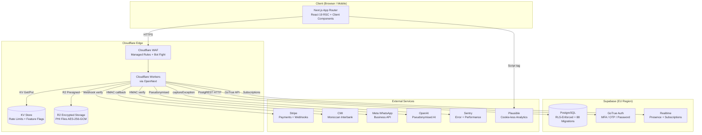

# Architecture Overview

> **Audience:** Engineers, auditors, new team members
> **Last updated:** May 2026



## Tenant Isolation (4 Layers)

```
1. Middleware   →  Subdomain → clinic_id header (strips client headers)
2. withAuth()  →  User session + RBAC + clinic_id from profile
3. Supabase    →  createTenantClient(clinicId) sets app.clinic_id
4. PostgreSQL  →  RLS policies enforce clinic_id = current_setting('app.clinic_id')
```

## Key Directories

| Path                   | Purpose                                                                 |
| ---------------------- | ----------------------------------------------------------------------- |
| `src/middleware.ts`    | Request pipeline: security headers, CSRF, rate limit, tenant resolution |
| `src/app/api/`         | API route handlers (withAuth + withValidation wrappers)                 |
| `src/lib/ai/`          | AI modules: config, sanitize, pseudonymise, validate-output             |
| `src/lib/middleware/`  | Composable middleware modules                                           |
| `supabase/migrations/` | 90+ sequential SQL migrations with RLS                                  |
| `docs/`                | Runbooks, SOPs, compliance, ADRs                                        |
| `.github/workflows/`   | CI (lint, typecheck, test, security, e2e, deploy)                       |
| `wrangler.toml`        | Cloudflare Workers config (routes, KV, R2, crons)                       |
